# 一、软件架构演变过程

软件架构的发展经历了由单体架构、垂直架构、SOA架构到微服务架构的演进过程，下面我们分别了解一下这几个架构。

### 1.1 单体架构


架构说明：

​      全部功能集中在一个项目内（All in one）。

架构优点：

​      架构简单，前期开发成本低、开发周期短，适合小型项目。

架构缺点：

​       全部功能集成在一个工程中，对于大型项目不易开发、扩展和维护。

​       技术栈受限，只能使用一种语言开发。

​       系统性能扩展只能通过扩展集群节点，成本高。

### 1.2 垂直架构


架构说明：       

​      按照业务进行切割，形成小的单体项目。

架构优点：

​      技术栈可扩展（不同的系统可以用不同的编程语言编写）。

架构缺点：

​       功能集中在一个项目中，不利于开发、扩展、维护。

​       系统扩张只能通过集群的方式。

​       项目之间功能冗余、数据冗余、耦合性强。

### 1.3 SOA架构

SOA全称为Service-Oriented Architecture，即面向服务的架构。它可以根据需求通过网络对松散耦合的粗粒度应用组件(服务)进行分布式部署、组合和使用。一个服务通常以独立的形式存在于操作系统进程中。

站在功能的角度，把业务逻辑抽象成可复用的服务，通过服务的编排实现业务的快速再生，目的：把原先固有的业务功能转变为通用的业务服务，实现业务逻辑的快速复用。


架构说明：

​      将重复功能或模块抽取成组件的形式，对外提供服务，在项目与服务之间使用ESB（企业服务总线）的形式作为通信的桥梁。

架构优点：

​       重复功能或模块抽取为服务，提高开发效率。

​       可重用性高。

​       可维护性高。

架构缺点：

​       各系统之间业务不同，很难确认功能或模块是重复的。

​       抽取服务的粒度大。

​       系统和服务之间耦合度高。

### 1.4 微服务架构


架构说明：

​       将系统服务层完全独立出来，抽取为一个一个的微服务。

​       抽取的粒度更细，遵循单一原则。

​       采用轻量级框架协议传输。

架构优点：

​       服务拆分粒度更细，有利于提高开发效率。 

​       可以针对不同服务制定对应的优化方案。

​       适用于互联网时代，产品迭代周期更短。

架构缺点：

​      粒度太细导致服务太多，维护成本高。

​      分布式系统开发的技术成本高，对团队的挑战大。

### 1.5 SOA和 微服务架构的区别

首先SOA和微服务架构一个层面的东西，而对于ESB和微服务网关是一个层面的东西，一个谈到是架构风格和方法，一个谈的是实现工具或组件。

 1.SOA（Service Oriented Architecture）“面向服务的架构”:他是一种设计方法，其中包含多个服务， 服务之间通过相互依赖最终提供一系列的功能。一个服务 通常以独立的形式存在与操作系统进程中。各个服务之间 通过网络调用。

 2.微服务架构:其实和 SOA 架构类似,微服务是在 SOA 上做的升华，微服务架构强调的一个重点是“业务需要彻底的组件化和服务化”，原有的单个业务系统会拆分为多个可以独立开发、设计、运行的小应用。这些小应用之间通过服务完成交互和集成。

 微服务架构 = 80%的SOA服务架构思想 + 100%的组件化架构思想 + 80%的领域建模思想


# 二、Dubbo 基本使用

**什么是RPC？**

RPC全称为remote procedure call，即**远程过程调用**。比如两台服务器A和B，A服务器上部署一个应用，B服务器上部署一个应用，A服务器上的应用想调用B服务器上的应用提供的方法，由于两个应用不在一个内存空间，不能直接调用，所以需要通过网络来表达调用的语义和传达调用的数据。

## 1、概述


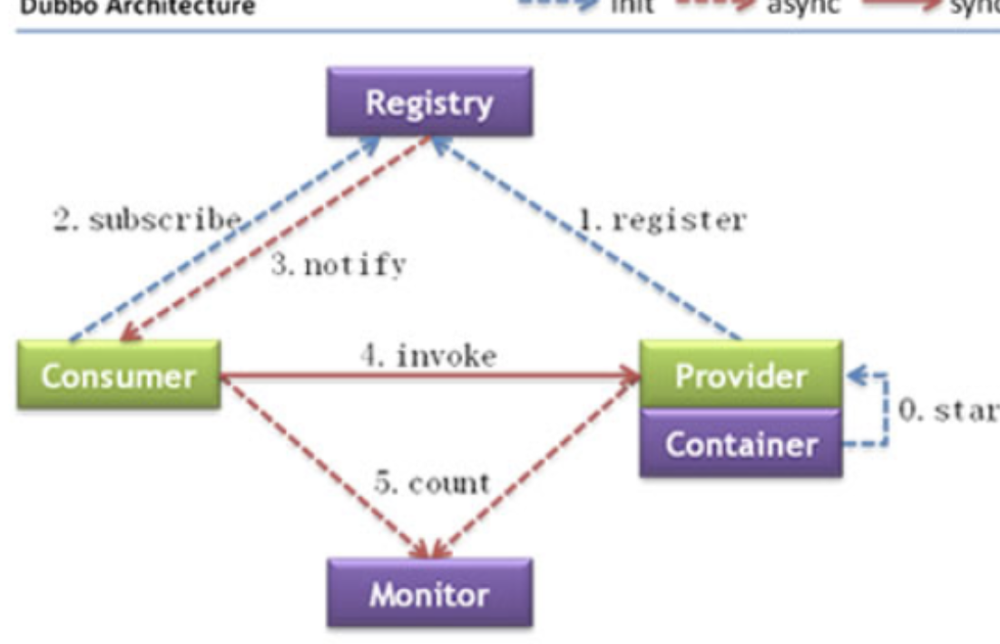

节点角色说明：

| 节点      | 角色名称                               |
| --------- | -------------------------------------- |
| Provider  | 暴露服务的服务提供方                   |
| Consumer  | 调用远程服务的服务消费方               |
| Registry  | 服务注册与发现的注册中心               |
| Monitor   | 统计服务的调用次数和调用时间的监控中心 |
| Container | 服务运行容器                           |

虚线都是异步访问，实线都是同步访问
蓝色虚线:在启动时完成的功能
红色虚线(实线)都是程序运行过程中执行的功能

调用关系说明:

0. 服务容器负责启动，加载，运行服务提供者。
1. 服务提供者在启动时，向注册中心注册自己提供的服务。
2. 服务消费者在启动时，向注册中心订阅自己所需的服务。
3. 注册中心返回服务提供者地址列表给消费者，如果有变更，注册中心将基于长连接推送变更数据给消费者。
4. 服务消费者，从提供者地址列表中，基于软负载均衡算法，选一台提供者进行调用，如果调用失败，再选另一台调用。
5. 服务消费者和提供者，在内存中累计调用次数和调用时间，定时每分钟发送一次统计数据到监控中心。

## 2、dubbo配置

以下采用API的方式
https://dubbo.apache.org/zh/docs/references/configuration/api/

```java
// 消费端
protected <T> ReferenceBean<T> registerReference(Class<T> clazz) {
        ReferenceBean<T> referenceBean = new ReferenceBean<>();
        referenceBean.setInterface(clazz);
        referenceBean.setRegistry(SpringHelper.getBean(RegistryConfig.class));
        referenceBean.setApplication(SpringHelper.getBean(ApplicationConfig.class));
        referenceBean.setProtocol(DubboProtocol.NAME);
        referenceBean.setConsumer(SpringHelper.getBean(ConsumerConfig.class));
        referenceBean.setCheck(false);
//        referenceBean.setFilter();
        referenceBean.setRetries(0);
        referenceBean.setGroup(referenceBean.getConsumer().getGroup());
          // 直连
          // 如果点对点直连，可以用reference.setUrl()指定目标地址，设置url后将绕过注册中心，
        // 其中，协议对应provider.setProtocol()的值，端口对应provider.setPort()的值，
        // 路径对应service.setPath()的值，如果未设置path，缺省path为接口名
        referenceBean.setUrl("dubbo://10.20.130.230:20880/com.xxx.DemoService"); 
        return referenceBean;
    }

// 服务端
    protected <T> ServiceBean<T> registerService(Class<T> clazz, T ref) {
        ServiceBean<T> serviceBean = new ServiceBean<>();
        serviceBean.setInterface(clazz);
        serviceBean.setApplication(SpringHelper.getBean(ApplicationConfig.class));
        serviceBean.setProvider(SpringHelper.getBean(ProviderConfig.class));
        serviceBean.setRegistry(SpringHelper.getBean(RegistryConfig.class));
        serviceBean.setProtocols(Lists.newArrayList(SpringHelper.getBeanFactory().getBeansOfType(ProtocolConfig.class).values()));
        serviceBean.setRef(ref);
        serviceBean.setGroup(serviceBean.getProvider().getGroup());
        serviceBean.setRetries(0);
        return serviceBean;
    }
```

## 3、本地存根

> 远程服务后，客户端通常只剩下接口，而实现全在服务器端，但提供方有些时候想在客户端也执行部分逻辑，比如：做 ThreadLocal 缓存，提前验证参数，调用失败后伪造容错数据等等，此时就需要在 API 中带上 Stub，客户端生成 Proxy 实例，会把 Proxy 通过构造函数传给 Stub [1](https://dubbo.apache.org/zh/docs/advanced/local-stub/#fn:1)，然后把 Stub 暴露给用户，Stub 可以决定要不要去调 Proxy。

stub的实现，其实就是在调用之前自动的做一些操作，可以理解为代理远程的接口，并为其曾增强了一些方法

```java
public class BarServiceStub implements BarService {
    private final BarService barService;
    
    // 构造函数传入真正的远程代理对象
    public BarServiceStub(BarService barService){
        this.barService = barService;
    }
 
    public String sayHello(String name) {
        // 此代码在客户端执行, 你可以在客户端做ThreadLocal本地缓存，或预先验证参数是否合法，等等
        try {
            return barService.sayHello(name);
        } catch (Exception e) {
            // 你可以容错，可以做任何AOP拦截事项
            return "容错数据";
        }
    }
}
```

```xml
<dubbo:service interface="com.foo.BarService" stub="com.foo.BarServiceStub" />
或
<dubbo:service interface="com.foo.BarService" stub="true" />
```


1. Stub 必须有可传入 Proxy 的构造函数。 [↩︎](https://dubbo.apache.org/zh/docs/advanced/local-stub/#fnref:1)
2. 在 interface 旁边放一个 Stub 实现，它实现 BarService 接口，并有一个传入远程 BarService 实例的构造函数

## 4、高可用

### zookeeper宕机和dubbo直连

> zookeeper注册中心宕机，还是可以消费dubbo暴露的服务。

注册中心集群中任何一台宕机后，都会自动切换到另一台。

注册中心宕机之后，服务提供者和服务消费者扔能通过本地缓存通讯。

服务提供者全部宕机之后，服务消费者将无法使用。消费者会重连，等待服务提供者上线。

### dubbo直连

在配置文件中配置目标主机地址

```java
referenceBean.setUrl("dubbo://10.20.130.230:20880/com.xxx.DemoService"); 
```

### 负载均衡

- Random LoadBalance（随机）

根据  权重的 随机分配，有2/7的概率到达1

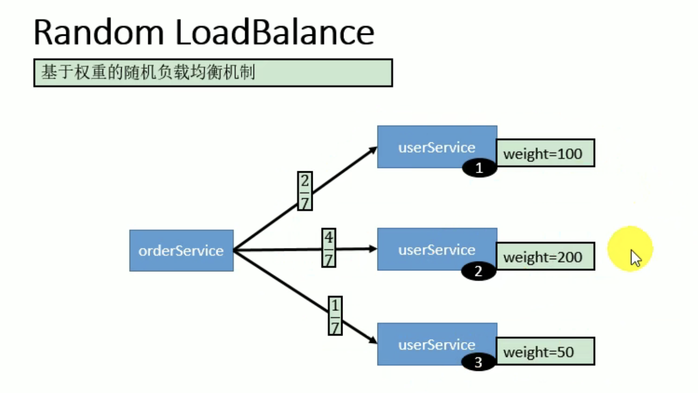

- RoundRobin LoadBalance（轮询）

基于权重的轮询负载均衡机制，假如有找七次，根据权重，七次之内，1只能2次，2只能4次，3只能1次；第一遍1 2 3，第二遍 1 2 （3已经有过一次了，1也已经2次了。所以又到了2）2。。。。。

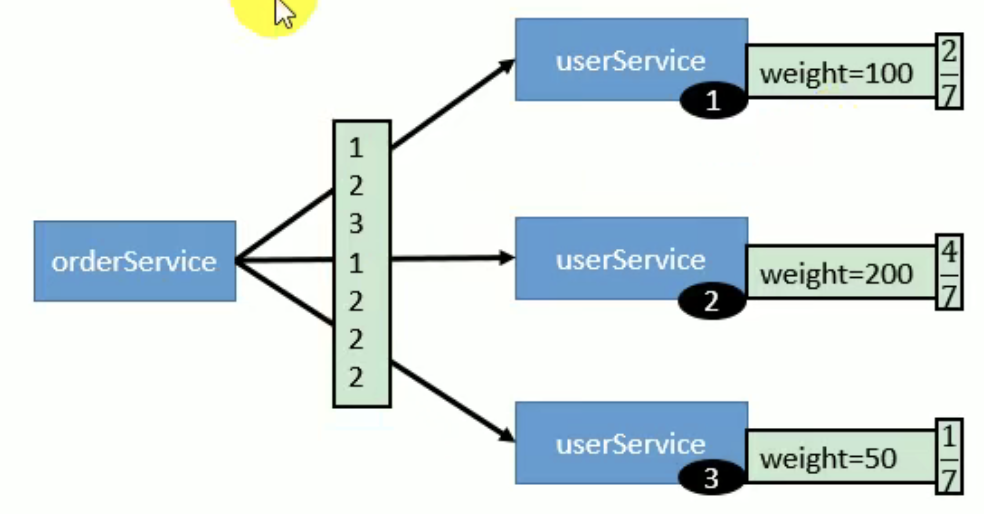

- LeastActive LoadBalance（最少活跃数 ）

最少活跃数--负载均衡机制，每次调用之前，先看下上一次处理时间最短的服务器是哪个，然后使用那个调用时间最短的服务器

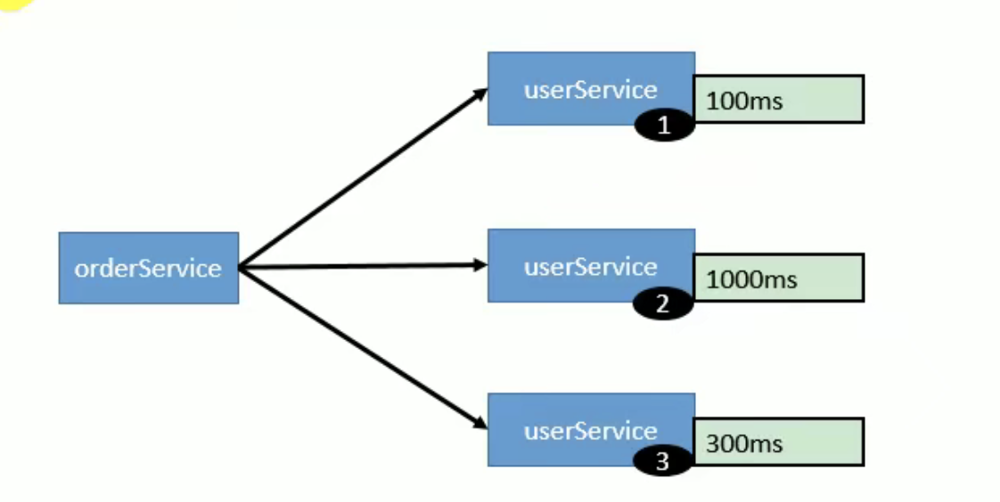

- ConsistentHash LoadBalance

一致性哈希，更具方法名参数名的哈希值选择调哪台机器

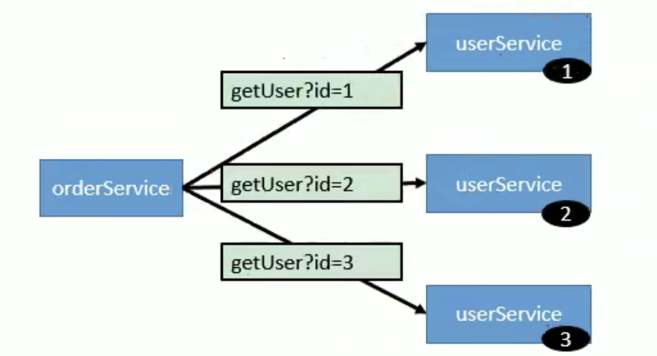

相关接口：

com.alibaba.dubbo.rpc.cluster.LoadBalance

RandomLoadBalance.NAME指向第二章截图，RandomLoadBalance

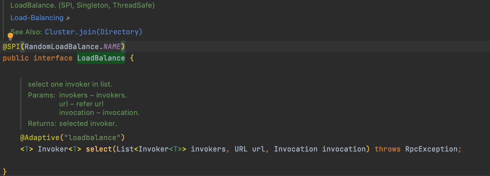

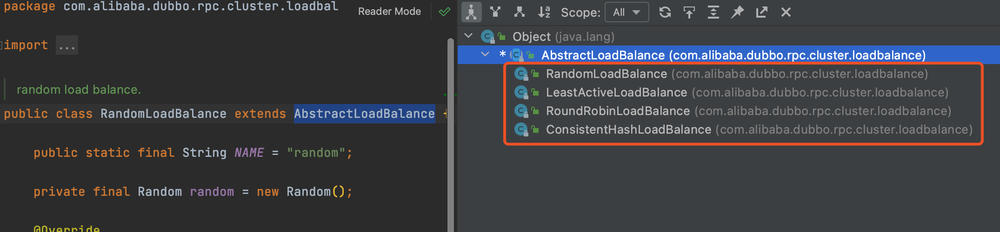

```java
// 代码指定使用哪种负载均衡机制
referenceBean.setLoadbalance(RandomLoadBalance.NAME);
```

#### 改变权重

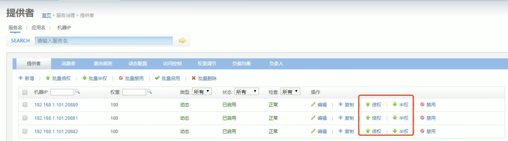

### 服务降级

当服务器压力剧增的时候，根据业务场景及流量，对一些服务和页面有策略的不处理，或者是换种简单的方式进行处理，从而释放 服务器资源以保证核心功能正常运行或高效运作。

方式：

mock=force:return+null 表示消费方对服务的调用直接返回null，不发起远程调用，用来屏蔽不重要的服务不可用时对调用方的影响。

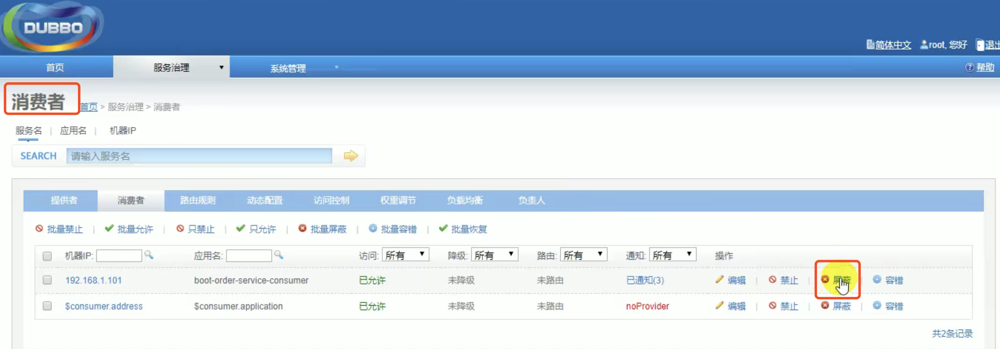

mock=fail:return+null 表示消费方对该服务的方法调用在失败后，再返回null值，不抛出异常。用来容忍不重要服务的不稳定时对调用方的影响。

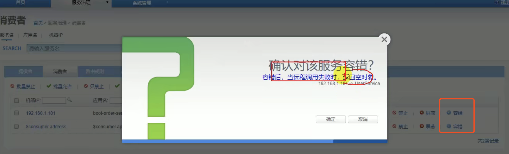

### 集群容错

> 当集群调用失败时，dubbo提供了多种容错方案，缺省为failover 重试。

#### Failover Cluster

失败时自动切换，重试其他服务器，通常用于读操作，但是重试会带来更大的延迟。可通过设置 retries=2 来设置重试次数（不包含第一次）。

还有一些其他的荣聪模式，如下图

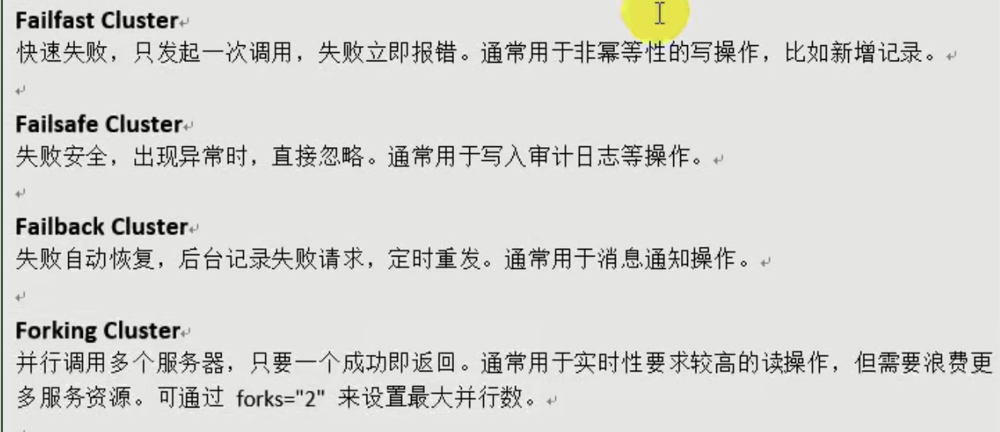

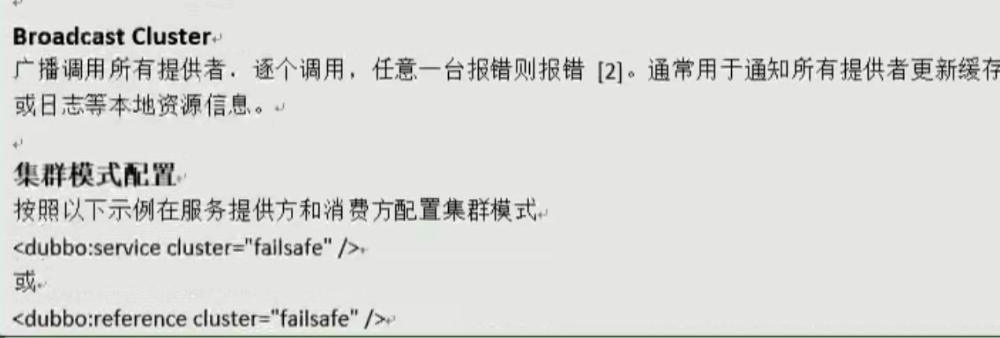

通过代码配置

```
referenceBean.setCluster(FailsafeCluster.NAME);
```

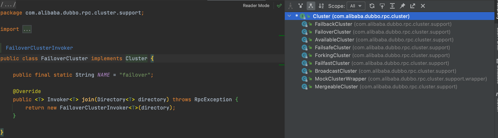

#### 其他容错方式

整合sentinel 或者是 hystrix

# 三、RPC调用的详细过程

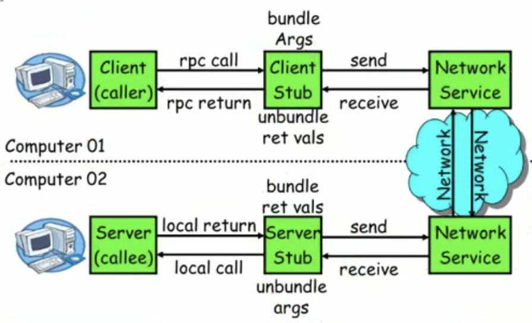

一次完整的RPC调用流程（同步）如下：

1、消费方调用 以本地调用 的方式调用服务。（本地调用的方式例如dubbo调用的本地jar 包）

2、client stub 接收到调用方后，负责将方法、参数等组装成能够进行网络传输的消息体（dubbo 就是序列化）

3、client stub 找到服务器地址，并将消息发送到服务器端；

4、server stub 收到消息后进行解码；

5、server stub 根据解码结果调用本地服务；

6、本地服务执行并将结果返回给server stub；

7、server stub 将返回结果打包成消息并发送给消费方

8、client stub接收到消息，并进行解码

9、服务消费方得到最终结果。

RPC框架的目标就是实现2~8这些步骤，将其封装起来，这些细节对用户来说是透明的，不可见的。

> stub 可以理解为是一个代理对象

# 四、BIO/NIO

Netty是一个异步事件驱动的网络应用程序框架，用于快速开发可维护的高性能协议服务器和客户端。它极大地简化了TCP和UDP套接字服务器等网络编程。基于java的NIO

## 1、 BIO（Blocking IO）即阻塞IO

每个线程只能执行一个请求，这个任务没有完成之前，线程不能得到释放，那服务器就不能处理大量的请求，因为大量的请求会被阻塞，等待。

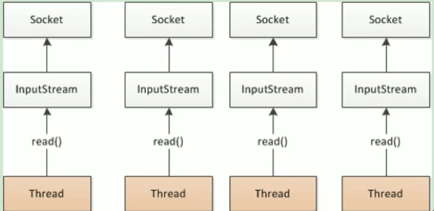


## 2、NIO：（Non-Blocking IO）即非阻塞IO

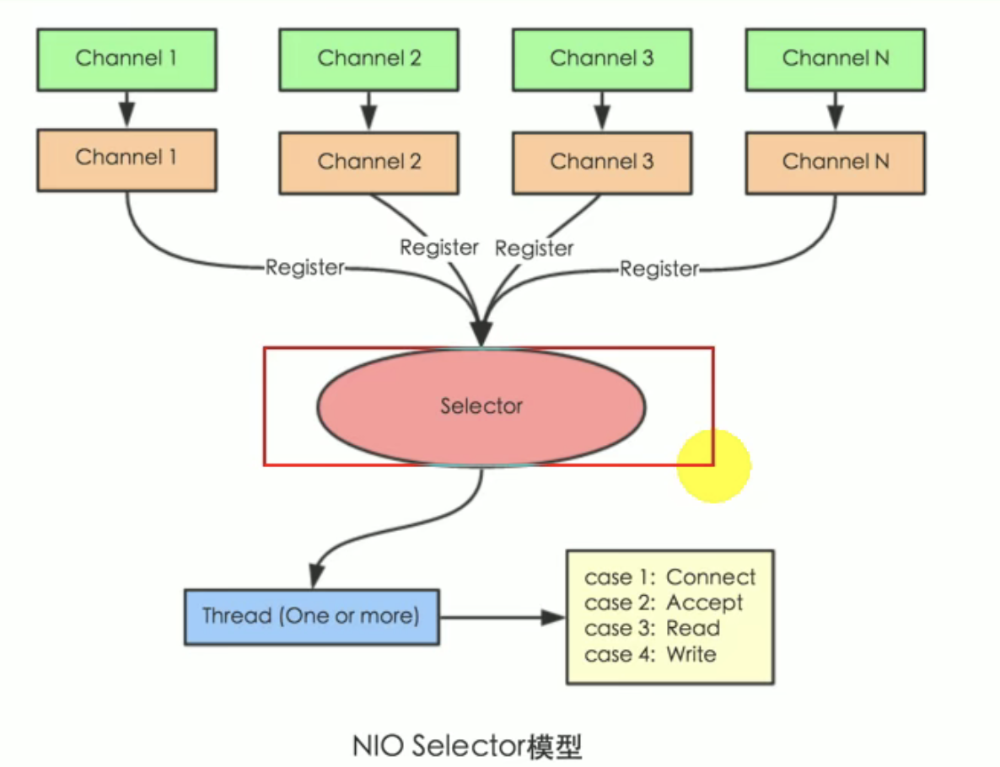

Selector 一般称为 选择器，也可以翻译成 多路复用器

Connect（连接就绪）、Accept（接受就绪）、Read（读就绪）、Write（写就绪）

过程：

当Select监听到Channel1的某个case状态好了，会开启一个线程去做相应的事情。

#### NIO基本介绍

> 从JDK1.4开始，java提供的一系列改进的输入/输出的新特性，被统称为NIO（即 New IO），是同步非阻塞的。
>
> NIO相关类都被放在java.nio包及其子包下，并对原java.io包中的很多类进行改写。
>
> NIO有三大核心部分：Channel（通道）、Buffer（缓冲区），Selector（选择器）
>
> NIO是面向缓冲区，或者是面向块编程的。数据读取到一个它稍后处理的缓冲区，需要时可在缓冲区中前后移动，这就增加了处理过程中的灵活性，使用它可以提供非阻塞式的高伸缩性网络。

下图可以和上图进行对比，下图描述的核心更加详细

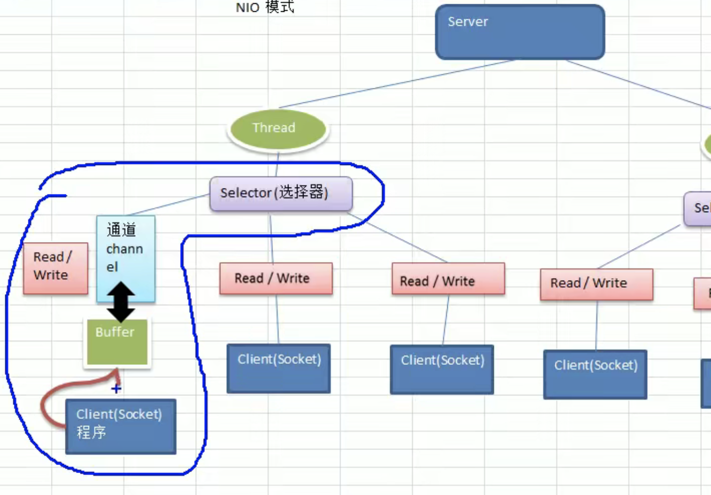

Client选择一个通道(channel)和Selector进行通信，即（读写），通道和程序之间可以有一个缓冲（Buffer）。buffer和通道之间也是可以相互读写的。底层可以通过buffer实现非阻塞（需要时可在缓冲区中前后移动，这就增加了处理过程中的灵活性，使用它可以提供非阻塞式的高伸缩性网络。）

#### 为什么是非阻塞的

一个selector可以同时支持多个通道，当某个通道完成了某个case，才会分配线程到server，否则这个selector会继续处理其他事情。即如下官网描述

> java NIO的非阻塞模式，是一个线程从某个通道发送请求或者读取数据，但是它只能得到目前可用的数据，如果目前没有可用的数据时，就什么都不会获取，而不是保持线程阻塞去等待获取数据，所以直到数据变成可以获取之前，该线程可以继续做其他事情。非阻塞写也是如此，一个线程请求写入一些数据到某个通道，但不需要等待它完全写入，这个线程同时可以去做别的事情。

通俗的说，NIO是可以做到一个线程来处理多个操作，假设有10000个请求过来，根据实际情况，可以分配50~100个线程来处理。不像之前的阻塞IO，非要分配10000个线程来处理。

HTTP2.0 使用了多路复用的技术，做到同一个连接并发处理多个请求，并且并发请求的数量比HTTP1.1大了好几个数量级。

#### NIO三大核心部分之间的关系

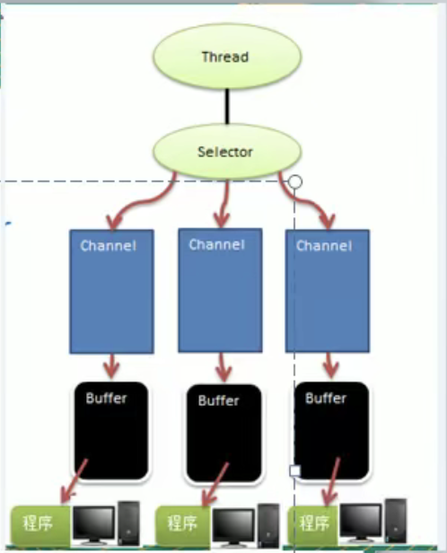

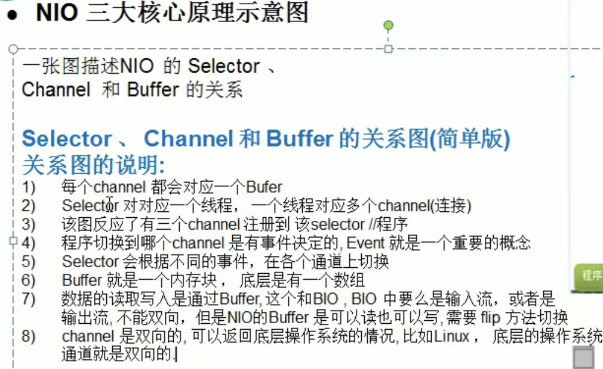


# 五、Netty


# 六、Dubbo原理

## 1、整体架构

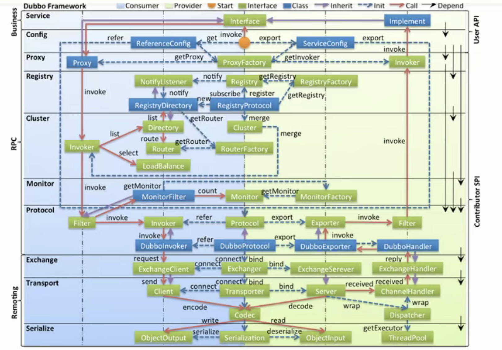

- 总共有三层：business，RPC，Remoting。
- comuser的在左边，provider的在右边。
- 绿色的都是interface接口，蓝色的都是class实现。
- inherit是堆接口的继承，init是dubbo启动时的初始化，call是调用逻辑，depend是依赖顺序
- business：service 是程序员关系的主要实现的一层
- RPC：是框架实现的一层,ReferenceConfig和ServiceConfig会被我妈用到，就是注册服务的时候。也可以用ReferenceBean等
- Remoting：发起远程调用，Netty在这里被使用

## 2、标签解析

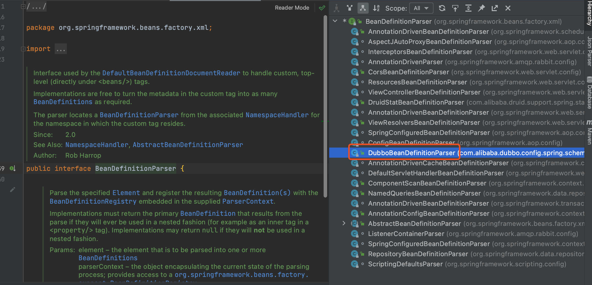

1、首先在启动的时候会在DubboNamespaceHandler通过new DubboBeanDefinitionParser载入一些class

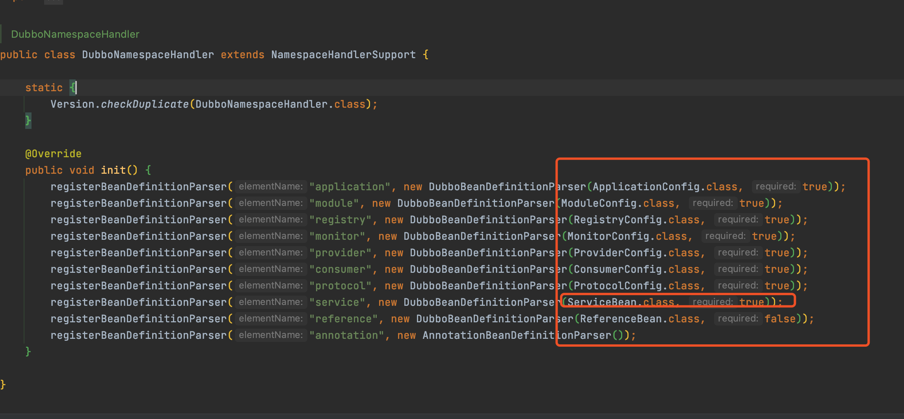

2、这里有个DubboBeanDefinitionParser实现了Spring的BeanDefinitionParser解析器接口，实现时根据beanClass的类型，设置指定的值，如下。

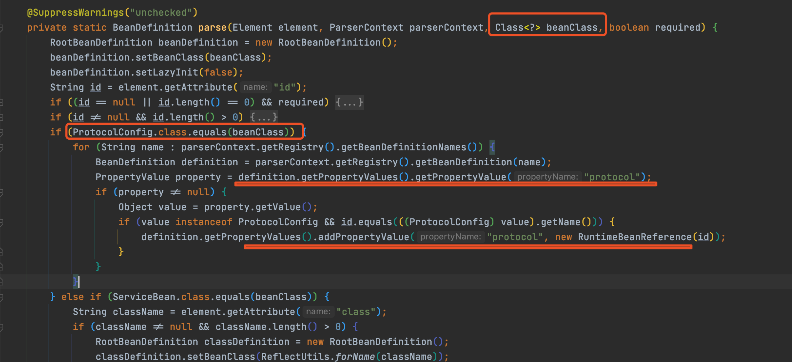

所以当使用API的方式进行配置时，就可以使用ServiceBean的一些方法，如下

```java
  protected <T> ReferenceBean<T> registerReference(Class<T> clazz) {
        ReferenceBean<T> referenceBean = new ReferenceBean<>();
        referenceBean.setInterface(clazz);
        referenceBean.setRegistry(SpringHelper.getBean(RegistryConfig.class));
        referenceBean.setApplication(SpringHelper.getBean(ApplicationConfig.class));
        referenceBean.setProtocol(DubboProtocol.NAME);
        referenceBean.setConsumer(SpringHelper.getBean(ConsumerConfig.class));
        referenceBean.setCheck(false);
//        referenceBean.setFilter();
        referenceBean.setRetries(0);
        referenceBean.setGroup(referenceBean.getConsumer().getGroup());
        referenceBean.setLoadbalance(RandomLoadBalance.NAME);
        referenceBean.setCluster(FailsafeCluster.NAME);
        return referenceBean;
    }

    protected <T> ServiceBean<T> registerService(Class<T> clazz, T ref) {
        ServiceBean<T> serviceBean = new ServiceBean<>();
        serviceBean.setInterface(clazz);
        serviceBean.setApplication(SpringHelper.getBean(ApplicationConfig.class));
        serviceBean.setProvider(SpringHelper.getBean(ProviderConfig.class));
        serviceBean.setRegistry(SpringHelper.getBean(RegistryConfig.class));
        serviceBean.setProtocols(Lists.newArrayList(SpringHelper.getBeanFactory().getBeansOfType(ProtocolConfig.class).values()));
        serviceBean.setRef(ref);
        serviceBean.setGroup(serviceBean.getProvider().getGroup());
        serviceBean.setRetries(0);
//        serviceBean.setCluster();
        return serviceBean;
    }
```

## 3、服务暴露流程

```java
public class ServiceBean<T> extends ServiceConfig<T> implements InitializingBean, DisposableBean, ApplicationContextAware, ApplicationListener<ContextRefreshedEvent>, BeanNameAware{}
```

1、ServiceBean这个类实现了很多接口，有Spring的InitializingBean，在属性设置完之后会回调afterPropertiesSet方法，如下图所示，会设置providerConfig的信息并保存起来，还有其他信息，不一一列举了。

```java
// Spring的接口
public interface InitializingBean {
	void afterPropertiesSet() throws Exception;
}
```

dubbo的实现如下

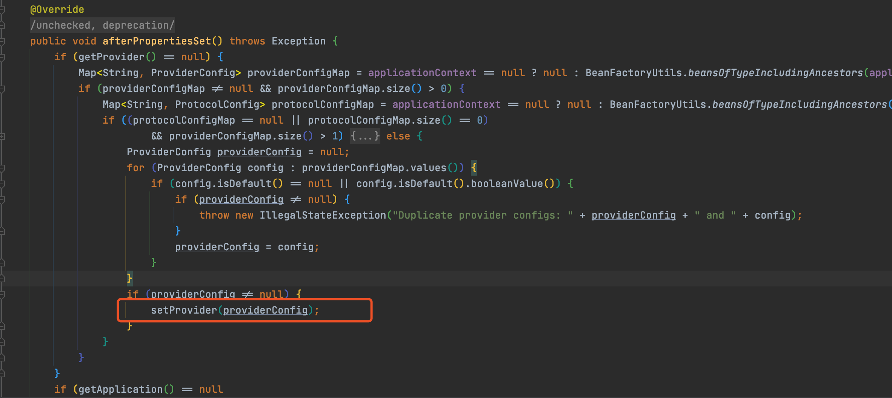

2、还有个接口就是ApplicationListener，Dubbo实现这个接口监听的是ApplicationListener<ContextRefreshedEvent>

> ContextRefreshedEvent，即当整个容器刷新完成，全部创建完之后。

回调方法onApplicationEvent()

```java
// Spring的接口
public interface ApplicationListener<E extends ApplicationEvent> extends EventListener {

	/**
	 * Handle an application event.
	 * @param event the event to respond to
	 */
	void onApplicationEvent(E event);

}
```

dubbo的实现如下，具体暴露流程

```java
// 不是延迟，还没有暴露，不是不暴露
isDelay() && !isExported() && !isUnexported()
```

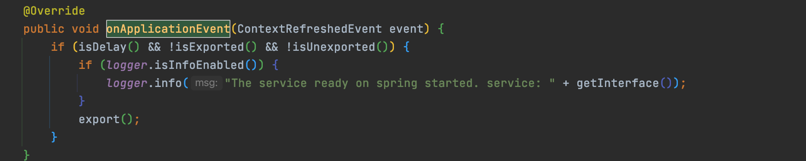

调用export()方法,如下

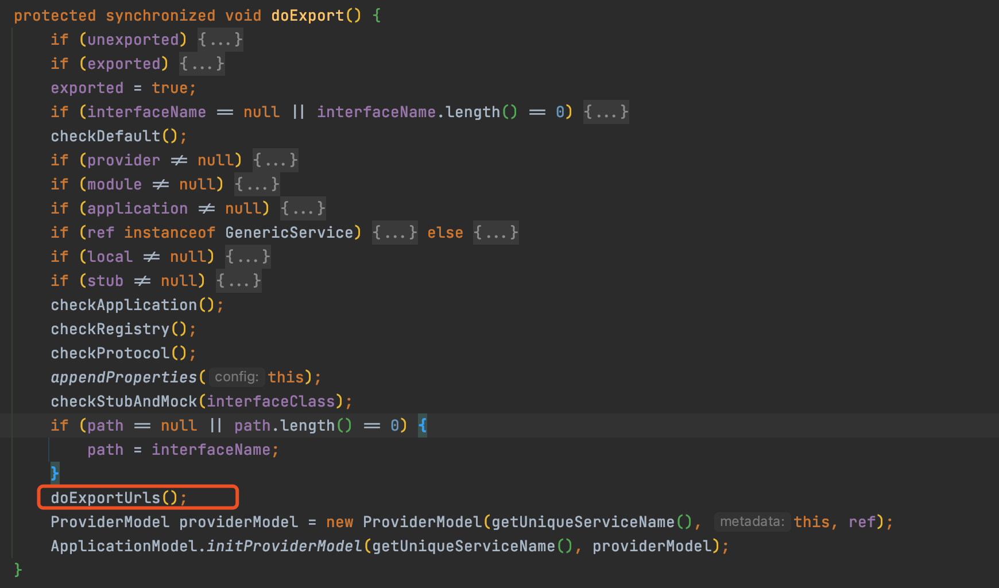

接着调用doExportUrls()方法

```java
 private void doExportUrls() {
   // 加载注册中心的信息,例如获取到地址
        List<URL> registryURLs = loadRegistries(true);
        for (ProtocolConfig protocolConfig : protocols) {
            doExportUrlsFor1Protocol(protocolConfig, registryURLs);
        }
    }
```

doExportUrls方法里遍历协议集合，在方法doExportUrlsFor1Protocol里选择使用哪种协议 进行暴露

在doExportUrlsFor1Protocol中有个关键性的代码Exporter<?> exporter = protocol.export(wrapperInvoker);

```java
// 获取代理类
Invoker<?> invoker = proxyFactory.getInvoker(ref, (Class) interfaceClass, url);
// 对其进行包装
DelegateProviderMetaDataInvoker wrapperInvoker = new DelegateProviderMetaDataInvoker(invoker, this);
// 会进行两个暴露DubboProtocol，和通过RegistryProtocol协议到注册中心暴露
Exporter<?> exporter = protocol.export(wrapperInvoker);
exporters.add(exporter);
```

这里的protocal的获取方式是通过扩展类加载器获取，如下

```java
private static final Protocol protocol = ExtensionLoader.getExtensionLoader(Protocol.class).getAdaptiveExtension();
```

在dubbo中会使用dubbo的DubboProtocol，还有底下的RegistryProtocol将其注册到注册中心

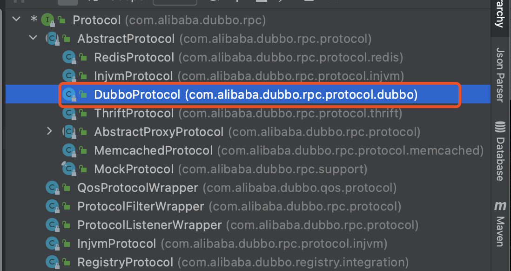

首先会使用RegistryProtocol，注册到注册中心

这里是RegistryProtocol的export

com.alibaba.dubbo.registry.integration.RegistryProtocol#export

```java
// 这里是RegistryProtocol的export
@Override
    public <T> Exporter<T> export(final Invoker<T> originInvoker) throws RpcException {
        //export invoker 本地暴露，包装一个暴露器，会使用DubboProtocol注册到注册中心，并在这里启动Netty（详细介绍看后面）
        final ExporterChangeableWrapper<T> exporter = doLocalExport(originInvoker);

        URL registryUrl = getRegistryUrl(originInvoker);

        //registry provider
        final Registry registry = getRegistry(originInvoker);
        final URL registeredProviderUrl = getRegisteredProviderUrl(originInvoker);

        //to judge to delay publish whether or not
        boolean register = registeredProviderUrl.getParameter("register", true);
				// 提供者，消费者的注册表，把提供者、注册中心的地址、提供者的地址保存到originInvoker里面（详细介绍看后面）
        ProviderConsumerRegTable.registerProvider(originInvoker, registryUrl, registeredProviderUrl);
      // 注册中心会提供注册服务
           if (register) {
            register(registryUrl, registeredProviderUrl);
            ProviderConsumerRegTable.getProviderWrapper(originInvoker).setReg(true);
        }

        final URL overrideSubscribeUrl = getSubscribedOverrideUrl(registeredProviderUrl);
        final OverrideListener overrideSubscribeListener = new OverrideListener(overrideSubscribeUrl, originInvoker);
        overrideListeners.put(overrideSubscribeUrl, overrideSubscribeListener);
        registry.subscribe(overrideSubscribeUrl, overrideSubscribeListener);
        //Ensure that a new exporter instance is returned every time export
        return new DestroyableExporter<T>(exporter, originInvoker, overrideSubscribeUrl, registeredProviderUrl);
    }
```

doLocalExport（）方法

```java
private <T> ExporterChangeableWrapper<T> doLocalExport(final Invoker<T> originInvoker) {
        String key = getCacheKey(originInvoker);
        ExporterChangeableWrapper<T> exporter = (ExporterChangeableWrapper<T>) bounds.get(key);
        if (exporter == null) {
            synchronized (bounds) {
                exporter = (ExporterChangeableWrapper<T>) bounds.get(key);
                if (exporter == null) {
                  // invokerDelegete是注册中心的 RegistryProtocol
                    final Invoker<?> invokerDelegete = new InvokerDelegete<T>(originInvoker, getProviderUrl(originInvoker));
                  // 这里再次使用protocol.export暴露，这里就会跳转到dubboProcol，
                    exporter = new ExporterChangeableWrapper<T>((Exporter<T>) protocol.export(invokerDelegete), originInvoker);
                    bounds.put(key, exporter);
                }
            }
        }
        return exporter;
    }
```

doLocalExport会到dubboProcol，

```java
// dubboProcol的export方法
@Override
    public <T> Exporter<T> export(Invoker<T> invoker) throws RpcException {
      // 获取到该方法在注册中心登记的地址
        URL url = invoker.getUrl();
。。。。。。。。。。。
				// 打开服务器
        openServer(url);
        optimizeSerialization(url);
        return exporter;
```

openServer---》serverMap.put(key, createServer(url))里面的createServer（）---》server = Exchangers.bind(url, requestHandler);

继续进入方法中看不停的bind，然后是Transporters.bind，最后就到netty了

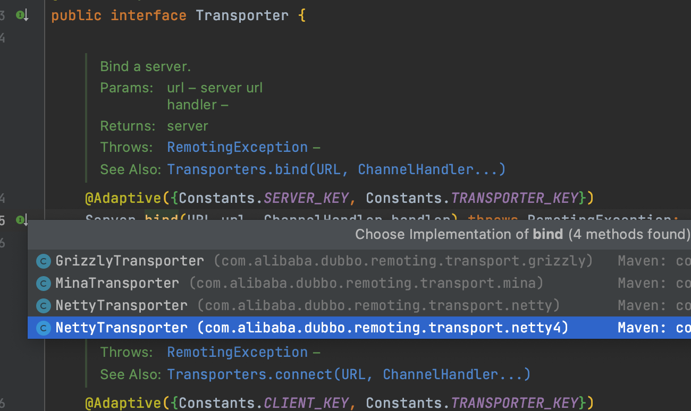

总之openServer（）干的事情最终就是启动netty服务器，监听20880端口。

然后我们再回到RegistryProtocol接着看里面的 ProviderConsumerRegTable.registerProvider(originInvoker, registryUrl, registeredProviderUrl);

```java
public class ProviderConsumerRegTable {
  // <提供者地址，执行器> 执行器里有真正的提供者的对象等其他信息
    public static ConcurrentHashMap<String, Set<ProviderInvokerWrapper>> providerInvokers = new ConcurrentHashMap<String, Set<ProviderInvokerWrapper>>();
    public static ConcurrentHashMap<String, Set<ConsumerInvokerWrapper>> consumerInvokers = new ConcurrentHashMap<String, Set<ConsumerInvokerWrapper>>();
		
  // 主要就是将提供者的执行器放入到 invokers里
    public static void registerProvider(Invoker invoker, URL registryUrl, URL providerUrl) {
        ProviderInvokerWrapper wrapperInvoker = new ProviderInvokerWrapper(invoker, registryUrl, providerUrl);
        String serviceUniqueName = providerUrl.getServiceKey();
        Set<ProviderInvokerWrapper> invokers = providerInvokers.get(serviceUniqueName);
        if (invokers == null) {
            providerInvokers.putIfAbsent(serviceUniqueName, new ConcurrentHashSet<ProviderInvokerWrapper>());
            invokers = providerInvokers.get(serviceUniqueName);
        }
        invokers.add(wrapperInvoker);
    }
```

结束

**总结：**

关键方法 com.alibaba.dubbo.registry.integration.RegistryProtocol#export

netty开启在这里

```java
// 这里是RegistryProtocol的export
@Override
    public <T> Exporter<T> export(final Invoker<T> originInvoker) throws RpcException {
        //export invoker 本地暴露，包装一个暴露器，会使用DubboProtocol注册到注册中心，并在这里启动Netty（详细介绍看后面）
        final ExporterChangeableWrapper<T> exporter = doLocalExport(originInvoker);
```

最终当netty启动后，dubbo利用netty监听20880端口，进行服务调用的时候根据url地址，去下面这两个Map里面去找地址对应的服务执行器是哪个。

```java
// <Url,执行器（一个代理对象invoke）>
public static ConcurrentHashMap<String, Set<ProviderInvokerWrapper>> providerInvokers = new ConcurrentHashMap<String, Set<ProviderInvokerWrapper>>();
    public static ConcurrentHashMap<String, Set<ConsumerInvokerWrapper>> consumerInvokers = new ConcurrentHashMap<String, Set<ConsumerInvokerWrapper>>();
```

## 4、服务引用的流程

```java
public class ReferenceBean<T> extends ReferenceConfig<T> implements FactoryBean, ApplicationContextAware, InitializingBean, DisposableBean {}
```

可以看到ReferenceBean实现了Spring的FactoryBean，当我们的bean被注入之后，可以在工厂里找到这些bean，并通过getObject()方法获取。

```java
@Override
    public Object getObject() throws Exception {
        return get();
    }
    public synchronized T get() {
        if (destroyed) {
            throw new IllegalStateException("Already destroyed!");
        }
        if (ref == null) {
          // 初始化
            init();
        }
        return ref;
    }
```

init()方法的里面会创建代理对象（在init方法的末尾），ref = createProxy(map);

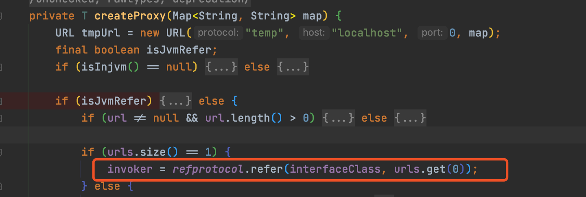

```java
//这里有个远程引用，就是提供者的接口全类名,urls.get(0)是注册中心的地址
invoker = refprotocol.refer(interfaceClass, urls.get(0));

// com.alibaba.dubbo.rpc.protocol.dubbo.DubboProtocol#refer
public <T> Invoker<T> refer(Class<T> serviceType, URL url) throws RpcException {
        optimizeSerialization(url);
        // create rpc invoker.
        DubboInvoker<T> invoker = new DubboInvoker<T>(serviceType, url, getClients(url), invokers);
        invokers.add(invoker);
        return invoker;
    }

// com.alibaba.dubbo.registry.integration.RegistryProtocol#refer
public <T> Invoker<T> refer(Class<T> type, URL url) throws RpcException {
        url = url.setProtocol(url.getParameter(Constants.REGISTRY_KEY, Constants.DEFAULT_REGISTRY)).removeParameter(Constants.REGISTRY_KEY);
        Registry registry = registryFactory.getRegistry(url);
        if (RegistryService.class.equals(type)) {
            return proxyFactory.getInvoker((T) registry, type, url);
        }

        // group="a,b" or group="*"
        Map<String, String> qs = StringUtils.parseQueryString(url.getParameterAndDecoded(Constants.REFER_KEY));
        String group = qs.get(Constants.GROUP_KEY);
        if (group != null && group.length() > 0) {
            if ((Constants.COMMA_SPLIT_PATTERN.split(group)).length > 1
                    || "*".equals(group)) {
                return doRefer(getMergeableCluster(), registry, type, url);
            }
        }
        return doRefer(cluster, registry, type, url);
    }
```

首先看注册中心的RegisterProtocol的refer

里面的doRefer方法会去订阅信息

```java
directory.subscribe(subscribeUrl.addParameter(Constants.CATEGORY_KEY,
                Constants.PROVIDERS_CATEGORY
                        + "," + Constants.CONFIGURATORS_CATEGORY
                        + "," + Constants.ROUTERS_CATEGORY));

        Invoker invoker = cluster.join(directory);
// 将消费者的url和信息保存到invoker里面，registerConsumer的实现看后面介绍
        ProviderConsumerRegTable.registerConsumer(invoker, url, subscribeUrl, directory);
```

> 再看DubboProtocol里面的refer，会获取getClients
>
> getClients--》getSharedClient--》initClient--》--》client = Exchangers.connect(url, requestHandler);（底层是Netty传输的）
>
> 总之getClients这个方法就是创建了一个netty的客户端来监听端口。

ProviderConsumerRegTable.registerConsumer方法和服务暴露时的registerProvider一样，也是将消费者的信息url和执行器（一个代理对象invoke）的信息保存到map中，并返回invoker

```java
  public static ConcurrentHashMap<String, Set<ProviderInvokerWrapper>> providerInvokers = new ConcurrentHashMap<String, Set<ProviderInvokerWrapper>>();
    public static ConcurrentHashMap<String, Set<ConsumerInvokerWrapper>> consumerInvokers = new ConcurrentHashMap<String, Set<ConsumerInvokerWrapper>>();

public static void registerConsumer(Invoker invoker, URL registryUrl, URL consumerUrl, RegistryDirectory registryDirectory) {
        ConsumerInvokerWrapper wrapperInvoker = new ConsumerInvokerWrapper(invoker, registryUrl, consumerUrl, registryDirectory);
        String serviceUniqueName = consumerUrl.getServiceKey();
        Set<ConsumerInvokerWrapper> invokers = consumerInvokers.get(serviceUniqueName);
        if (invokers == null) {
            consumerInvokers.putIfAbsent(serviceUniqueName, new ConcurrentHashSet<ConsumerInvokerWrapper>());
            invokers = consumerInvokers.get(serviceUniqueName);
        }
        invokers.add(wrapperInvoker);
    }
```

到这里为止，com.alibaba.dubbo.config.ReferenceConfig#init里面的createProxy创建代理对象就完成了并返回（proxyFactory.getProxy(invoker);）。

**总结**

ReferenceBean实现了Spring的FactoryBean，并使用的里面的getObject()方法，初始化对象，创建了一个代理对象，在创建代理的对象的方法createProxy方法里面，回去使用DubboProtocol#refer启动netty监听端口，然后RegisterProtocol#redfer把消费者的url和信息保存到一个 名为 consumerInvokers的ConcurrentHashMap里面并返会invoke。然后用返回的invoker放到ConsumerModel中，最后完成。

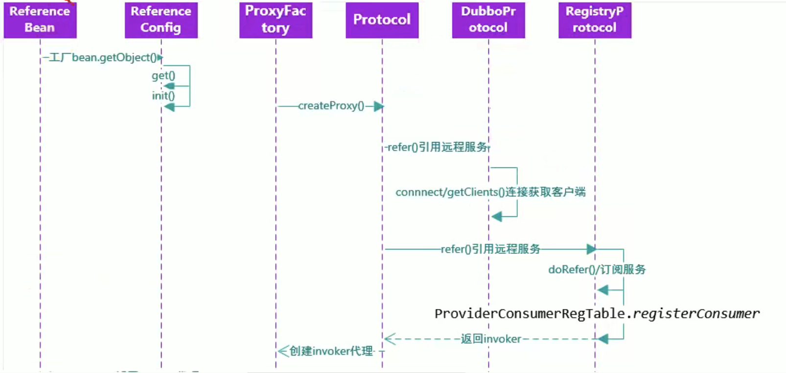


## 5、服务的调用流程

看方法：com.alibaba.dubbo.rpc.proxy.InvokerInvocationHandler

```java
@Override
    public Object invoke(Object proxy, Method method, Object[] args) throws Throwable {
        String methodName = method.getName();
        Class<?>[] parameterTypes = method.getParameterTypes();
        if (method.getDeclaringClass() == Object.class) {
            return method.invoke(invoker, args);
        }
        if ("toString".equals(methodName) && parameterTypes.length == 0) {
            return invoker.toString();
        }
        if ("hashCode".equals(methodName) && parameterTypes.length == 0) {
            return invoker.hashCode();
        }
        if ("equals".equals(methodName) && parameterTypes.length == 1) {
            return invoker.equals(args[0]);
        }
        return invoker.invoke(new RpcInvocation(method, args)).recreate();
    }
```

这里的invoker.invoke是com.alibaba.dubbo.rpc.support.MockInvoker#invoke，然后里面还有个invoke（com.alibaba.dubbo.rpc.cluster.support.AbstractClusterInvoker#invoke）获取到负载均衡机制，然后doInvoke(invocation, invokers, loadbalance);，经过层层Filter之后（例如Monitor），最后到达Duboo的Invoke，里面有个request获取到对象并返回，如下图

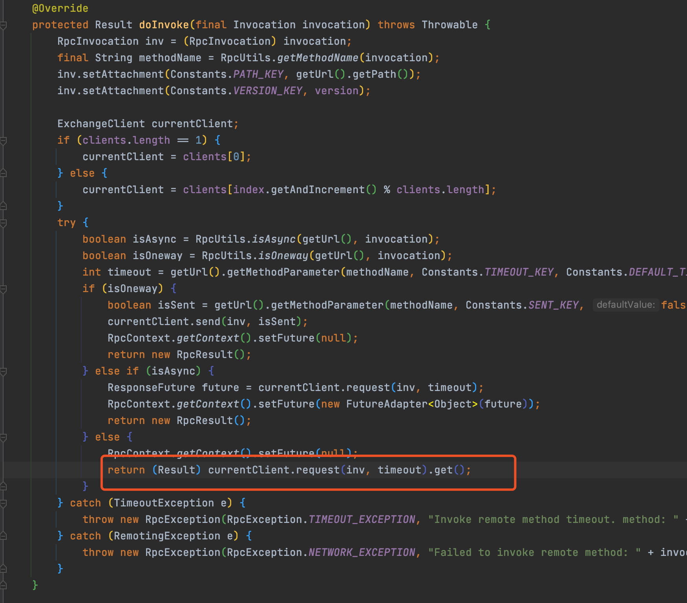

