# 一、JVM部分零碎知识

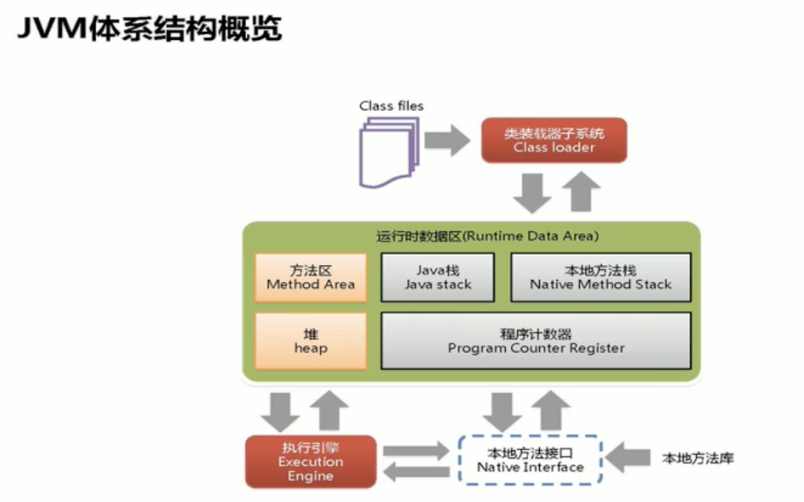

灰色部分（java stack、Native Method Stack、Program counter register）线程私有，几乎不存在垃圾回收

黄色部分（Method area、head）**存在垃圾回收**

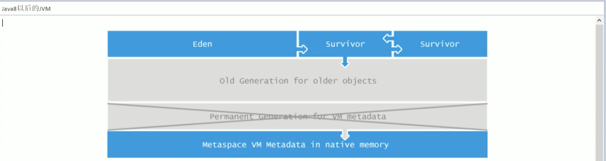


## 1、栈、堆


> 堆（heap）：存储对象、实例，和数组
>
> 栈（stack）：虚拟机栈。用于存储局部变量表。局部变量表存放了编译期可以知道长度的各种基本数据类型（boolean、byte、short、char、int、float、long、double）、对象引用（reference类型，存储对象在堆内存的首地址）。方法执行完自动释放。
>
> 方法区 即 MetaSpace（Method Area）用于存储已被虚拟机加载的类信息、常量、静态常量、即时编译器编译后的代码等数据。

例如Demo02 obj1 = new Demo02()，obj1在栈里面，new Demo02()在堆里面


## 2、GC是什么

GC主要发生在JVM体系结构图中的亮色部分（Method area、heap）

GC是指分代收集算法

- 在次数上频繁收集Young区的是Minor GC
- 在次数上较少收集Old区   Full GC
- 基本不动Perm区


### （1）什么是垃圾？

内存中已经不再被使用到的空间就是垃圾


### （2）如何判断一个对象是否被回收

两种方法，如下（关注GC root）

1、引用计数法

（参考后面的四大算法）

2、GC Root
	枚举根节点做可达性分析(根搜索路径)

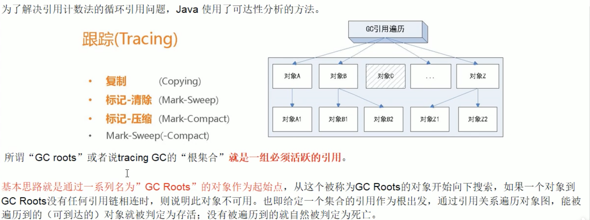

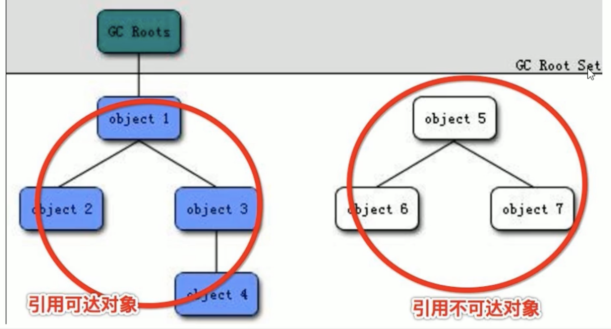

问题：哪些节点可以作为GC ROOT

> 虚拟机栈（栈帧中的局部变量区，也叫做局部变量表）中引用的对象。
>
> 2、方法区中的类静态属性引用的对象。
>
> 3、方法区中常量引用的对象。
>
> 4、本地方法栈中JNI（Native方法）引用的对象

```java
public class GCRootDemo {
    private byte[] bytes = new byte[8 * 1024 * 1024 * 100];
//    private static GCRootDemo2 t2;
  //    private static final GCRootDemo3 t3;
    public static void m1(){
        GCRootDemo t = new GCRootDemo();
        System.gc();
        System.out.println("第一次GC完成");
    }

    public static void main(String[] args) {
        m1();
    }
}
```

m1()方法在栈中，即符合第一条要求，称为引用对象，然后t1指向了 new GCRootDemo()，这就是对象可达。

t2，就符合第二条，类静态属性引用的对象。

t3，符合第三条，常量引用的对象。

线程里面的start()，就是native方法，符合第四条


## 3、GC 发生在JVM哪部分

> 发生在堆里，堆就是内存里面


## 4、GC 4大算法

### 1、引用计数法

有对象引用就+1、没对象用就-1，即有对象被引用就不回收

缺点：每次对象赋值均要维护计数器，且计数器本身也有一定的消耗，较难处理循环引用

JVM实现不采用这种方式了

### 2、复制算法（Copying）

年轻代中使用的是Minor GC，这种GC算法采用的是复制算法（Copying）

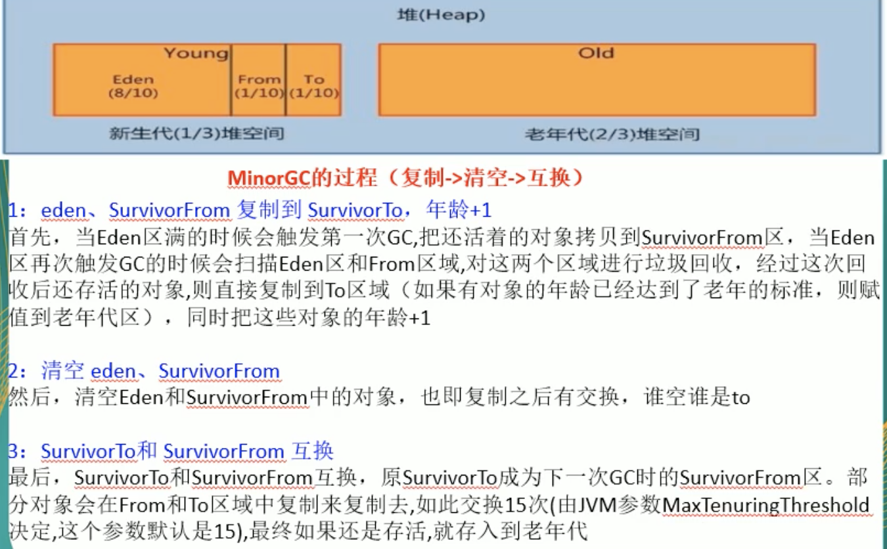

#### 原理

- 从根集合（GC Root）开始，通过Tracing从From中找到存活的对象，拷贝到To中。
- From、To交换身份，下次内存分类从To开始

#### 缺点

需要双倍空间

#### 优点

没有标记清除过程，效率高

没有内存碎片，可以实现快速内存分配（bump-the-pointer）

### 3、标记清除（Mark-Sweep）

老年代回收使用


### 4、标记压缩（Mark-Compact）

老年代回收使用


### 5、标记清除压缩（Mark-Sweep-Compact）

两种算法(Mark-Sweep和Mark-Compact)结合使用的，先进行标记清除，清除一些产生一些碎片后再进行压缩

老年代常用这种方式回收对象

## 5、老年代和新生代

参考文档：jvm快速入门.md


## 6、如何查看本机的JVM

```shell
# Jps：查看当前机器的java运行进程
superking@wangchaodeMacBook-Pro examination % jps -l
18658 com.supkingx.base.l_jvm.gc.HelloGC
18693 jdk.jcmd/sun.tools.jps.Jps
3750 org.jetbrains.idea.maven.server.RemoteMavenServer36
2342 
16154 org.jetbrains.jps.cmdline.Launcher
18654 org.jetbrains.jps.cmdline.Launcher

# jinfo 查看当前进程的信息（是否打印GC细节）
superking@wangchaodeMacBook-Pro examination % jinfo -flag PrintGCDetails 18658
-XX:-PrintGCDetails

# jinfo 查看当前进程的信息（MetaspaceSize）
superking@wangchaodeMacBook-Pro examination % jinfo  -flag MetaspaceSize 19212
-XX:MetaspaceSize=21807104
```

## 7、java7和java8的区别

在java8中，永久代已经被删除，被一个叫元空间的区域所取代。元空间的本质和永久代类似。

元空间（java8）与永久代（java7）之间最大的区别在于：永久代使用的JVM的堆内存，但是java8以后的元空间并不是在虚拟机中，**而是使用本机的物理内存**。因此，默认情况下，元空间的大小仅受本地内存限制。类的元数据放入native memory，字符串池和类的静态变量放入java堆中，这样可以加载多少类的元数据就不再由MaxPermSize控制，而是由系统的实际可用空间来控制

## 8、GC/FullGC

利用参数 -XX:+PrintGCDetails 输出GC的详细信息

```java
// 此时的jvm参数配置为 -Xms20m -Xmx30m -XX:+PrintGCDetails
public class HelloGC {
    public static void main(String[] args) throws InterruptedException {
        // 人为制造GC
        byte[] bytes = new byte[50 * 1024 * 1024];
    }
}
```

输出GC信息

```
[GC (Allocation Failure) [PSYoungGen: 1545K->496K(6144K)] 1545K->528K(26624K), 0.0009955 secs] [Times: user=0.01 sys=0.00, real=0.00 secs] 
[GC (Allocation Failure) [PSYoungGen: 496K->512K(6144K)] 528K->568K(26624K), 0.0006948 secs] [Times: user=0.00 sys=0.00, real=0.00 secs] 
[Full GC (Allocation Failure) [PSYoungGen: 512K->0K(6144K)] [ParOldGen: 56K->405K(13824K)] 568K->405K(19968K), [Metaspace: 2995K->2995K(1056768K)], 0.0043182 secs] [Times: user=0.03 sys=0.00, real=0.01 secs] 
[GC (Allocation Failure) [PSYoungGen: 0K->0K(6144K)] 405K->405K(26624K), 0.0003394 secs] [Times: user=0.00 sys=0.01, real=0.00 secs] 
[Full GC (Allocation Failure) [PSYoungGen: 0K->0K(6144K)] [ParOldGen: 405K->388K(13824K)] 405K->388K(19968K), [Metaspace: 2995K->2995K(1056768K)], 0.0036971 secs] [Times: user=0.02 sys=0.00, real=0.00 secs] 
Heap
 PSYoungGen      total 6144K, used 281K [0x00000007bf600000, 0x00000007c0000000, 0x00000007c0000000)
  eden space 5632K, 5% used [0x00000007bf600000,0x00000007bf6467f8,0x00000007bfb80000)
  from space 512K, 0% used [0x00000007bfb80000,0x00000007bfb80000,0x00000007bfc00000)
  to   space 512K, 0% used [0x00000007bff80000,0x00000007bff80000,0x00000007c0000000)
 ParOldGen       total 20480K, used 388K [0x00000007be200000, 0x00000007bf600000, 0x00000007bf600000)
  object space 20480K, 1% used [0x00000007be200000,0x00000007be261030,0x00000007bf600000)
 Metaspace       used 3045K, capacity 4496K, committed 4864K, reserved 1056768K
  class space    used 334K, capacity 388K, committed 512K, reserved 1048576K
Exception in thread "main" java.lang.OutOfMemoryError: Java heap space
	at com.supkingx.base.l_jvm.gc.HelloGC.main(HelloGC.java:15)

```

解析

GC在新生区，FullGC 在养老区

GC日志解释

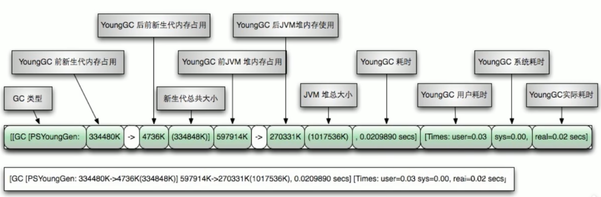

FUll GC 日志解释

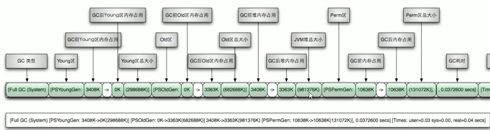

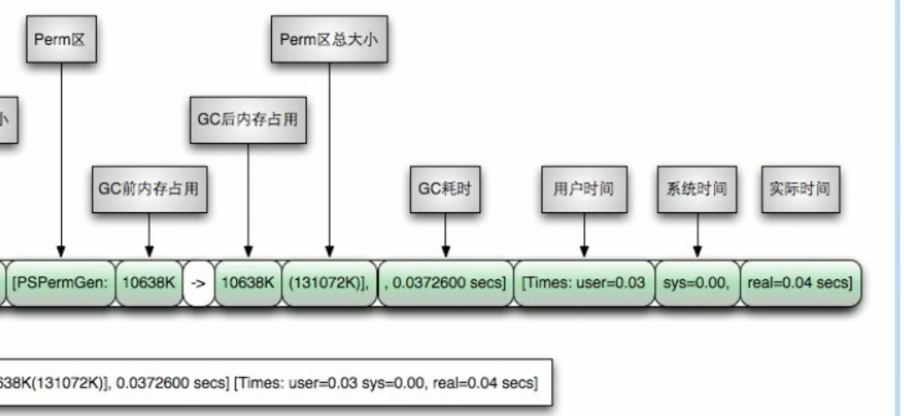

选取一条Full GC思考

```
[Full GC (Allocation Failure) [PSYoungGen: 0K->0K(6144K)] [ParOldGen: 405K->388K(13824K)] 405K->388K(19968K), [Metaspace: 2995K->2995K(1056768K)], 0.0036971 secs] [Times: user=0.02 sys=0.00, real=0.00 secs] 
```

可以看到[ParOldGen: 405K->388K(13824K)] 405K->388K(19968K), [Metaspace: 2995K->2995K(1056768K)]。老年代回收内存前后差距不大，Metaspace内存回收前后不变，说明GC扛不住了，老年代也不行了，所以报错了，java.lang.OutOfMemoryError: Java heap space


# 二、JVM参数

-Xms：初始堆空间

-Xmx：最大堆空间

-Xss：最初始的栈空间

## 1、标配参数

java -version    
java -help  
 java -showversion

## 2、X参数（了解）

-Xint   解释执行

-Xcomp   第一次使用就编译成本地代码

-Xmixed  混合模式

## 3、XX参数

### Boolean类型

#### 公式

```
	-XX:+(-)某个属性
	+：表示开启
	-：表示关闭
```

#### 举例

1、是否打印GC收集细节：

​		-XX:-PrintGCDetails （开启）
​	    -XX:+PrintGCDetails   （关闭）

2、是否使用串行垃圾回收器

​       -XX:-UseSerialGC（开启）

​	   -XX:+UseSerialGC（关闭）


### KV设值类型

#### 公式

```
-XX:属性key=属性值value
```

#### 举例

1、-XX:MetaspaceSize=128m 

2、-XX:MaxTenuringThreshold=15

​	young区到老年区，需要活过15次

3、-XX:SurvivorRatio=8

​		设置新生代中Eden 和 S0/S1空间的比例，默认-XX:SurvivorRatio=8，Eden:S0:S1 = 8:1:1
​	    假如：-XX:SurvivorRatio=4，那么Eden:S0:S1 = 4:1:1
​		即：SurvivorRatio值就是设置Eden区比例占多少，S0/S1相同

​		以下是-XX:SurvivorRatio=4的示例，很明显Eden的容量是from区和 to区的四倍

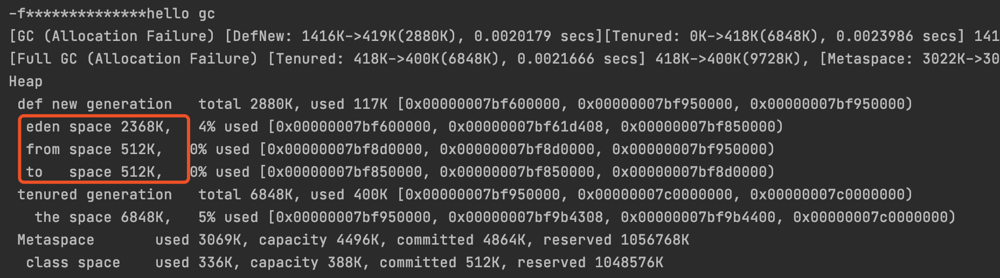


4、-XX:NewRatio=2

​		设置新生代与老年代在 堆结构中的占比，默认-XX:NewRatio=2，年轻代占整个堆的1/3
​		假如：-XX:NewRatio=4：新生代占1，老年代占4，年轻代占整个堆的1/5
​		NewRatio就是设置老年代的占比，剩下的1给新生代

​		下图就是-XX:NewRatio=4的示例

​		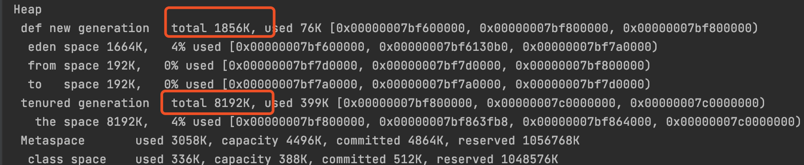

### 经典参数

-Xms：等价于 -XX:InitialHeapSize，初始堆空间、默认是物理内存的1/64

-Xmx：等价于 -XX:MaxHeapSize，最大堆空间、默认为物理内存的1/4

-Xss：等价于 -XX:ThreadStackSize，设置单个线程栈的大小，默认为512K~1024K

-Xmn：设置年轻代大小

-XX:MetaspaceSize


### 常用参数

```
-Xms10m -Xmx10m -Xss1024k -XX:MetaspaceSize=512m -XX:+PrintCommandLineFlags -XX:+PrintGCDetails -XX:+UseSerialGC
-Xms10m -Xmx10m -XX:+PrintGCDetails -XX:+UseSerialGC -XX:SurvivorRatio=8
```


## 4、盘点家底查看JVM默认值

1、查看默认初始值

java -XX:+PrintFlagsInitial -version 或 java -XX:+PrintFlagsInitial

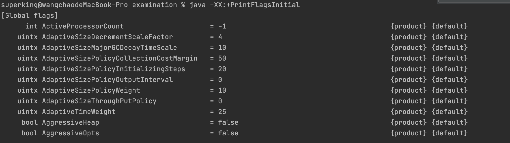

=表示初始值

:= 表示修改之后的

调整参数：
java -XX:+PrintFlagsInitial +XX:MetaspaceSize=512m


2、打印命令行参数

-XX:+PrintCommandLineFlags

Java -XX:+PrintCommandLineFlags -version (参数+版本号)


# 三、引用

> 强、软、弱、虚引用分别是什么

## 强引用

当内存不足的时候，JVM开始垃圾回收，对于强引用的对象，就算出现了OOM也不会对该对象进行回收，死都不回收。强引用是我们最常见的普通对象引用，只要还有强引用指向一个对象，就能表明对象还活着，垃圾收集器不会碰这种对象。在JAVA中最常见的就是强引用，把一个对象赋值给另外一个引用变量，这个引用变量就是一个强引用。当一个对象被强引用变量引用时，它处于可达状态，它是不可能被GC的，即使该对象以后永远都不会被用到JVM，也不会回收。因此强引用时造成java内存泄漏（占用内存过大）的主要原因之一。

对于一个普通的对象，如果没有其他的引用关系，只要超过了引用的作用域或者显示的将相应的强引用赋值为null，一般认为就是可以被GC的。（当然具体GC还要看JVM的策略）。

```java
public class StrongReferenceDemo {
    public static void main(String[] args) {
        Object o1 = new Object();
        Object o2 = o1;
        o1 = null;
        System.gc();
        // o2依然有值，即使o1变为null了，但是o2是强引用。
        System.out.println(o2);
    }
}
```

## 软引用

需要用java.lang.ref.SoftReference类来实现，内存足够的情况下，不收你，内存不够了，就收你。软引用一般用在对内存敏感的程序中，比如高速缓存就用到了软引用，内存够用就保留，内存不够就回收！（MyBatis里的缓存用到过软引用），当自己做缓存的时候，也可以使用软引用，

1、代码示例，内存够用的场景，代码可见objectSoftReference不会被回收

```java
public class SoftReferenceDemo {
    public static void main(String[] args) {
        Object o1 = new Object();
        SoftReference<Object> objectSoftReference = new SoftReference<>(o1);
        System.out.println(o1);
        System.out.println(objectSoftReference.get());

        o1= null;
        System.gc();
        System.out.println(o1);
        System.out.println(objectSoftReference.get());
    }
}

输出
  
java.lang.Object@511d50c0
java.lang.Object@511d50c0
null
java.lang.Object@511d50c0
```

2、代码示例，内存不用够用的场景，发现OOM后，objectSoftReference被回收了

```java
/**
 * @description: 软引用（内存 不够用场景）
 * 配置小内存 -Xms10m -Xmx10m
 * 大对象new byte[30 * 1024 * 1024] 使其OOM
 */
public class SoftReferenceDemo2 {
    public static void main(String[] args) {
        Object o1 = new Object();
        SoftReference<Object> objectSoftReference = new SoftReference<>(o1);
        System.out.println(o1);
        System.out.println(objectSoftReference.get());

        o1= null;
        try{
            byte[] bytes = new byte[30 * 1024 * 1024];
        }catch (Throwable e){
            e.printStackTrace();
        }finally {
            System.out.println(o1);
            // 内存不够用，会被回收
            System.out.println(objectSoftReference.get());
        }
    }
}

输出
java.lang.Object@71bc1ae4
java.lang.Object@71bc1ae4
java.lang.OutOfMemoryError: Java heap space
	at com.supkingx.base.l_jvm.gc.SoftReferenceDemo2.main(SoftReferenceDemo2.java:21)
null
null
```

### 使用场景分析

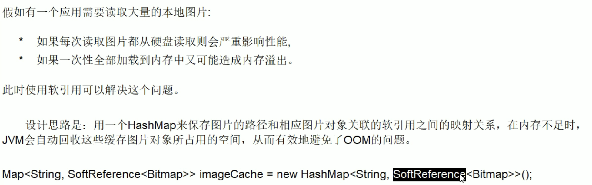


## 弱引用

需要使用java.lang.WeakReference类来实现，它比软引用的生存期更短，对于只有弱引用的对象来说，只要垃圾回收机制一运行，不管JVM的内存空间是否足够，都会回收对象占用的内存。

代码如下，GC之后，objectSoftReference被回收

```java
public class WeakReferenceDemo {
    public static void main(String[] args) {
        Object o1 = new Object();
        WeakReference<Object> objectSoftReference = new WeakReference<>(o1);
        System.out.println(o1);
        System.out.println(objectSoftReference.get());

        o1 = null;
        System.gc();
        System.out.println(o1);
        // 内存不够用，会被回收
        System.out.println(objectSoftReference.get());
    }
}
```

### WeakHashMap

HashMap和WeakHashMap的比较

```java
public class WeakHashMapDemo {
    public static void main(String[] args) {
        myHashMap();
        System.out.println("=========================");
        myWeakHashMap();
    }

    private static void myHashMap() {
        HashMap<Integer, String> map = new HashMap<>();
        Integer key = new Integer(2);
        String value = "HashMap";
        map.put(key, value);
        System.out.println(map);

        key = null;
        System.out.println(map);

        System.gc();
        // 正常输出
        System.out.println(map);
    }
    private static void myWeakHashMap() {
        WeakHashMap<Integer, String> map = new WeakHashMap<>();
        Integer key = new Integer(2);
        String value = "WeakHashMap";
        map.put(key, value);
        System.out.println(map);

        key = null;
        System.out.println(map);

        System.gc();
        // 输出为空，一GC就回收
        System.out.println(map);
    }
}
```

**注意，当WeakHashMap中，Integer key = 1时，则不会被回收。因为此时key是常量，存储在方法区，即metaspace**

## 虚引用

需要用到包java.lang.ref.PhantomReference。

股顾名思义，虚引用就是形同虚设，与其他几种引用不同，虚引用并不会决定对象的生命周期。如果一个对象仅持有虚引用，那么它就和没有任何引用一样，在任何时候都可能被垃圾回收器回收，它不能单独使用也不能通过它访问对象，虚引用必须和引用队列（ReferenceQueue）联合使用。

虚引用 的主要作用是跟踪对象被垃圾回收的状态。仅提供了一种确保对象被finalize以后，做某些事情的机制。PhantomReference的get方法总是返回null，因此无法访问对应的引用对象。其意义在于说明一个对象已经进入finalization阶段，可以被gc回收，用来实现比finalization机制更灵活的回收操作。

换句话说，设置虚引用关联的唯一目的，就是在这个对象被GC的时候收到一个系统通知或者后续添加进一步的处理。
java技术允许使用finalize()方法在垃圾收集器将对象从内存中清除出去之前做必要的清理工作。

1、以下是虚引用的展示，GC将要开始的时候，对象会被放入虚引用队列：

```java
public class ReferenceQueueDemo {
    public static void main(String[] args) throws InterruptedException {
        Object o = new Object();
        ReferenceQueue<Object> referenceQueue = new ReferenceQueue<>();
        WeakReference<Object> weakReference = new WeakReference<>(o, referenceQueue);

        System.out.println(o);
        System.out.println(weakReference.get());
        // 弱引用
        System.out.println("gc之前的弱引用队列" + referenceQueue.poll());
        o = null;
        System.gc();
        Thread.sleep(1000);
        System.out.println("gc之后的对象" + o);
        System.out.println("gc之后的虚引用" + weakReference.get());
        System.out.println("gc之后的弱引用队列" + referenceQueue.poll());
    }
}

输出：
java.lang.Object@511d50c0
java.lang.Object@511d50c0
gc之前的弱引用队列null
  
gc之后的对象null
gc之后的虚引用null
gc之后的弱引用队列java.lang.ref.WeakReference@60e53b93
```

2、使用PhantomReference实现虚引用

```java
public class PhantomReferenceDemo {
    public static void main(String[] args) {
        Object o1 = new Object();
        ReferenceQueue<Object> referenceQueue = new ReferenceQueue<>();
        PhantomReference<Object> phantomReference = new PhantomReference<>(o1,referenceQueue);

        System.out.println(o1);
        System.out.println(phantomReference.get());
        System.out.println(referenceQueue.poll());

        System.out.println("==========GC之后=======================");
        o1=null;
        System.gc();
        System.out.println(o1);
        System.out.println(phantomReference.get());
        System.out.println(referenceQueue.poll());
    }
}

输出：
java.lang.Object@511d50c0
null
null
==========GC之后=======================
null
null
java.lang.ref.PhantomReference@60e53b93
```

## 引用小总结

- java中可以作为GC roots的对象（关于GC Root的介绍可以回顾上面 第一章->第二小节）
  - 虚拟机栈（栈帧中的局部变量区，也叫做局部变量）
  - 方法区中的类静态属性引用的对象
  - 方法区中常量引用的对象
  - 本地方法栈中JNI（native方法）引用的对象

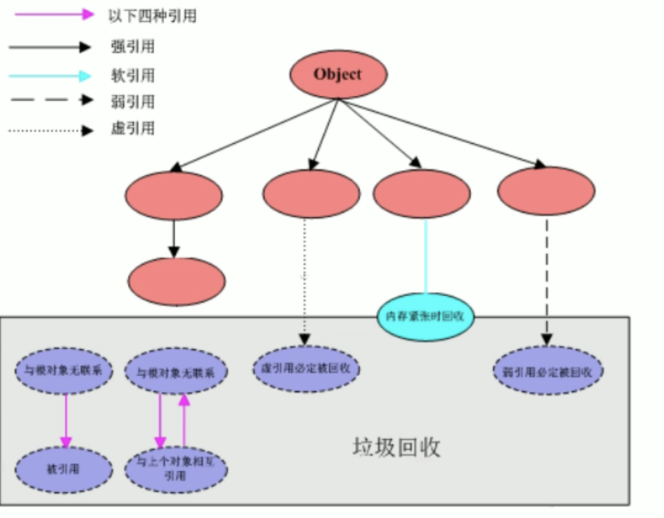

# 四、OOM的认识

## 1、StackOverflowError

栈溢出。代码如下，其他关于栈的介绍，可以参考jvm快速入门

```java
public class Test02 {
    public static void main(String[] args) {
        System.out.println("sssss");
        fun1();
        System.out.println("uuuuuu");

    }
    public static void fun1(){
        fun1();
    }
}

// Exception in thread "main" java.lang.StackOverflowError
```

以上代码递归调用自己，最终导致栈溢出，这是error级别错误，不是Exception

## 2、OutOfMemoryError: Java heap space

new一个大对象导致堆内存溢出

```java
public class Test01 {
    public static void main(String[] args) throws InterruptedException {
        byte[] bytes = new byte[10 * 1024 * 1024];
    }
}

抛出异常
  Exception in thread "main" java.lang.OutOfMemoryError: Java heap space
    at Demo03.Test01.main(Test01.java:17)
```

## 3、OutOfMemoryError: GC overhead limit

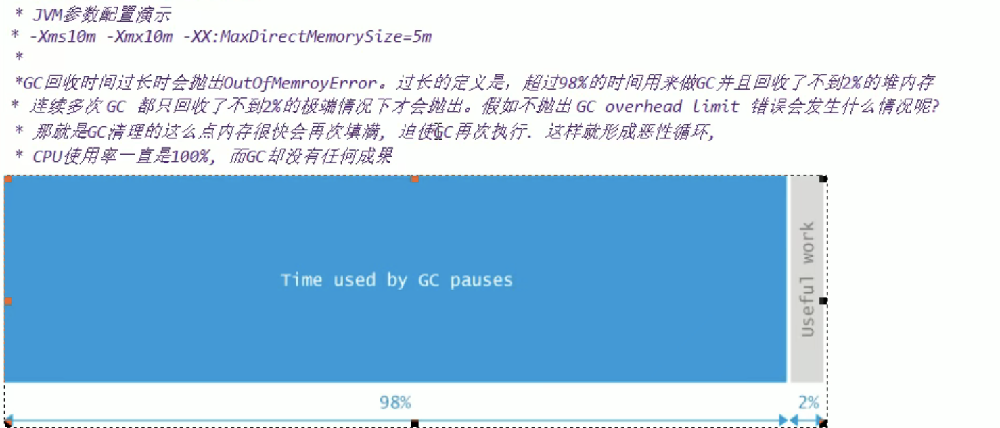

综上所述，用了98%的时间去GC却只回收了2%的堆内存，连续多次GC都只回收不到2%的内存的 极端情况下，会报错 GC overhead limit。

代码示例如下，数次GC，但是每次GC回收的内存小于2%，就会报错

```java
/**
 * @description: 模拟 java.lang.OutOfMemoryError: GC overhead limit exceeded
 * -Xms10m -Xmx20m -XX:+PrintGCDetails -XX:MaxDirectMemorySize=5m
 * MaxDirectMemorySize：直接内存大小，因为本机内存太大，所以设置的小一点
 *
 * @Author: wangchao
 * @Date: 2021/7/31
 */
public class GCOverheadDemo {
    public static void main(String[] args) {
        int i = 0;
        ArrayList<Object> list = new ArrayList<>();
        try {
            while (true){
                // TODO 记得关注 https://www.runoob.com/java/java-string-intern.html
                list.add(String.valueOf(++i).intern());
            }
        }catch (Throwable e){
            System.out.println("***************i:"+i);
            e.printStackTrace();
            throw e;
        }
    }
}

// 输出
java.lang.OutOfMemoryError: GC overhead limit exceeded
```

## 3、OutOfMemoryError: Direct buffer memory

```java
//  -Xms10m -Xmx20m -XX:+PrintGCDetails -XX:MaxDirectMemorySize=5m
public class DirectBufferMemoryDemo {
    public static void main(String[] args) {
       // 默认是本机的1/4 ，为了测试，我们将直接内存调小   -XX:MaxDirectMemorySize=5m
        System.out.println("配置的maxDirectMemory:"+(VM.maxDirectMemory()/(double)1024/1024)+"MB");
        ByteBuffer byteBuffer = ByteBuffer.allocateDirect(6 * 1024 * 1024);
    }
}
```

异常原因如下

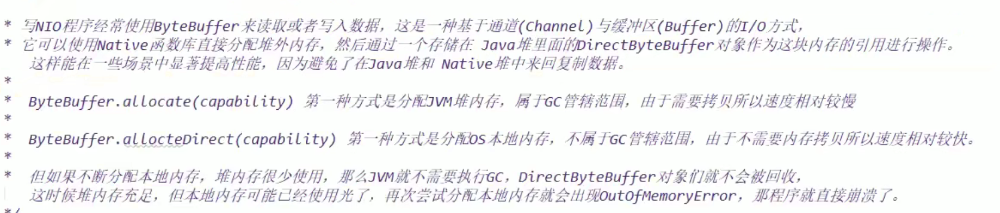

## 4、OutOfMemoryError: unable to create new native thread

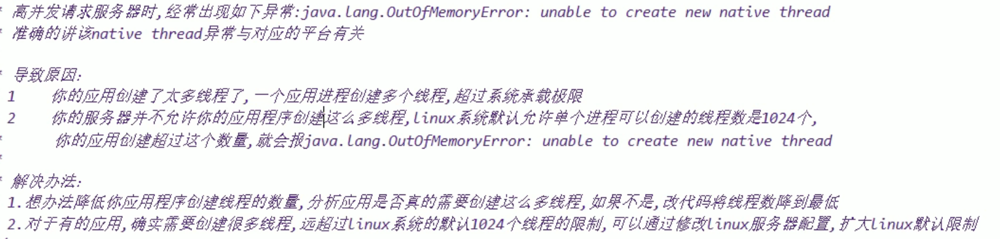

代码展示错误

```java
public class UnableCreateNewThreadDemo {
    public static void main(String[] args) {
        for (int i = 0; i < 10000; i++) {
            new Thread(() -> {
                System.out.println(Thread.currentThread().getName() + "start");
                try {
                    Thread.sleep(Integer.MAX_VALUE);
                } catch (InterruptedException e) {
                    e.printStackTrace();
                }
            }, "" + i).start();
        }
    }
}

报错：
Exception in thread "main" java.lang.OutOfMemoryError: unable to create new native thread
	at java.lang.Thread.start0(Native Method)
	at java.lang.Thread.start(Thread.java:717)
	at com.supkingx.base.l_jvm.gc.oom.UnableCreateNewThreadDemo.main(UnableCreateNewThreadDemo.java:18)
```

## 5、OutOfMemoryError: Metaspace

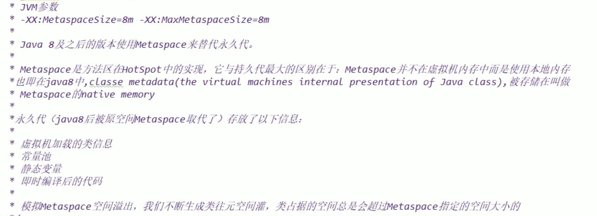

代码默认报错如下，使用Enhancer创建数个代理类挤爆MetaSpace

```java
// -XX:MetaspaceSize=5m -XX:MaxMetaspaceSize=20m
public class MetaspaceOOMDemo {
    static class OOMTest {
    }

    public static void main(String[] args) {
        int i = 0;

        try {
            while (true) {
                i++;
                Enhancer enhancer = new Enhancer();
                enhancer.setSuperclass(OOMTest.class);
                enhancer.setUseCache(false);
                enhancer.setCallback(new MethodInterceptor() {
                    @Override
                    public Object intercept(Object o, Method method, Object[] objects, MethodProxy methodProxy) throws Throwable {
                        return methodProxy.invokeSuper(o, objects);
                    }
                });
                Object o = enhancer.create();
                System.out.println("创建类:" + o);
            }
        } catch (Throwable e) {
            System.out.println("多少次后发生了异常：" + i);
            e.printStackTrace();
        }
    }
}

报错
Caused by: java.lang.OutOfMemoryError: Metaspace
	at java.lang.ClassLoader.defineClass1(Native Method)
	at java.lang.ClassLoader.defineClass(ClassLoader.java:756)
	... 14 more
```

# 五、垃圾收集器

> 垃圾回收器有哪些？回收的方式有哪些？
>
> GC四大算法是内存回收的方法论，垃圾收集器就是算法落地实现
>
> 目前还没有完美的垃圾收集器，只有针对具体应用最合适的收集器。

1、垃圾回收的方式：serialOldGc（已废弃）、serial（串行）、parallel（并行）、cms（concMarkSweepGC）（并发）、ParNewGC、ParallelOldGC、G1

2、如何查看服务器的垃圾收集器？

命令：java -XX:+PrintCommandLineFlags -version

```shell
// 查看使用了那种GC收集器
superking@wangchaodeMacBook-Pro examination % java -XX:+PrintCommandLineFlags -version
-XX:G1ConcRefinementThreads=10 -XX:GCDrainStackTargetSize=64 -XX:InitialHeapSize=268435456 -XX:MaxHeapSize=4294967296 -XX:+PrintCommandLineFlags -XX:ReservedCodeCacheSize=251658240 -XX:+SegmentedCodeCache -XX:+UseCompressedClassPointers -XX:+UseCompressedOops -XX:+UseG1GC 

// 查看是否使用某种收集器
superking@wangchaodeMacBook-Pro examination % jinfo -flag UseSerialGC 3149
-XX:-UseSerialGC
```

3、生产上如何配置垃圾收集器？


4、谈谈你对垃圾收集器的理解？

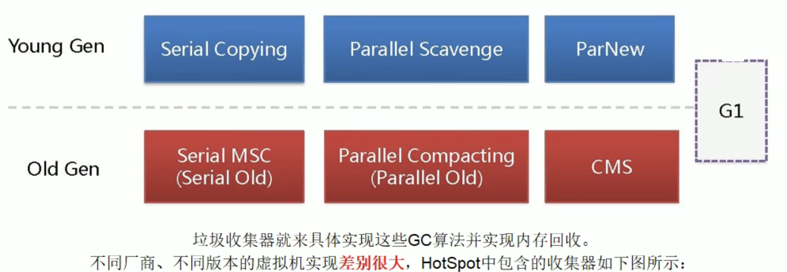

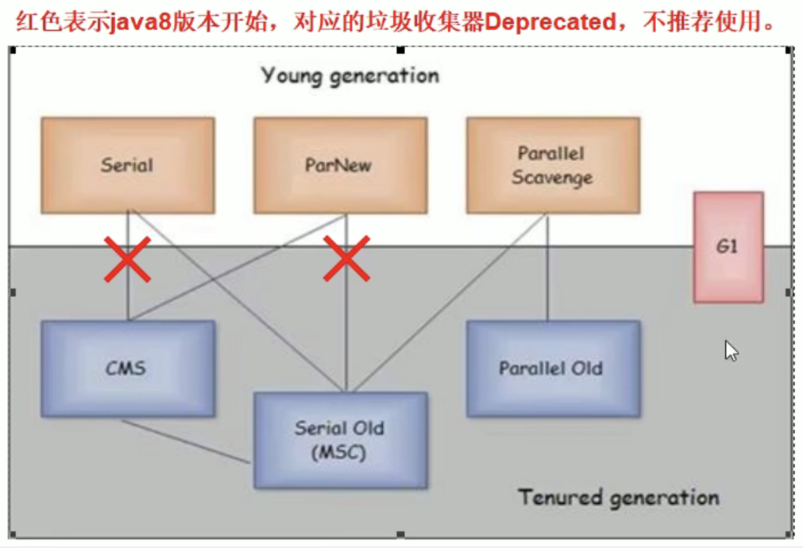

上图的意思是：假如新生代用了Serial垃圾收集器，那么老年代就会使用serial old收集器。其他的线条类似。

GC日志中约定的单词

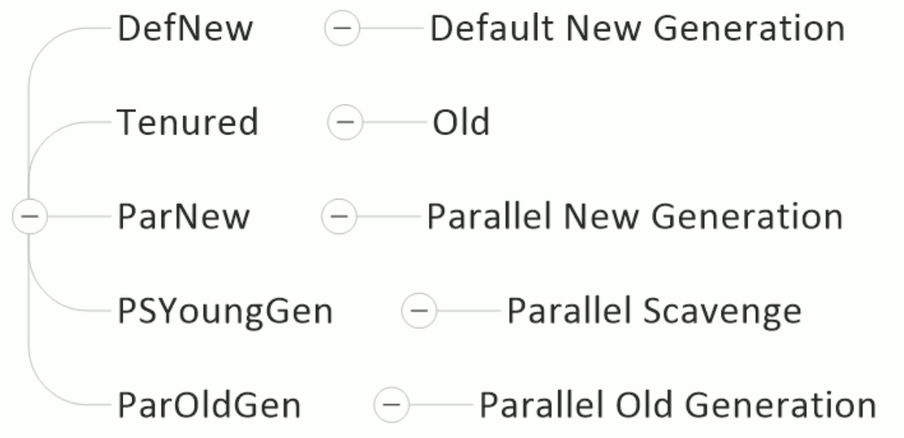


## 1、串行垃圾回收器（Serial）

它为单线程环境设计且只使用一个线程进行垃圾回收，会暂停所有用户线程。所以不适合服务器环境。对于限定单个CPU环境来说，没有现存交互的开销可以获得最高的单线程垃圾收集效率，因此Serial垃圾搜集器依然是java虚拟机运行在Client模式下默认的新生代垃圾收集器。

对应参数：-XX:+UseSerialGC
开启后，新生代用Serial，老年代用Serial Old ，即新生代老年代都会使用串行回收收集器，新生代使用复制算法，老年代使用标记-整理算法。


## 2、并行垃圾回收器（parallel）

多个垃圾收集线程并行工作（其实就是Serila收集器的新生代并发多线程版本），此时用户线程是暂停的，适用于科学计算/大数据处理、首台处理等弱交互环境，parNew最常见的应用就是配合老年代的CMSGC工作

- ParNew

对应参数：-XX:UseParNewGC    
开启后值影响新生代的收集，不影响老年代，开启上诉参数后，会使用：ParNew（Young区）+Serial Old的收集器组合使用，新生代使用复制算法，老年代采用标记-整理算法。

备注：-XX:ParallelGCThreads 限制线程数量，默认开启和CPU数目相同的线程数

- parallel Scavenge

类似于ParNew，使用复制算法。俗称吞吐量优先收集器。

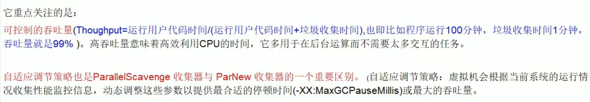

对应参数：-XX:+UseParallelGC 或-XX:+UseParallelOldGC
这两个参数可相互激活即，配置了一个，另外一个也会自动配置，在新生代用了ParallelGC，老年代会自动切换到ParallelOldGC

备注：-XX:ParallelGCThreads=N 限制线程数量，默认开启和CPU数目相同的线程数


## 3、并发垃圾回收器 CMS（ConcMarkSweepGC）

是一种以获取最短回收停顿时间为目标的收集器。用户线程和垃圾线程可以同时进行（不一定是并行，可能交替进行），不需要停顿用户线程，互联网公司多用它，适用于对响应时间有要求的场景。

- 开启参数：-XX:+UseConcMarkSweepGC 
  开启该参数后会自动将-XX:UseParNewGC打开，新生代用ParNew，老年代用CMS，Serial OLD作为CMS出错的后备收集器。老年代使用标记清除算法。

该回收器分为四个步骤：

1、初始标记（CMS inital mark）和用户线程不一起运行
只是标记下GC Roots能直接关联的对象，速度很快，仍然需要暂停所有的工作线程。

2、并发标记（CMS concurrent mark）和用户线程一起运行
进行GC Roots跟踪过程，和用户线程一起，不需要暂停工作线程。主要标记过程，标记全部对象。

3、重新标记（CMS remark）和用户线程不一起运行
为了修正正在并发标记期间，因用户程序继续运行而导致标记产生变动的那一部分对象的标记记录，仍然需要暂停所有的工作线程。由于并发标记时，用户线程依然运行，因此在正式清理之前，再做修正。

4、并发清除（CMS concurrent sweep）和用户线程一起运行
清除GC Roots不可达对象，和用户线程一起工作，不需要暂停工作线程。基于标记结果，直接清理对象
由于耗时最长的并发标记和并发清除过程中，垃圾收集线程可以和用户现在一起并发工作，所以总体上看CMS收集器的内存回收和用户线程是一起并发进行的。

- 优点：并发收集，停顿低（用户线程停顿低）
- 缺点：
  - 并发执行，多CPU资源压力大
    - CMS在收集时会和用户线程同时对堆内存进行占用，也就是说CMS必须在老年代堆用尽之前完成垃圾回收，否则CMS失败，出发担保机制，串行老年代收集器上场，以STW（什么是STW，看下文的备注）的方式进行一次GC，从而造成大量的时间浪费。
  - 采用标记清除算法会导致大量的碎片
    - 标记清除算法无法整理碎片空间，老年代空间会随着时长被耗尽，最后不得不通过担保机制对堆内存进行压缩，CMS也提供了参数-XX:CMSFullGCsBeForeCompaction（默认值是0，即每次都进行内存整理）指定多少次CMS后进行一次压缩的Full GC。

备注：

> Java中Stop-The-World机制简称STW，是在执行垃圾收集算法时，[Java](http://www.jb51.net/list/list_207_1.htm)应用程序的其他所有线程都被挂起（除了垃圾收集帮助器之外）。Java中一种全局暂停现象，全局停顿，所有Java代码停止，native代码可以执行，但不能与JVM交互；这些现象多半是由于gc引起

以下就是使用了CMS后的效果

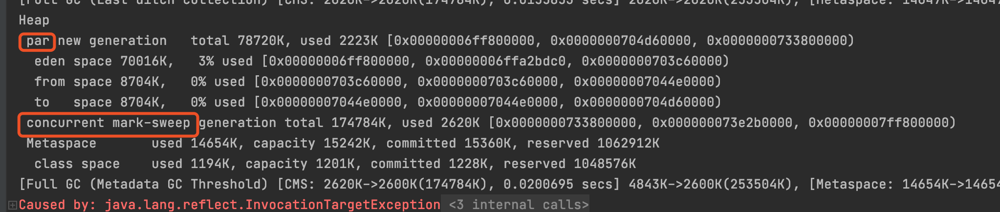


## 4、G1垃圾回收器

G1垃圾回收器将堆内存分割成不同的区域然后并发的对其进行垃圾回收


## 5、总结

### 如何选择合适的垃圾收集器

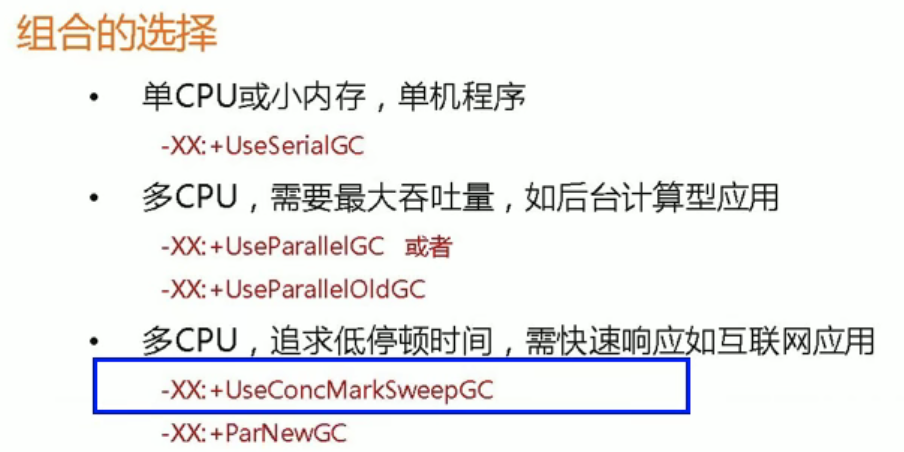

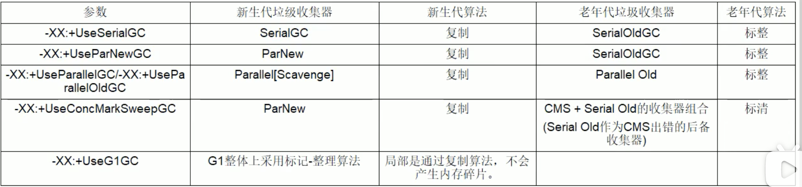


