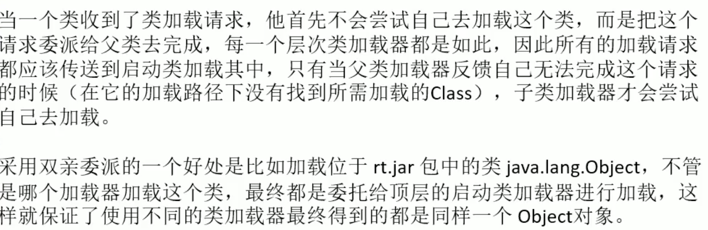
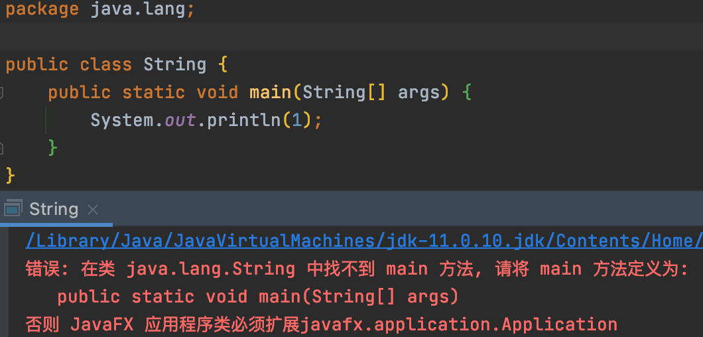
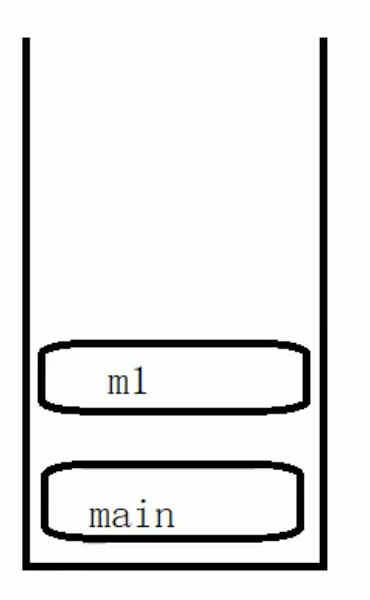
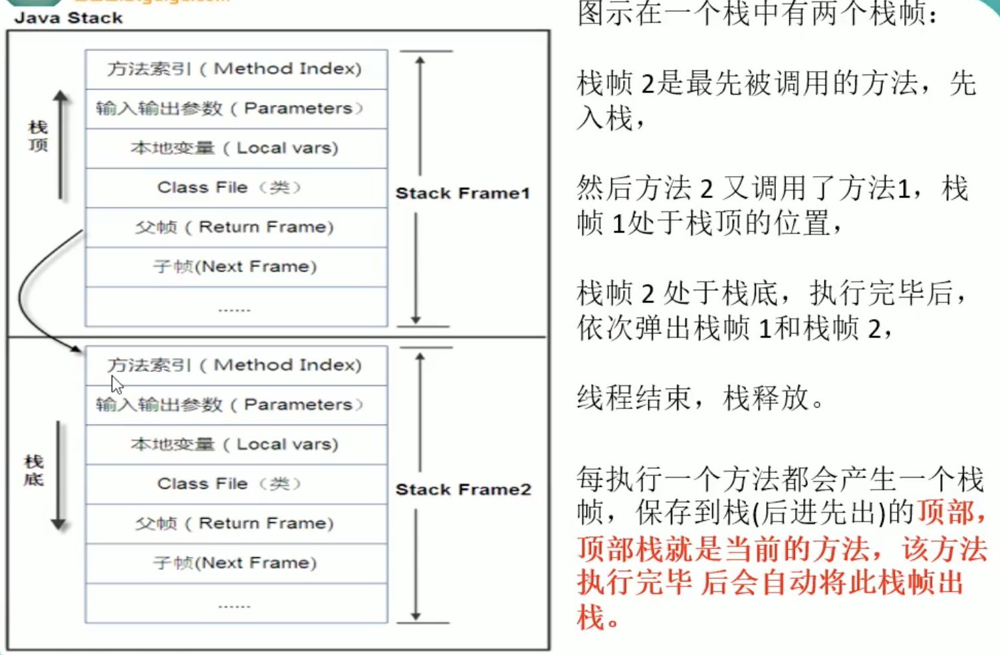
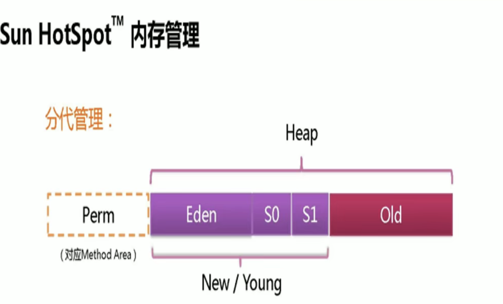
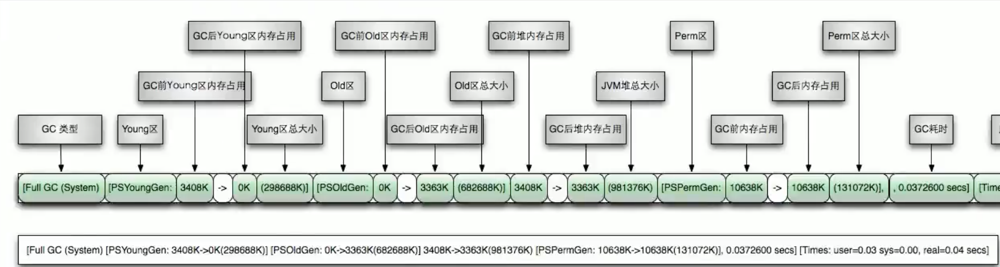
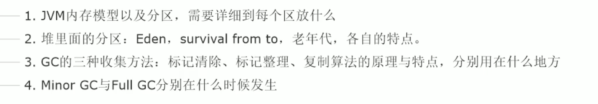

# 一、JVM体系结构概述


亮色：所有线程共享

灰色：线程私有

栈管运行、堆管存储

## 1、类装载器


上图中，`Car Class`就在方法区，它就是类的结构信息

Class文件开头特定的文件标识，是 `cafe babe`，如下图


### 类装载器的种类

- 启动类装载器（BootStrap）C++

  系统自带的类使用

- 扩展类加载器（Extension）/（PlatformClassLoader）Java

  我们自己写的类使用

- 应用程序类加载器（AppClassLoader），

  java也叫系统类加载器，加载当前应用的classpath的所有类


- 用户自定义加载器

  Java.lang.ClassLoader的子类，用户可以定制类的加载方式。

#### 测试装载器

```java
public class Test01 {
    public static void main(String[] args) {
        Object o = new Object();
        // 查看Object是谁装载进来的
        System.out.println(o.getClass().getClassLoader());
        Person person = new Person();
        // 查看person是谁装载进来的
        System.out.println(person.getClass().getClassLoader());
        System.out.println(person.getClass().getClassLoader().getParent());
    }
}

结果
null
jdk.internal.loader.ClassLoaders$AppClassLoader@512ddf17
jdk.internal.loader.ClassLoaders$PlatformClassLoader@75bd9247
```

为什么o.getClass().getClassLoader()=null？

> 因为Object是最高父类，它是由BootStrap（C++）装载进来的，java就显示null

为什么person.getClass().getClassLoader())不是null

> 因为person不是最高父类，它是由AppClassLoader装载进来的

person.getClass().getClassLoader().getParent() ，是拓展类加载器，因为Person不是系统自带的，使我们自己写的

### 双亲委派



当自己定义一个包，java.lang和系统自带的lang包冲突时，系统会优先加载系统自带的包，防止系统自己的代码被污染（即沙箱安全）。测试代码如下：



## 2、Execution Engine

执行引擎负责解释命令，提交给操作系统执行


## 3、本地方法接口

只要是被关键字native修饰的，都是调用的与java无关的、底层的操作系统库、C语言函数库

```
private native void start0();
```

native放在native method stack方法栈里面


## 4、程序计数器

> Program Counter Register（程序计数器） 
>
> Register(寄存器)：cpu中的寄存器 存储的下一步要执行的程序的地址

功能：程序的排班执行表，记录下一步要做什么事情，即这个代码从哪跳到哪？即from 地址1 同 地址2


## 5、方法区

> 线程共享，它存储每一个类的结构信息（例如：上面1、类装载器中的Car Class），例如运行时常量池（Runtime Constant Pool）、普通/静态常量和方法数据、构造函数和普通方法的字节码内容,即编译器编译后的代码等数据。上面讲的是**规范**。**虽然JVM规范将方法区描述为堆的一个逻辑部分，但是它却还有一个别名叫做Non-heap（非堆），目的就是要和堆分开。**
>
> 实例变量存在堆内存中，和方法区无关。
>
> 对于HotSpot虚拟机 ，很多开发者习惯将**方法区称之为“永久代(permanent gen)”**，但是严格本质上说两者不同，或者说使用永久代来实现方法区而已，永久代是方法区（相当于是一个接口inteface）的一个实现，jdk1.7的版本中，**已经将原本放在永久代的字符串常量池移走了**

上诉重点加黑体部分。

1、虽然JVM规范将方法区描述为堆的一个逻辑部分，但是它却还有一个别名叫做Non-heap（非堆），目的就是要和堆分开。
2、jdk1.7的版本中，已经将原本放在永久代的字符串常量池移走了

3、注意，jdk8版本，已经将永久代称之为元空间，且结构有变化，具体jdk8中的元空间介绍，关注后面。


永久代和元空间的介绍，关注后面章节。这里将不再展开介绍

## 6、栈

> 管运行，不存在垃圾回收

1、管运行：最典型的例子：报错时 打印出栈信息（printstackTrace），这就是程序运行的信息。

2、栈保存哪些东西：用于存储局部变量表。局部变量表存放了编译期可以知道长度的各种基本数据类型（boolean、byte、short、char、int、float、long、double）、对象引用（reference类型，存储对象在堆内存的首地址）。方法执行完自动释放。

3、java中的方法（例如main方法）==虚拟机中的 栈帧

4、栈帧中主要保存三种数据

- 本地变量（Local Variables）：输入参数和输出参数以及方法内的变量
- 栈操作（Operand Stack）：记录出栈、入栈的操作
- 栈帧数据（Frame Data）：包括类文件、方法等等。



5、栈的运行原理




5、栈溢出

```java
public class Test02 {
    public static void main(String[] args) {
        System.out.println("sssss");
        fun1();
        System.out.println("uuuuuu");

    }
    public static void fun1(){
        fun1();
    }
}

// Exception in thread "main" java.lang.StackOverflowError
```

以上代码递归调用自己，最终导致栈溢出，这是error级别错误，不是Exception


## 7、栈、堆、方法区的交互关系


通俗理解方法区：

假如 Person person1 = new Person()；Person person2 = new Person()；Person person3 = new Person()；那么reference中村的是person1、person3、person2这些引用（地址），java堆中存的是三个引用对应的三个new Person()，方法区存的就是一个Person.class （模板/规范）


## 7、堆

> 管存储，存储对象、实例，和数组
>
> 一个JVM实例只有一个堆内存，堆内存的大小是可调节的
>
> 逻辑上分三个部分：新生、养老、元空间
>
> 物理上分两个部分：新生、养老


### （1）新生代

#### 伊甸园区（Eden Space）

不停的new。。。满了之后，会产生GC，这个GC发生在Eden Space，可以叫做GC=Young GC=轻GC=Minor GC
之后，Eden 基本全部清空，剩下没有被清除的会移动到Survivor 0 Space

#### 幸存者0区（Survivor 0 Space）

承接Eden Space的幸存者，如果0区满了，再进行垃圾回收，剩下的移到1区

#### 幸存者1区（Survivor 1 Space）

承接0区过来的幸存者，满了就垃圾回收。

当一个类被回收过15次（该次数可以通过参数配置-XX:MaxTenuringThreshold=15）之后，进入老年代

#### 注意：

Survivor 0 Space=S0=from
Survivor =1 Space=S1=to

from区和to区，他们的位置和名分不是固定的，每次GC后会交换，GC之后交换，谁空谁是to。


### （2）老年代（(old)Tenure Generation Space）

满了之后会产生 Full GC = FGC=MajorGC，进行老年代的垃圾清理。
Full GC多次后发现养老区空间没办法腾出来，就会报错（OOM，java heap space堆内存溢出）

> 彩蛋：堆内存溢出，说明jvm的堆内存不够了，原因有二：
>
> 1、堆内存设置太小，java的堆内存可以通过参数-Xms 和 -Xmx来调整
>
> 2、代码中创建了大量大对象，并且长时间不能被垃圾收集器收集（存在被引用）


### GC整体流程


# 二、元空间（metaspace）/永久代（Permanent Space）



jdk7是Permanent Space，jdk8变成了metaspace，由于现在

> 元空间/永久代存储肯定会用的东西，例如rt.jar这个包就加载在这永久代里面

jdk7及之前版本的叫法，永久存储区是一个常驻内存区域，用于存放JDK自身携带的Class，被装载进此区域的数据是不会被垃圾回收器回收的，关闭JVM才会释放此区域所占用的内存。

元空间和永久代最大的区别在于：永久带使用的是JVM的堆内存，而元空间使用的的本机的物理内存，因此默认情况下，元空间的大小仅受本地内存限制。类的元数据放入native momery，**字符串池和类的静态变量放入java堆中**，这样可以加载多少类的元数据就不再由MaxPermSize控制，而由系统的实际可用空间来控制。

一般默认元空间只占用本机物理内存的1/4，


# 三、堆参数调优入门


> 疑问：你的机器内存是16G，那JVM的堆内存能分配到多少？？

## （1）调优1

-Xms 初始堆内存，默认是本机物理内存的1/64

-Xmx 最大堆内存，默认是本机物理内存的1/4

-XX:+PrintGCDetails  输出详细的GC处理日志

```java
public class HelloGC {
    public static void main(String[] args) throws InterruptedException {
        // jvm目前使用的总内存
        final long totalMemory = Runtime.getRuntime().totalMemory();
        // jvm能使用的最大内存
        final long maxMemory = Runtime.getRuntime().maxMemory();
        System.out.println("TOTAL_MEMORY(-Xms) = "+totalMemory + "(字节)、"+(totalMemory/(double)1024/1024)+"MB");
        System.out.println("MAX_MEMORY(-Xmx) = "+maxMemory + "(字节)、"+(maxMemory/(double)1024/1024)+"MB");
    }
}

输出
TOTAL_MEMORY(-Xms) = 10485760(字节)、10.0MB
MAX_MEMORY(-Xmx) = 10485760(字节)、10.0MB
```

认为制造GC

```java
public class Test01 {
    public static void main(String[] args) throws InterruptedException {
        byte[] bytes = new byte[10 * 1024 * 1024];
    }
}

抛出异常
  Exception in thread "main" java.lang.OutOfMemoryError: Java heap space
    at Demo03.Test01.main(Test01.java:17)
```

截取部分GC日志，并加以分析

```
[GC (Allocation Failure) [PSYoungGen: 1545K->496K(6144K)] 1545K->528K(26624K), 0.0009955 secs] [Times: user=0.01 sys=0.00, real=0.00 secs] 
[GC (Allocation Failure) [PSYoungGen: 496K->512K(6144K)] 528K->568K(26624K), 0.0006948 secs] [Times: user=0.00 sys=0.00, real=0.00 secs] 
[Full GC (Allocation Failure) [PSYoungGen: 512K->0K(6144K)] [ParOldGen: 56K->405K(13824K)] 568K->405K(19968K), [Metaspace: 2995K->2995K(1056768K)], 0.0043182 secs] [Times: user=0.03 sys=0.00, real=0.01 secs] 
```

GC日志解析


Full GC日志解析




# 四、GC

> GC（分代收集算法）1、次数上频繁收集Young 区；2、次数上较少收集Old区；3、基本不动元空间
>
> java系统后台至少几个线程？
> 两个：一个main线程、一个GC


## 1、GC算法总体概述

GC的回收流程，可以参考上面堆的内容。

- Minor GC 和 Full GC的区别
  - 普通GC（Minor GC）：只针对新生代区域的GC，指放生在新生代的垃圾收集动作，因为大多数java对象的存活率都不高，所以Minor GC 非常频繁，一般回收速度也比较快
- 全局GC（Major GC / Full GC）
  - 只发生在老年代的垃圾收集动作，出现了Major GC，经常会伴随至少一次的Minor GC（但并不是绝对的）。Major GC的速度一般要比minor GC慢10倍以上。（慢的原因：老年代的空间大）

## 2、四大算法

### （1）引用计数法

该算法已废弃。


有对象引用就+1、没对象用就-1，即有对象被引用就不回收


### （2）复制算法

GC里面最常用的算法，年轻代中使用的是Minor GC，这种GC算法采用的是复制算法（Copying）


#### 缺点

需要双倍空间

#### 优点

没有标记清除过程，效率高

没有内存碎片，可以实现快速内存分配（bump-the-pointer）

### （3）标记清除（Mark-Sweep）

一般用在old区，标记清除和标记整理 混合实现。


若在程序运行期间，内存被耗尽，GC线程就会触发并将程序暂停，随后将要回收的对象标记一遍，最终统一回收这些对象，完成标记清理工作，接下来继续让程序运行。

#### 优点

不需要额外的空间

#### 缺点

两次扫描（第一次标记，第二次扫描堆内存，清除标记的），耗时严重

会产生内存碎片

### （4）标记压缩（Mark-Compact）

> 该算法就是比标记清除算法多了一个整理的步骤

一般用在old区，标记清除和标记整理 混合实现。当进行多次GC后才会Compact


### 还有更牛逼的算法吗？

有，在java9 及其以上，有个G1回收算法


### 总结





# 五、总结

