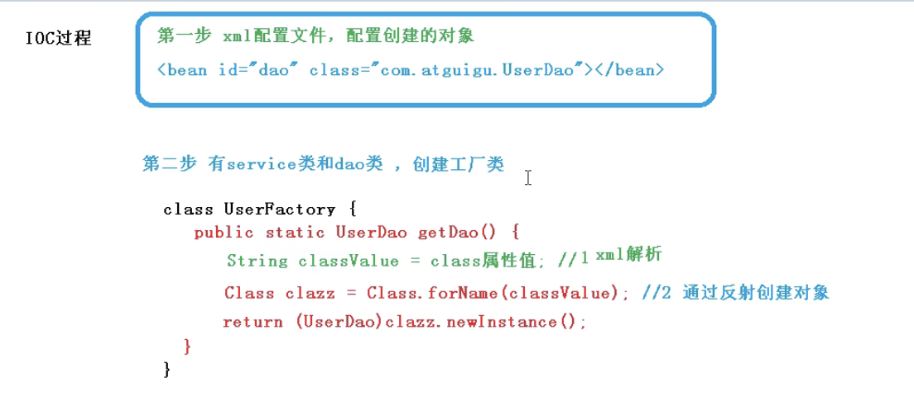

# 一、Spring


Spring框架由七个部分组成，分别是Spring Core、Spring AOP、Spring ORM、Spring DAO、Spring Context、Spring Web、Spring Web MVC

## 1、Sping Bean作用域

> 默认情况下Sping只为每个在IOC容器里面声明的bean创建唯一一个实例，整个IOC容器范围内只能共享该实例，该作用域被称为singleton

- singleton 在SpingIOC容器中仅存在一个bean实例，Bean以单实例的方式存在
- prototype 每次调用getBean()时都会返回一个新的实例
- request 每次Http请求都会创建一个新的Bean，该作用域仅适用于WebApplicationContext环境
- session 同一个HTTP Session共享一个bean，不同的HTTP Session适用不同的Bean。该作用域仅适用于WebApplicationContext环境。

### springbean是否线程安全

> Spring容器中的Bean是否线程安全，容器本身并没有提供Bean的线程安全策略，因此可以说Spring容器中的Bean本身不具备线程安全的特性，但是具体还是要结合具体scope的Bean去研究。

原型Bean
　　对于原型Bean,每次创建一个新对象，也就是线程之间并不存在Bean共享，自然是不会有线程安全的问题。

单例Bean
　　对于单例Bean,所有线程都共享一个单例实例Bean,因此是存在资源的竞争。

　　如果单例Bean,是一个无状态Bean，也就是线程中的操作不会对Bean的成员执行**查询**以外的操作，那么这个单例Bean是线程安全的。比如Spring mvc 的 Controller、Service、Dao等，这些Bean大多是无状态的，只关注于方法本身。

#### 解决bean的线程安全问题？

1、加注解@Scope(value = "prototype") // prototype singleton

2、对成员变量使用ThreadLocal

3、

```java
public class MyConfig {
    @Bean
    @Scope(value = "prototype")
    public User user(){
        return new User();
    }    
}
```

总结:

1、在@Controller/@Service等容器中，默认情况下，scope值是单例-singleton的，也是线程不安全的。
2、尽量不要在@Controller/@Service等容器中定义静态变量，不论是单例(singleton)还是多实例(prototype)他都是线程不安全的。
3、默认注入的Bean对象，在不设置scope的时候他也是线程不安全的。
4、一定要定义变量的话，用ThreadLocal来封装，这个是线程安全的

## 2、IOC

> 控制反转，把创建对象的过程和对象之间的调用过程，交给Spring进行管理。
>
> 目的：耦合度降低。
>
> IOC的简单实现如下：
>
> ```java
> ApplicationContext context = new ClassPathXmlApplicationContext("bean.xml");
>         // 获取配置创建的对象
>         User user = context.getBean("user", User.class);
>         System.out.println(user);
>         user.add();
> ```

### 2.1 IOC的底层原理

> xml解析，工厂模式，反射

#### 工厂模式

原始方式如下，耦合度太高


降低耦合度，如下介绍工厂模式


通过UserFactory.getDao()获取对象，降低了耦合度，注：是不是看着优点像单例模式，哈哈哈哈。


#### IOC的简单过程

将解耦降到最低，主需要改配置文件即可，代码不用改



### 2.2 IOC接口（BeanFactory）

1、IOC思想基于IOC容器完成，IOC容器底层就是对象工厂

2、Spring提供IOC容器实现方式：（两个接口）

（1）BeanFactory：IOC容器基本实现，是Sping内部的使用接口，不提供开发人员使用。加载配置文件的时候不会去创建对象，在获取(使用)对象的时候才去创建。

（2）ApplicationContext：BeanFactory接口的子接口，提供更多强大的功能，一般由开发人员使用。在加载配置文件的时候就会创建对象。

3、ApplicationContext接口有实现类


### 2.3 Bean管理

> 1、创建对象 2、注入属性
>
> 方式：xml、注解

1、Spring有两种bean，一种是普通bean，另外一种是工厂bean （FactoryBean）

2、普通bean：在配置文件中定义bean类型就是返回类型

如下里面的context.getBean，就是返回一个普通bean

```java
ApplicationContext context = new ClassPathXmlApplicationContext("bean.xml");
// 获取配置创建的对象
User user = context.getBean("user", User.class);
System.out.println(user);
user.add();
```

3、工厂bean：在配置文件定义bean类型可以和返回类型不一样

第一步，创建类，让这个类作为工厂bean，实现接口FactoryBean

第二步，实现接口里面的方法，在实现的方法中定义返回的bean类型。

代码如下可见，Dog对象的获取是靠getObject，这里明显返回的是User

```java
public class Dog implements FactoryBean<User> {
    @Override
    public User getObject() throws Exception {

        return new UserImpl();
    }
    @Override
    public Class<?> getObjectType() {
        return null;
    }
}
```

执行如下代码，则报错

```java
ApplicationContext context = new ClassPathXmlApplicationContext("bean.xml");
Dog dog = context.getBean("dog", Dog.class);
System.out.println(dog);

//报错信息如下，期望的是Dog，实际是UserImpl
Exception in thread "main" org.springframework.beans.factory.BeanNotOfRequiredTypeException: Bean named 'dog' is expected to be of type 'com.supking.factorybean.Dog' but was actually of type 'com.supking.service.impl.UserImpl'
```

需要修改返回值，代码如下，指定返回值为User，则不会报错。

```java
ApplicationContext context = new ClassPathXmlApplicationContext("bean.xml");
// 注意配置文件中dog对应的类是com.supking.factorybean.Dog
// <bean id="dog" class="com.supking.factorybean.Dog"></bean>
User user = context.getBean("dog", User.class);
System.out.println(user);
```

### 2.4 自动装配

#### 手动装配如下

```xml
<bean id="orders" class="com.supking.bean.Orders" init-method="initMethod" destroy-method="destroyMethod">
        <property name="name" value="phone"></property>
 </bean>

<bean id="emp" class="com.supking.autowire.Emp">
        <property name="dept" ref="dept"></property>
 </bean>

<bean id="dept" class="com.supking.autowire.Dept"></bean>
```

#### 自动装配

```xml
<!--  实现自动装配
     autowire，配置自动装配
     autowire属性常用两个值 byName:根据名字  type:根据类型(缺点，多个相同类型的bean会失败)
-->
    <bean id="emp" class="com.supking.autowire.Emp" autowire="byName"></bean>
    <bean id="dept" class="com.supking.autowire.Dept"></bean>
```

引入外部属性文件


### 2.5 注解管理bean

> 注解是什么？注解是代码标记，格式，@注解名称（属性名称=属性值,.........），可以作用在类、方法、属性上面；
>
> 使用注解的目的：简化xml的配置

引入重要依赖

```java
<dependency>
            <groupId>org.springframework</groupId>
            <artifactId>spring-aop</artifactId>
            <version>${spring.version}</version>
        </dependency>
```

```xml
    <!--告知spring在创建容器时，要扫描的包，配置所需要的标签不是在beans的约束中，
    而是一个名称为context名称空间和约束中
    use-default-filters:false，不再设置默认filter(扫描所有东西)，知己配置filter
    -->
    <context:component-scan base-package="com.supkingx" use-default-filters="false">
<!--        指定扫描哪些内容-->
        <context:include-filter type="annotation" expression="org.springframework.stereotype.Controller"/>
    </context:component-scan>

    <context:component-scan base-package="com.supkingx">
        <!--        指定不扫描哪些内容-->
        <context:exclude-filter type="annotation" expression="org.springframework.stereotype.Controller"/>
    </context:component-scan>
```


#### Spring中针对bean创建对象，提供了哪些注解

> @Component、@Service、@Controller、@Repository、

上面四个注解的功能是一样的，都可以用来创建bean实例

#### 基于注解方式实现属性注入

@Autowired：根据属性类型进行自动装配

@Qualifier（value=”userDaoImpl“）：根据属性名称进行注入，需要和@Autowired一起使用

@Resource（name=”userDaoImpl“）：可以根据类型注入，可以根据名称注入

@Value：注入普通类型

#### 完全注解开发

无需xml

```java
@Configuration
@ComponentScan(basePackages = {"com.supkingx"})
public class SpringConfig {
}
```

```java
// 使用AnnotationConfigApplicationContext
public static void main(String[] args) {
        ApplicationContext context = new AnnotationConfigApplicationContext(SpringConfig.class);
        UserService userService = context.getBean(UserService.class);
        userService.add();
    }
```


## 3、AOP

> Apsect Oriented Programming
> 面向切面：不修改源代码进行功能的增强。利用AOP可以对业务逻辑的各个部分进行隔离，从而使得业务逻辑各个部分之间的耦合性降低，提高程序的可用性，同时提高了开发效率。
>
> 通俗描述：不通过修改源代码，在主干方法里面添加新功能。
>
> 

### 优先级

- 前置通知 (@Before) 。
- 返回通知 (@AfterReturning) 。
- 异常通知 (@AfterThrowing) 。
- 后置通知 (@After)。
- 环绕通知 (@Around) :（优先级最高）

```java
@Aspect
@Component
public class SysTimeAspect {

 /**
  * 切入点
  */
 @Pointcut("bean(sysMenuServiceImpl)")
 public void doTime(){}

 @Before("doTime()")
 public void doBefore(JoinPoint jp){
  System.out.println("time doBefore()");
 }
 @After("doTime()")
 public void doAfter(){//类似于finally{}代码块
  System.out.println("time doAfter()");
 }
 /**核心业务正常结束时执行
  * 说明：假如有after，先执行after,再执行returning*/
 @AfterReturning("doTime()")
 public void doAfterReturning(){
  System.out.println("time doAfterReturning");
 }
 /**核心业务出现异常时执行
  * 说明：假如有after，先执行after,再执行Throwing*/
 @AfterThrowing("doTime()")
 public void doAfterThrowing(){
  System.out.println("time doAfterThrowing");
 }
 @Around("doTime()")
 public Object doAround(ProceedingJoinPoint jp)
   throws Throwable{
  System.out.println("doAround.before");
  try {
  Object obj=jp.proceed();
  return obj;
  }catch(Throwable e) {
  System.out.println("doAround.error-->"+e.getMessage());
  throw e;
  }finally {
  System.out.println("doAround.after");
  }
 }
}
```


总结

> around优先级最高，afterThrowing在after之后

### boot1和boot2对AOP顺序的影响

> boot1对应spring4，boot2对应spring5


spring4和spring5的AOP顺序对比结果


综上图中可以看到，spring5之后，@After的优先级被放到（@afterReturn和@AfterThrowing）之后了，@Around的环绕后通知被置到最后


### AOP的底层原理

动态代理

### AOP术语

- 连接点：类里面那些方法可以被增强，这些方法称为连接点
- 切入点：实际上真正被增强的方法
- 通知（增强）：实际增加的那一部分逻辑，即在原方法的前面和后面增加的那一部分逻辑
  - 前置、后置、环绕、异常、最终
- 切面：是一个过程，即把通知应用到切入点的过程。

表达式：权限修饰符 返回来下 全类名路径 方法名称 (参数列表)

例如

```java
 @After(value = "execution(* com.supkingx.UserService.add(..))")
```

```java
// 提取出表达式
@Pointcut(value = "execution(* com.supkingx.UserService.add(..))")
public void pointdemo(){

}

@After(value="pointdemo()")
public void xxx(){
  .............
}
```


## 4、TX（事务）


## 5、循环依赖

多个bea之间相互依赖，形成了一个闭环，构造器的循环依赖是无法解决的，**spring的singleton支持框架自动解决循环依赖**，而prototype不支持解决，

Spring内部是通过三级缓存来解决循环依赖的。（DefaultSingletonBeanFactory）

### 构造器注入的循环依赖

先创建连个互相依赖的类

```java
public class ServiceA{
    private ServiceB b;
    // 构造方法
    public ServiceA(ServiceB b){
       this.b = b;
    }
}

public class ServiceB{
    private ServiceA a;
    // 构造方法
    public ServiceB(ServiceA a){
       this.a = a;
    }
}
```

然后main函数中调用;发现该依赖无法解决

```java
new ServiceA(new ServiceB(new ServiceA(.......)))
```

### set方式注入

设置两个循环依赖的类

```java
public class ServiceBB{
    private ServiceAA aa;
    // set方法
    public void setServiceAA(ServiceAA serviceAA){
       this.aa = serviceAA;
    }
}

public class ServiceAA{
    private ServiceBB bb;
    // set方法
    public void setServiceBB(ServiceBB servicebb){
       this.bb = servicebb;
    }
}
```

然后main函数调用，set可以解决循环调用，因为new的时候是调用一个空的无参构造方法，此时并没有依赖。

```java
public class test{
   public static void main(String[] args){
     ServiceAA a = new ServiceAA();
     ServiceBB b = new ServiceBB();
     b.setServiceAA(a);
     a.setServiceBB(b);
   }
}
```

### Spring源码分析

#### Sping内部通过三级缓存来解决循环依赖

org.springframework.beans.factory.support.DefaultSingletonBeanRegistry

1、所谓的三级缓存如下。

```java
/** Cache of singleton objects: bean name to bean instance. */
// 一级
// 单例池：存放了已经经历了完整生命周期的bean对象，即已经初始化好的bean，也就是所谓的单例池
private final Map<String, Object> singletonObjects = new ConcurrentHashMap<>(256);

/** Cache of singleton factories: bean name to ObjectFactory. */
// 三级 存放可以生成Bean的工厂，存放FactoryBean。假如A类实现了FactoryBean，那么依赖注入的时候不是A类，而是A类产生的Bean
private final Map<String, ObjectFactory<?>> singletonFactories = new HashMap<>(16);

/** Cache of early singleton objects: bean name to bean instance. */
// 二级
// 存放早期暴露出来的bean对象，Bean的生命周期未结束（属性还没有填充完整），即存放的是实例化了，但是未初始化的bean
private final Map<String, Object> earlySingletonObjects = new HashMap<>(16);
```

只有单例的bean才会通过三级缓存提前暴露来解决循环依赖的问题，而非单例的bean，每次从容器中获取都是一个新的对象，都会重新创建，所以非单例的bean没有缓存，不会放到以上三个缓存中去。

上述三个缓存有四个重要的方法，getSingleton、doCreateBean、populateBean、addSingleton

> 彩蛋：实例化：就是new一个空间，即申请一块内存空间。初始化：完成属性的各种复制。


2、A/B利用三级缓存解决循环依赖的理论依据

- A创建过程中需要B，于是A将自己放到三级缓存里面，然后去实例化B
- B实例化过程中发现自己需要A，于是B先查一级缓存，然后二级，三级，直到找到A，最后把三级缓存里面的A放到二级缓存里面去实例化，并删除三级缓存里面的A
- B顺利初始化之后，将自己放到一级缓存里面（此时B里面的A依然是创建中状态），然后回来接着创建A，此时B已经创建结束，直接从一级缓存里面拿到B，然后A创建完成，并将A自己放到一级缓存里面。

## 6、Sping Bean的生命周期

### 1、BeanDefinition的解析


### 2、生命周期过程

#### 2.1 基本过程

1、从xml配置的Bean,@Bean注解，或者Java代码`BeanDefinitionBuilder`中读取Bean的定义,实例化Bean对象；

2、为bean的属性设置值和对其他bean引用（调用set方法）

3、调用bean的初始化方法（需要进行配置初始化方法）

4、bean可以使用了（对象获取到了）

5、当容器关闭的时候，调用bean的销毁方法（需要进行配置销毁的方法）

测试生命周期

init-method：初始化方法；  对应注解：@PostConstruct

destroy-method：销毁方法；对应注解：@PreDestroy

```xml
<bean id="orders" class="com.supking.bean.Orders" init-method="initMethod" destroy-method="destroyMethod">
        <property name="name" value="phone"></property>
    </bean>
```

```java
public class Orders {

    public Orders() {
        System.out.println("第一步....执行了无法参数的构造，创建了bean实例");
    }

    private String name;

    public void setName(String name) {
        this.name = name;
        System.out.println("第二步。。。。调用set方法设置属性的值。。。。。");
    }

    // 创建初始化方法
    public void initMethod(){
        System.out.println("第三步。。。执行初始化方法。。。。");
    }

    public void destroyMethod(){
        System.out.println("第五步。。。。执行销毁方法");
    }
}
```

```java
public static void main(String[] args) {
        ApplicationContext context = new ClassPathXmlApplicationContext("bean.xml");
        Orders orders = context.getBean("orders", Orders.class);
        System.out.println("第四步。。。获取到创建bean实例对象");
        // 手动让bean销毁
        ((ClassPathXmlApplicationContext)context).close();
    }

// 输出结果如下
第一步....执行了无法参数的构造，创建了bean实例
第二步。。。。调用set方法设置属性的值。。。。。
第三步。。。执行初始化方法。。。。
第四步。。。获取到创建bean实例对象
第五步。。。。执行销毁方法
```

#### 2.2 完全过程

基于第二种方法，如果加上了bean的后置处理器，即实现接口BeanPostProcessor，可以有七个步骤

1、从xml配置的Bean,@Bean注解，或者Java代码`BeanDefinitionBuilder`中读取Bean的定义,实例化Bean对象；

2、为bean的属性设置值和对其他bean引用（调用set方法）

**3、把bean的实例传递给bean的后置处理器（postProcessBeforeInitialization）**

4、调用bean的初始化方法（需要进行配置初始化方法）

**5、把bean的实例传递给bean的后置处理器（postProcessAfterInitialization）**

6、bean可以使用了（对象获取到了）

7、当容器关闭的时候，调用bean的销毁方法（需要进行配置销毁的方法）


##### 添加后置处理器

创建类，实现接口BeanPostProcessor，创建后置处理器

```java
public class MyBeanPost implements BeanPostProcessor {
    @Override
    public Object postProcessBeforeInitialization(Object bean, String beanName) throws BeansException {
        System.out.println("在初始化之前执行的方法");
        return bean;
    }

    @Override
    public Object postProcessAfterInitialization(Object bean, String beanName) throws BeansException {
        System.out.println("在初始化之后执行的方法");
        return bean;
    }
}
```

```xml
<!-- 后置处理器，会给容器中的所有bean添加，所以在此时这个的时候，记得将上面不需要的bean（user，dog）注释掉-->
    <bean id="myBeanPost" class="com.supking.bean.MyBeanPost"></bean>
```

```java
public static void main(String[] args) {
        ApplicationContext context = new ClassPathXmlApplicationContext("bean.xml");
        Orders orders = context.getBean("orders", Orders.class);
        System.out.println("第四步。。。获取到创建bean实例对象");
        // 手动让bean销毁
        ((ClassPathXmlApplicationContext)context).close();
    }
// 输出结果
第一步....执行了无法参数的构造，创建了bean实例
第二步。。。。调用set方法设置属性的值。。。。。
在初始化之前执行的方法
第三步。。。执行初始化方法。。。。
在初始化之后执行的方法
第四步。。。获取到创建bean实例对象
第五步。。。。执行销毁方法
```

