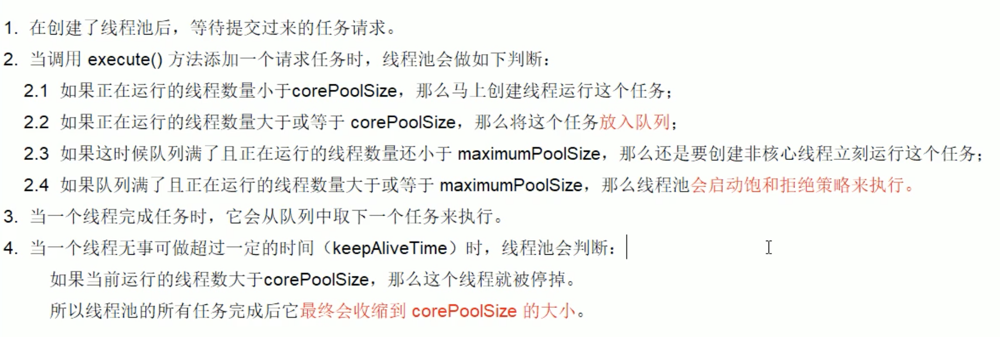

# 一、java基础

## 1、考虑输出结果

视频资料：https://www.bilibili.com/video/BV1Eb411P7bP?t=46

```java
public class Demo01 {
    public static void main(String[] args) {
        int i = 1;
        i = i++;    // i = 1
        int j = i++;   // j=1
        int k = i + ++i * i++; // k=2+3*3 = 11  i=4
        System.out.println("i=" + i);
        System.out.println("j=" + j);
        System.out.println("k=" + k);
    }
}
```

结果

```
i=4
j=1
k=11
```

## 2、集合源码分析

视频：https://www.bilibili.com/video/BV1Kb411W75N?p=259

### 2.1 ArrayList

> 线程不安全

#### （1）初步小理解

##### 默认大小是多少？？？

1、查看源码可知默认大小是10，但是没找到初始化为10的代码？？？？？

```java
/**
  * Constructs an empty list with an initial capacity of ten.
  */
public ArrayList() {
  this.elementData = DEFAULTCAPACITY_EMPTY_ELEMENTDATA;
}
```

2、查看新增方法，在calculateCapacity中可知默认的容量是10

```java
public boolean add(E e) {
        ensureCapacityInternal(size + 1);  // Increments modCount!!
        elementData[size++] = e;
        return true;
    }

// 确定容量
private void ensureCapacityInternal(int minCapacity) {
        ensureExplicitCapacity(calculateCapacity(elementData, minCapacity));
    }

// 计算出容量，小于10，则返回10（可知默认的容量是10）
private static final int DEFAULT_CAPACITY = 10;
private static int calculateCapacity(Object[] elementData, int minCapacity) {
        if (elementData == DEFAULTCAPACITY_EMPTY_ELEMENTDATA) {
            return Math.max(DEFAULT_CAPACITY, minCapacity);
        }
        return minCapacity;
    }
```

##### 为什么线程不安全

add方法没有加synchronized

##### 线程不安全示例

```java
public class NoSafeDemo {
    public static void main(String[] args) {
        List<String> list = new ArrayList<>();
        for (int i = 0; i <= 30; i++) {
            new Thread(()->{
               list.add(UUID.randomUUID().toString().substring(0,9));
                System.out.println(list);
            }).start();
        }
        // 报错：java.util.ConcurrentModificationException 线程不安全常见的异常（并发修改异常）
      	// 报错原因：并发争抢修改导致
    }
}
```

##### 变成线程安全

1、使用方法Collections.synchronizedList()

```java
public class SafeDemo2 {
    public static void main(String[] args) {
        List<String> list = Collections.synchronizedList(new ArrayList<>());
        for (int i = 0; i <= 30; i++) {
            new Thread(()->{
               list.add(UUID.randomUUID().toString().substring(0,9));
                System.out.println(list);
            }).start();
        }
    }
}
```

2、使用java.util.concurrent包中的CopyOnWriteArrayList，写时复制

```java
public class SafeDemo3 {
    public static void main(String[] args) {
        List<String> list = new CopyOnWriteArrayList<>();
        for (int i = 0; i <= 30; i++) {
            new Thread(()->{
               list.add(UUID.randomUUID().toString().substring(0,9));
                System.out.println(list);
            }).start();
        }
    }
}
```

参考源码add()

```java
public boolean add(E e) {
    final ReentrantLock lock = this.lock;
    lock.lock();
    try {
        Object[] elements = getArray();
        int len = elements.length;
        Object[] newElements = Arrays.copyOf(elements, len + 1);
        newElements[len] = e;
        setArray(newElements);
        return true;
    } finally {
        lock.unlock();
    }
}
```

CopyOnWrite容器即写时复制容器，往一个容器中添加元素的时候，不直接往当前容器Object[]添加，而是先将当前容器进行copy，复制出一个新容器 Object[] newElements，新容器容量比原容器大1，将新元素放入新容器的最后，最后将原容器的引用指向新容器setArray(newElements);
这样做的好处是可以对CopyOnWrite容器进行并发读，而不需要加锁，因为当前容器不会添加任何元素，所以CopyOnWrite容器也是一种读写分离的思想，读和写时不同的容器。
写的时候加锁，保证线程安全。

P529


### 2.2 LinkedList

P530


### 2.3 Vector

P531

add方法加了synchronized，线程安全

```java
 public synchronized boolean add(E e) {
        modCount++;
        ensureCapacityHelper(elementCount + 1);
        elementData[elementCount++] = e;
        return true;
    }
```

以下代码完美运行无报错

```java
public class SafeDemo {
    public static void main(String[] args) {
        List<String> list = new Vector<>();
        for (int i = 0; i <= 30; i++) {
            new Thread(()->{
               list.add(UUID.randomUUID().toString().substring(0,9));
                System.out.println(list);
            }).start();
        }
    }
}
```


### 2.4HashMap

#### (1)初步小理解

##### 非线程安全实例

```java
public class NoSafeDemo {
    public static void main(String[] args) {
        Map<Object, Object> map = new HashMap<>();
        for (int i = 0; i <= 30; i++) {
            new Thread(()->{
                map.put(Thread.currentThread().getName(),UUID.randomUUID().toString().substring(0,9));
                System.out.println(map);
            }).start();
        }
        // 报错：java.util.ConcurrentModificationException 线程不安全常见的异常（并发修改异常）
    }
}
```

##### 解决线程安全

1、使用ConcurrentHashMap（怎么实现的有空看下）

```java
public class SafeDemo {
    public static void main(String[] args) {
        Map<Object, Object> map = new ConcurrentHashMap<>();
        for (int i = 0; i <= 30; i++) {
            new Thread(()->{
                map.put(Thread.currentThread().getName(),UUID.randomUUID().toString().substring(0,9));
                System.out.println(map);
            }).start();
        }
    }
}
```

2、使用Collections.synchronizedMap

```java
public class SafeDemo2 {
    public static void main(String[] args) {
        Map<Object, Object> map = Collections.synchronizedMap(new HashMap<>());
        for (int i = 0; i <= 30; i++) {
            new Thread(()->{
                map.put(Thread.currentThread().getName(),UUID.randomUUID().toString().substring(0,9));
                System.out.println(map);
            }).start();
        }
    }
}
```


P550


### 2.5 HashSet

> 线程不安全

#### （1）初步小理解

##### 查看HashSet底层实现

底层居然是HashMap<>();.........

```java
/**
 * Constructs a new, empty set; the backing <tt>HashMap</tt> instance has
 * default initial capacity (16) and load factor (0.75).
 */
public HashSet() {
    map = new HashMap<>();
}
```

那为什么hashSet只能add一个元素，HashMap是put(k,v)呢？？？

因为HashSet的add方法底层也是map的put，只是put的value是固定值PRESENT

```java
private static final Object PRESENT = new Object();
public boolean add(E e) {
        return map.put(e, PRESENT)==null;
}
```

##### 线程不安全实例

```java
public class NoSafeDemo {
    public static void main(String[] args) {
        Set<String> set = new HashSet<>();
        for (int i = 0; i <= 30; i++) {
            new Thread(()->{
                set.add(UUID.randomUUID().toString().substring(0,9));
                System.out.println(set);
            }).start();
        }
        // 报错：java.util.ConcurrentModificationException 线程不安全常见的异常（并发修改异常）
    }
}
```

##### 解决线程安全

1、使用Collections.synchronizedSet()

```java
public class SafeDemo {
    public static void main(String[] args) {
        Set<String> set = Collections.synchronizedSet(new HashSet<>());
        for (int i = 0; i <= 30; i++) {
            new Thread(()->{
                set.add(UUID.randomUUID().toString().substring(0,9));
                System.out.println(set);
            }).start();
        }
    }
}
```

2、使用CopyOnWriteArraySet()

```java
public class SafeDemo2 {
    public static void main(String[] args) {
        Set<String> set = new CopyOnWriteArraySet<>();
        for (int i = 0; i <= 30; i++) {
            new Thread(()->{
                set.add(UUID.randomUUID().toString().substring(0,9));
                System.out.println(set);
            }).start();
        }
    }
}
```

CopyOnWriteArraySet的底层还是CopyOnWriteArrayList

```java
public CopyOnWriteArraySet() {
    al = new CopyOnWriteArrayList<E>();
}
```


## 3、反射

### (1) 概述

- 反射被视为动态语言的关键，反射机制允许程序在执行期间借助于Reflection API取得任何类的内部信息，并能直接操作任意对象的内部属性及方法。
- 加载完类后，在堆内存的方法区中就会产生一个CLass类型的对象，这个对象就包含了类的结构信息。我们可以通过这个对象看到类的结构。这个对象就像一面镜子，透过这个镜子看到类的结构，所以，我们形象的称之为：反射。


话不多说，上代码

```java
public class Person {
    private int age;
    private String name;

    public Person(int age, String name) {
        this.age = age;
        this.name = name;
    }

    public int getAge() {
        return age;
    }

    public void setAge(int age) {
        this.age = age;
    }

    public String getName() {
        return name;
    }

    public void setName(String name) {
        this.name = name;
    }

    public void show(){
        System.out.println("秀一下");
    }

    @Override
    public String toString() {
        return "Person{" +
                "age=" + age +
                ", name='" + name + '\'' +
                '}';
    }
}
```

```java
public class Demo01 {
    public static void main(String[] args) throws Exception {
        Class<Person> personClass = Person.class;
        Constructor<Person> constructor = personClass.getConstructor(int.class,String.class);
        // 创建了这个对象
        Person king = constructor.newInstance( 12,"king");

        System.out.println(king);
        // 获取class中的这个字段
        Field age = personClass.getDeclaredField("age");
        // 无视private
        age.setAccessible(true);
        // 给king对象中的age字段设置参数
        age.set(king,100);
        System.out.println(king);
        age.setAccessible(false);

        // 获取class中的show方法
        Method show = personClass.getDeclaredMethod("show");
        // 执行king对象中的show方法
        show.invoke(king);
    }
}
```

疑问：

1、通过直接new的方式或反射的方式都可以直接调用公共的结构，开发中到底用哪个？

> 建议直接用new的方式

2、什么时候用到反射

> 编译的时候不确定用哪个对象，反射特征：动态性，例如动态代理

3、反射机制与面向对象中的封装性是不是矛盾的？如果看待两个技术？

> 不矛盾。反射解决的问题是怎么调用，封装解决的问题是：哪些方法建议使用，哪些方法不建议使用


### (2) 理解Class类并获取Class实例（掌握）

1、类的加载过程

程序经过javac命令后，会生成一个或多个字节码文件（.class），接着我们使用java命令来对某个字节码文件进行解释运行，相当于将某个字节码文件加载到内存中。此过程称之为加载。加载到内存中的类，我们称之为运行时类，此运行时类，就作为Class的一个实例。

换句话说，Class的实例就对应着加载到内存中的一个运行时类


2、获取CLass实例

- 方式一：调用运行时类的属性：class

```java
Class<Person> personClass = Person.class;
```

- 方式二：通过运行时类的对象,调用getClass()

```java
Person person = new Person();
Class aClass = person.getClass();
```

- 方式三：调用Class的静态方法，forName(String classPath)

```java
Class clazz = Class.forName("com.supkingx.base.h_reflect.Person");
```

- 方式四：使用类的加载器

```java
ClassLoader classLoader = Demo01.class.getClassLoader();
Class aClass1 = classLoader.loadClass("com.supkingx.base.h_reflect.Person");
```

### (3) 类的加载与ClassLoader的理解（了解）


```java
// 方式四：使用类的加载器
ClassLoader classLoader = Demo01.class.getClassLoader();
Class aClass1 = classLoader.loadClass("com.supkingx.base.h_reflect.Person");
```

```java
public class Test01 {
    public static void main(String[] args) throws ClassNotFoundException {
        // 获取系统类加载器
        ClassLoader classLoader = Test01.class.getClassLoader();
        Class aClass1 = classLoader.loadClass("com.supkingx.base.h_reflect.Person");
        System.out.println(aClass1);
        System.out.println(classLoader);
        // 通过系统类加载器的getParent()，获取扩展类加载器
        System.out.println(classLoader.getParent());
        // 通过扩展类加载器的getParent()，获取引导类加载器
        // 引导类加载器主要负责java的核心类库，无法加载自定义类
        System.out.println(classLoader.getParent().getParent());
    }
}
```

读取配置文件

```java
public class Test02 {
    public static void main(String[] args) throws IOException {
        Properties properties = new Properties();
        // 读取配置方式一
//        FileInputStream fileInputStream = new FileInputStream("/Users/superking/Documents/project/examination/src/main/resources/jdbc.properties");
       // 方式二：
        InputStream resourceAsStream = Test02.class.getClassLoader().getResourceAsStream("jdbc.properties");
        properties.load(resourceAsStream);
        String user = (String) properties.get("user");
        String password = (String) properties.get("password");
        System.out.println("user:" + user + "," + "password:" + password);

    }
}
```


### (4) 创建运行时类的对象(掌握)

```java
public class Demo02 {
    public static void main(String[] args) throws IllegalAccessException, InstantiationException {
        Class<Person> personClass = Person.class;
        // 调用此方法创建运行时类的对象（内部调用运行实时类的空参构造器）
        // 想要用此方法创建，必须提供public权限的空参构造器

        // 在javabean中要求提供一个public的空参构造器，原因：
        // 便于反射创建运行时类的对象
        // 便于子类继承此运行时类，默认调用super()时，保证父类有次构造器

        Person person = personClass.newInstance();
        System.out.println(person);
    }
}
```

以下创建运行时类的方式用的比较少

```java
Class<Person> personClass = Person.class;
Constructor<Person> constructor = personClass.getConstructor(int.class,String.class);
// 创建了这个对象
Person king = constructor.newInstance( 12,"king");
```


### (5) 获取运行时类的完整结构（了解）

参考代码：包package com.supkingx.base.h_reflect.Test 下的 Test01---Test06

### (6) 调用运行时类的指定结构（掌握）

```java
public class FieldTest {
    public static void main(String[] args) throws NoSuchFieldException, IllegalAccessException, InstantiationException {
        Class<Person> personClass = Person.class;
        Person person = personClass.newInstance();
        Field nameField = personClass.getDeclaredField("name");
        nameField.setAccessible(true);
        nameField.set(person,"king");
        System.out.println(person);

        String name = (String)nameField.get(person);
        System.out.println(name);
    }
}

```

```java
public class MethodTest {
    public static void main(String[] args) throws IllegalAccessException, InstantiationException, NoSuchFieldException, NoSuchMethodException, InvocationTargetException {
        Class<Person> personClass = Person.class;
        Person person = personClass.newInstance();

        final Method show = personClass.getDeclaredMethod("show");
        show.invoke(person);

        // 第二个参数是返回类型
        final Method display = personClass.getDeclaredMethod("display", String.class);
        System.out.println(display.invoke(person, "哈哈哈"));

    }
}
```

```java
public class ConstructorTest {
    public static void main(String[] args) throws NoSuchMethodException, IllegalAccessException, InvocationTargetException, InstantiationException {
        Class<Person> personClass = Person.class;
        Constructor<Person> declaredConstructor = personClass.getDeclaredConstructor(String.class);
        declaredConstructor.setAccessible(true);
        final Person person = declaredConstructor.newInstance("king");
        System.out.println(person);
    }
}
```


### (7) 反射的应用用：动态代理

见下一章

### (8)总结：

关注上面几个需要掌握的内容


## 4、静态代理

### (1)接口

```java
public interface ClothFactory {
    void produceCloth();
}
```

### (2)静态代理类

```java
public class ProxyClothFactory implements ClothFactory{

    private ClothFactory clothFactory; // 就拿被代理对象进行实例化

    public ProxyClothFactory(ClothFactory clothFactory) {
        this.clothFactory = clothFactory;
    }

    @Override
    public void produceCloth() {
        System.out.println("代理工厂做一些准备工作");

        clothFactory.produceCloth();

        System.out.println("代理工厂做一些后续的收尾工作");
    }
}
```

### (3)被代理对象

```java
public class SupClothFactory implements ClothFactory{
    @Override
    public void produceCloth() {
        System.out.println("sup生产衣服、。。。。。。。。");
    }
}
```

### (4)静态代理使用

```java
public class StaticProxyTest {
    public static void main(String[] args) {
        // 创建被代理对象
        SupClothFactory supClothFactory = new SupClothFactory();
        // 创建代理类对象
        ProxyClothFactory proxyClothFactory = new ProxyClothFactory(supClothFactory);
        proxyClothFactory.produceCloth();
    }
}
```

### (5)特点

代理类和被代理类在编译期间就确定下来了


## 5、动态代理

> 使用一个代理将对象包装起来，然后用该代理对象取代原始对象。任何对原始对象的调用都要通过代理。代理对象决定是否以及何时将方法调用转到原方法。

想要实现动态代理，需要解决的问题：
 1、如何根据加载到内存中的被代理类，动态创建一个代理类及其对象
 2、当通过代理类的对象调用方法时，如何动态的去调用被代理类中的同名方法。

### (1)接口

```java
public interface Human {

    String getBelief();

    void eat(String food);
}
```

### (2)动态代理工厂

```java
public class MyInvocationHandler implements InvocationHandler {

    private Object obj;// 需要使用被代理类的对象进行赋值

    public void bind(Object o) {
        this.obj = o;
    }

    // 当我们通过代理类的对象，调用方法A时，就会自动的调用如下方法：invoke(0
    // 将被代理类要执行的方法a的功能，声明在invoke()中
    @Override
    public Object invoke(Object proxy, Method method, Object[] args) throws Throwable {

        // 在原方法执行执行之前加入方法
        System.out.println("method.invoke(obj, args)，执行之前");

        // 代理类对象调用的方法，此方法也就作为了被代理类对象要调用的方法
        // obj:被代理对象
        Object invoke = method.invoke(obj, args);

        // 在原方法执行执行之后加入方法
        System.out.println("method.invoke(obj, args)，执行之后");

        // 上诉方法的返回值就作为当前类中的invoke()的返回值
        return invoke;
    }
}

public class ProxyFactory {
    // 调用此方法，放回一个被代理类对象，被代理类的对象
    public static Object getProxyInstance(Object o) {
        MyInvocationHandler handler = new MyInvocationHandler();
        handler.bind(o);
        // 被代理类的 类加载器、接口、
        return Proxy.newProxyInstance(o.getClass().getClassLoader(), o.getClass().getInterfaces(), handler);
    }
}
```

### (3)被代理对象

```java
public class Superman implements Human {
    @Override
    public String getBelief() {
        return "I believe I can fly";
    }

    @Override
    public void eat(String food) {
        System.out.println("I like eating " + food);
    }
}
```

### (4)动态代理的使用

```java
/**
 * @description: 动态代理
 * 想要实现动态代理，需要解决的问题：
 * 1、如何根据加载到内存中的被代理类，动态创建一个代理类及其对象
 * 2、当通过代理类的对象调用方法时，如何动态的去调用被代理类中的同名方法。
 * @Author: wangchao
 * @Date: 2021/7/18
 */
public class DynamicProxyTest {
    public static void main(String[] args) {
        // 被代理类对象
        Superman superman = new Superman();
        // 注意：这里的human不是superman，因为我们是使用superman在这里是被代理类，
        // 通过ProxyFactory.getProxyInstance(superman)生成了superman的代理对象
        Human proxyInstance = (Human) ProxyFactory.getProxyInstance(superman);
        System.out.println(proxyInstance.getBelief());
        proxyInstance.eat("fish");

        System.out.println("\n----------------------\n");

        // 之前的静态代理，我们也可以通过动态代理来创建SupClothFactory的代理对象
        SupClothFactory supClothFactory = new SupClothFactory();
        ClothFactory clothFactory = (ClothFactory)ProxyFactory.getProxyInstance(supClothFactory);
        clothFactory.produceCloth();
    }
}
```

### (5)、总结

1、如何根据加载到内存中的被代理类，动态创建一个代理类及其对象

```java
Proxy.newProxyInstance(o.getClass().getClassLoader(), o.getClass().getInterfaces(), handler);
```

2、当通过代理类的对象调用方法时，如何动态的去调用被代理类中的同名方法

实现InvocationHandler方法，并使用method.invoke(obj,args);

```java
public class MyInvocationHandler implements InvocationHandler {

    private Object obj;// 需要使用被代理类的对象进行赋值

    public void bind(Object o) {
        this.obj = o;
    }

    // 当我们通过代理类的对象，调用方法A时，就会自动的调用如下方法：invoke(0
    // 将被代理类要执行的方法a的功能，声明在invoke()中
    @Override
    public Object invoke(Object proxy, Method method, Object[] args) throws Throwable {

        // 在原方法执行执行之前加入方法
        System.out.println("method.invoke(obj, args)，执行之前");

        // 代理类对象调用的方法，此方法也就作为了被代理类对象要调用的方法
        // obj:被代理对象
        Object invoke = method.invoke(obj, args);

        // 在原方法执行执行之后加入方法
        System.out.println("method.invoke(obj, args)，执行之后");

        // 上诉方法的返回值就作为当前类中的invoke()的返回值
        return invoke;
    }
}
```


# 二、单例模式

> ```
> 在某个类或者整个系统中只能有一个实例对象可被获取和使用的代码模式
> ```

## 1、几个重点

- 只能有一个实例
  - 构造器私有化
- 它必须自己创建这个实例
  - 含有一个该类的静态变量来保存这个唯一的实例对象
- 它必须自行向整个系统提供这个实例
  - 对外提供获取该实例对象的方式（直接暴露、提供get方法）

## 2、几种常见形式

- 饿汉式：直接创建对象，不存在线程安全问题
  - 直接实例化饿汉式（简洁直观）
  - 枚举式（最简洁）
  - 静态代码块饿汉式（适合复杂实例化）
- 懒汉式：延迟创建对象
  - 线程不安全（适用于单线程）
  - 线程安全（适用于多线程）
  - 静态内部类形式（适用于多线程）

### 2.1 代码描述

#### 2.1.1 饿汉式

##### 直接实例化饿汉式

```java
/**
 * @description:
 * 饿汉式：直接创建，不管你需不需要
 * @Author: wangchao
 * @Date: 2021/7/11
 */
public class Singleton1 {
    public static final Singleton1 SINGLETON = new Singleton1();

    private Singleton1() {
    }
}
```

测试

```java
public class Test1 {
    public static void main(String[] args) {
        Singleton1 singleton1 = Singleton1.SINGLETON;
        System.out.println(singleton1);
    }
}
```

##### 枚举式（最简洁）

```java
/**
 * @description:
 * 枚举类型：表示该类型的对象是有限的几个，我们可以限定为一个，就成了单例
 * @Author: wangchao
 * @Date: 2021/7/11
 */
public enum Singleton2 {
    SINGLETON
}
```

测试

```java
public class Test2 {
    public static void main(String[] args) {
        Singleton2 singleton2 = Singleton2.SINGLETON;
        System.out.println(singleton2);
    }
}
```

##### 静态代码块饿汉式（适合复杂实例化）

```java
public class Singleton3 {

    public static final Singleton3 SINGLETON;

    private String info;

    static {
        try {
            Properties properties = new Properties();
            properties.load(Singleton3.class.getClassLoader().getResourceAsStream("singleton.properties"));
            SINGLETON = new Singleton3(properties.getProperty("info"));
        } catch (IOException e) {
            throw new RuntimeException(e);
        }
    }

    private Singleton3(String info) {
        this.info = info;
    }

    public String getInfo() {
        return info;
    }
}
```

测试

```java
public class Test3 {
    public static void main(String[] args) {
        Singleton3 singleton3 = Singleton3.SINGLETON;
        System.out.println(singleton3.getInfo());
    }
}
```

#### 2.1.2 懒汉式

##### 线程不安全（适用于单线程）

```java
public class Singleton4 {
    private static Singleton4 singleton;

    private Singleton4() {

    }

    public static Singleton4 getSingleton() {
        if (singleton == null) {
            singleton = new Singleton4();
        }
        return singleton;
    }
}
```

**测试**

```java
// 简单测试
public class Test4 {
    public static void main(String[] args) {
        Singleton4 singleton = Singleton4.getSingleton();
        Singleton4 singleton2 = Singleton4.getSingleton();
        System.out.println(singleton);
        System.out.println(singleton2);
    }
}

结果 是同一个对象
com.supkingx.base.b_singleton.Singleton4@5cad8086
com.supkingx.base.b_singleton.Singleton4@5cad8086
```

```java
// 展示线程不安全
public class Singleton4 {
    private static Singleton4 singleton;

    private Singleton4() {

    }

    public static Singleton4 getSingleton() {
        if (singleton == null) {
            try {
                // 为了展示线程不安全，这是睡眠100ms
                Thread.sleep(100);
            } catch (InterruptedException e) {
                e.printStackTrace();
            }
            singleton = new Singleton4();
        }
        return singleton;
    }
}


public class Test4_1 {
    public static void main(String[] args) throws ExecutionException, InterruptedException {
        Callable<Singleton4> callable = new Callable<Singleton4>() {
            @Override
            public Singleton4 call() throws Exception {
                return Singleton4.getSingleton();
            }
        };
        ExecutorService executorService = Executors.newFixedThreadPool(2);
        Future<Singleton4> submit1 = executorService.submit(callable);
        Future<Singleton4> submit2 = executorService.submit(callable);
        System.out.println(submit1.get());
        System.out.println(submit2.get());
    }
}

结果，不是同一个对象了
com.supkingx.base.b_singleton.Singleton4@5e2de80c
com.supkingx.base.b_singleton.Singleton4@1d44bcfa
```

##### 线程安全（适用于多线程）

```java
public class Singleton5 {
    private static Singleton5 singleton;

    private Singleton5() {

    }
		// DCL (double check lock双端检索机制)，但是这种写法也不是最完美的写法，存在风险（指令重排），详细可见包 com.supkingx.base.f_thread.VolatileDemo，或者第十七章中关于volatile的介绍
    public static Singleton5 getSingleton() {
        // 外层的这个判断完全是为了性能考虑
        if (singleton == null) {
            // 与Singleton4线程不安全锁区别，加了synchronized后线程安全
            synchronized (Singleton5.class) {
                if (singleton == null) {
                    try {
                        Thread.sleep(1000);
                    } catch (InterruptedException e) {
                        e.printStackTrace();
                    }
                    singleton = new Singleton5();
                }
            }
        }
        return singleton;
    }
}

// 测试
public class Test5 {
    public static void main(String[] args) throws ExecutionException, InterruptedException {
        Callable<Singleton5> callable = new Callable<Singleton5>() {
            @Override
            public Singleton5 call() throws Exception {
                return Singleton5.getSingleton();
            }
        };
        ExecutorService executorService = Executors.newFixedThreadPool(2);
        Future<Singleton5> submit1 = executorService.submit(callable);
        Future<Singleton5> submit2 = executorService.submit(callable);
        System.out.println(submit1.get());
        System.out.println(submit2.get());
    }
}

结果
com.supkingx.base.b_singleton.Singleton5@5e2de80c
com.supkingx.base.b_singleton.Singleton5@5e2de80c
```

##### 静态内部类形式（适用于多线程）

```java
/**
 * @description: 懒汉式
 * 在内部类被加载和初始化时，才创建SINGLETON实例对象
 * 静态内部类不会自动随着外部类的加载和初始化而初始化，它是要单独加载和初始化的。
 * 因为是在内部类加载和初始化时创建的，所以是线程安全的。
 * @Author: wangchao
 * @Date: 2021/7/11
 */
public class Singleton6 {
    private Singleton6() {
    }

    private static class Inner {
        private static final Singleton6 SINGLETON = new Singleton6();
    }

    private static Singleton6 getInstance() {
        return Inner.SINGLETON;
    }
}

// 测试
public class Test6 {
    public static void main(String[] args) {
        Singleton6 singleton = Singleton6.getInstance();
        System.out.println(singleton);
    }
}
```

### 总结

- 如果是饿汉式，枚举形式最简单
- 如果是懒汉式，静态内部类形式最简单


# 三、类初始化和实例初始化

## 1、 代码展示

```java
public class Father {
    private int i = test();
    private static int j = method();

    static {
        System.out.print("(1)");
    }

    Father() {
        System.out.print("(2)");
    }

    {
        System.out.print("(3)");
    }

    public int test() {
        System.out.print("(4)");
        return 1;
    }

    public static int method() {
        System.out.print("(5)");
        return 1;
    }
}
```

```java
public class Son extends Father{
    private int i = test();
    private static int j = method();

    static {
        System.out.print("(6)");
    }

    Son() {
        System.out.print("(7)");
    }

    {
        System.out.print("(8)");
    }

    @Override
    public int test() {
        System.out.print("(9)");
        return 1;
    }

    public static int method() {
        System.out.print("(10)");
        return 1;
    }

    public static void main(String[] args) {
        Son s1 = new Son();
        System.out.println();
        Son s2 = new Son();
    }
}
```

输出结果？为什么是这样子的 讲解：https://www.bilibili.com/video/BV1Eb411P7bP?p=3&spm_id_from=pageDriver

```
(5)(1)(10)(6)(9)(3)(2)(9)(8)(7)
(9)(3)(2)(9)(8)(7)
```

调用顺序

> 静态方法->父类被调用的静态方法->父类的静态代码块-->子类被调用的静态方法-->子类的静态代码块-->子类被调用的非静态方法-->父类的非静态代码块-->父类构造方法-->父类中被子类重写的方法（在这里就是指父类中的 int i = test();）-->子类的非静态代码块-->子类的构造方法

为什么（9）出现了两次？

> 因为非静态方法前面其实有一个默认的对象this,this在构造器（或<init>）它表示的是正在创建的对象，因为此时是子类的test()运行，这里父类的i=test() 执行的是子类重写的test()方法

为什么第二次执行少了几个步骤

> 因为(5)(1)(10)(6)是静态方法，只会执行一次


## 2、类初始化过程

- 一个类要创建实例需要先加载并初始化该类
  - main方法所在的类需要先加载和初始化
- 一个子类要初始化的时候需要先初始化父类
- 一个类初始化就是要执行<clinit>()方法
  - <clinit>()方法由静态类变量显示赋值代码和静态代码块组成
  - **类 变量显示赋值代码和静态代码块从上到下顺序执行**
  - <clinit>()方法只执行一次
- 基本执行流程
  - 主要是按照代码顺序执行
    静态方法->父类被调用的静态方法->父类的静态代码块-->子类被调用的静态方法-->子类的静态代码块-->子类被调用的非静态方法-->父类的非静态代码块-->父类构造方法-->父类中被子类重写的方法（在这里就是指父类中的 int i = test();）-->子类的非静态代码块-->子类的构造方法

## 3、实例初始化过程

实例初始化就是执行<init>()方法

下面所指的实例对象可以理解为 A a = new A()，这就是创建一个实例对象

1、<init>() 方法可能重载有多个，有几个构造器就有几个<init>方法

2、<init>()方法由非静态实例变量显示赋值代码和非静态代码块、对应构造器代码组成

3、非静态实例变量显示赋值代码和非静态代码块 代码从上到下顺序执行，而对应构造器的代码最后执行

4、每次创建实例对象，调用对应构造器，执行的就是对应的<init>()方法

5、<init>方法的首行是super()或super（参数列表），即对应父类的<init>方法


## 4、方法的重写

override

- 哪些方法不可以被重写
  - final方法
  - 静态方法
  - pricate等子类中不可见的方法
- 对象的多态
  - 子类如果重写的父类的方法，那么通过子类调用的一定是子类重写过的代码
  - 非静态方法默认的调用对象是this
  - this对象在构造器或者说<init>方法中就是正在创建的对象

## 进阶要求：

- Override和overload的区别
- Override重写的要求？
  - 方法名
  - 形参列表
  - 返回值类型
  - 抛出异常列表
  - 修饰符
- 了解《JVM虚拟机规范》中关于<clinit>和<init>方法的说明，invokespecial指令。


# 四、方法的参数传递机制

> 方法的参数传递机制
>
> String、包装类等对象的不可变性

话不多说，先上代码，猜一猜哪些值变了

```java
public class Exam4 {
    public static void main(String[] args) {
        int i = 1;
        String str = "hello";
        Integer num = 200;
        int[] arr = {1, 2, 3, 4, 5};
        MyData my = new MyData();

        change(i, str, num, arr, my);

        System.out.println("i= " + i);
        System.out.println("str= " + str);
        System.out.println("num= " + num);
        System.out.println("arr= " + Arrays.toString(arr));
        System.out.println("my.a= " + my.a);

    }

    public static void change(int j, String s, Integer n, int[] a, MyData m) {
        j += 1;
        s += "world";
        n += 1;
        a[0] += 1;
        m.a += 1;
    }
}

class MyData {
    int a = 10;

}
```

结果

```
i= 1
str= hello
num= 200
arr= [2, 2, 3, 4, 5]
my.a= 11
```

## 1、分析


```java
 public static void change(int j, String s, Integer n, int[] a, MyData m) {
        j += 1;
        s += "world";
        n += 1;
        a[0] += 1;
        m.a += 1;
    }

 // 分析
j = 2 （这里的j已经是新的地址的，不是原来的i）
s = helloword(但是由于String类型是不可变的，所以会产生一个新的对象，指向新的引用)，已经不在是原来的str了
n = 201（Integer类型的值不可变，所以会产生一个新的对象，指向新的引用)，已经不在是原来的num了
a[0]= 2 (这里的数组还是之前的数组，改了原来的值) 
m.a = 11（这里的MyData还是之前的地址，改了原来的值）
```


## 2、结论

**所以结论是 a[0]和m.a改变了，其他的都没变**

- 形参是基本数据类型
  - 传递数据值

- 实参是引用数据类型
  - 传递地址
  - 特殊类型：String、包装类等对象不可变

# 五、编程题

## 1、递归与循环迭代

1、有n步台阶，一次只能上1步或2步，共有几种走法？

（1）递归

设f(n)=x，表示有n个台阶时，有x中走法

- n=1，一步   f(1)=1
- n=2，一步一步 或者 直接两步    f(2)=2
- n=3，
  - 先到达f(1)，然后f(1)直接跨2步。 
  - 先到达f(2)，然后f(2)跨1步。        
  - 即 f(3) = f(1)+f(2)，表示，到f(1)的走法+到f(2)的走法
- n=4，
  - 先到达f(2)，然后从f(2)直接跨2步 
  - 先到达f(3)，然后f(3)跨1步             
  - 即 f(4) = f(2)+f(3)，表示到f(2)的走法+到f(3)的走法
- ........
- n=x
  - 先到达f(x-2)，然后从f(x-2)直接跨2步 
  - 先到达f(x-1)，然后f(x-1)直接跨1步    
  - 即f(x)=f(x-2)+f(x-1)，表示到f(x-2)的走法+到f(x-1)的走法

```java
public class Recursion {
    public static void main(String[] args) {
        final long start = System.currentTimeMillis();
        System.out.println("共有走法 " + fun(40) + " 种");
        final long end = System.currentTimeMillis();
        System.out.println("总共耗时" + (end - start) + "ms");
    }

    private static int fun(int n) {
        if (n < 1) {
            throw new IllegalArgumentException(n + "不能小于1");
        }
        if (n == 1 || n == 2) {
            return n;
        }
        return fun(n - 2) + fun(n - 1);
    }
}

// 结果
共有走法 165580141 种
总共耗时303ms
```

（2）循环迭代

设f(n)=x，表示有n个台阶时，有x中走法

令 one保存最后走一步的方法，two保存最后走两步的方法

- n=1，一步   f(1)=1
- n=2，一步一步 或者 直接两步    f(2)=2
- n=3，
  - 先到达f(1)，然后f(1)直接跨2步。 
  - 先到达f(2)，然后f(2)跨1步。        
  - 即 f(3) = f(1)+f(2)，表示，到f(1)的走法+到f(2)的走法
    two=f(1)，one=f(2)
- n=4，
  - 先到达f(2)，然后从f(2)直接跨2步 
  - 先到达f(3)，然后f(3)跨1步             
  - 即 f(4) = f(2)+f(3)，表示到f(2)的走法+到f(3)的走法
    two=f(2)；one=f(3)
- ........
- n=x
  - 先到达f(x-2)，然后从f(x-2)直接跨2步 
  - 先到达f(x-1)，然后f(x-1)直接跨1步    
  - 即f(x)=f(x-2)+f(x-1)，表示到f(x-2)的走法+到f(x-1)的走法
    two=f(x-2)，one=f(x-1)

```java
public class LoopIterate {

    public static void main(String[] args) {
        final long start = System.currentTimeMillis();
        System.out.println("共有走法 " + loop(40) + " 种");
        final long end = System.currentTimeMillis();
        System.out.println("总共耗时" + (end - start) + "ms");
    }

    private static int loop(int n) {
        if (n < 1) {
            throw new IllegalArgumentException(n + "不能小于1");
        }
        if (n == 1 || n == 2) {
            return n;
        }
        // 最后走一步的方法是f(2)，其有2种走法 即 初始化为走到第二级台阶的走法
        int one = 2;
        // 最后走两步的方法是f(1)，其有1种走法 即 初始化为走到第一级台阶的走法
        int two = 1;
        // 一共的走法
        int sum = 0;

        // 最后走1步 + 最后走2步的走法
        for (int i = 3; i <= n; i++) {
            sum = one + two;
            two = one;
            one = sum;
        }
        return sum;
    }
}

结果
共有走法 165580141 种
总共耗时0ms
```

**总结**

- 方法调用自身称其为递归，利用变量的原值推出新值称为迭代
- 递归
  - 优点：大问题转化为小问题，减少代码量，可读性好
  - 缺点：递归浪费空间，递归太深容易造成堆栈溢出。
- 迭代
  - 优点：代码运行效率好，因为时间只因循环次数增加而增加，而且没有额外的空间开销；
  - 缺点：代码可读性没有递归强，不够简洁

# 六、成员变量与局部变量

> - 就近原则
> - 变量的分类
>   - 成员变量：类变量、实例变量
>   - 局部变量
> - 非静态代码块的执行：每次创建实例对象都会执行
> - 方法的调用规则：调用一次执行一次

老规矩先上代码

```java
public class Demo02 {
    static int s; // 成员变量--类变量
    int i; // 成员变量--实例变量
    int j; // 成员变量--实例变量

    {
        int i = 1; // 非静态代码块中的局部变量i
        i++;
        j++;
        s++;
    }

    public void test(int j) { // 形参，局部变量,j
        j++;
        i++;
        s++;
    }

    public static void main(String[] args) { // 形参，局部变量 args
        Demo02 obj1 = new Demo02();  // 局部变量,obj1    i=0，j=1，s=1
        Demo02 obj2 = new Demo02();  // 局部变量,obj2    i=0，j=1，s=2

        obj1.test(10);  // i=1,j=1,s=3
        obj1.test(20);  // i=2,j=1,s=4
        obj2.test(30);  // i=1,j=1,s=5

        System.out.println(obj1.i + "," + obj1.j + "," + obj1.s);
        System.out.println(obj2.i + "," + obj2.j + "," + obj2.s);
    }
}

运行结果：
2,1,5
1,1,5
```


## 1、成员变量与局部变量的区别

### 1.1 申明位置

- 局部变量：方法体 { } 中，形参，代码块 { } 中
- 成员变量：类中方法外
  - 类变量：有static修饰
  - 实例变量：没有static修饰

### 1.2 修饰符

- 局部变量：final
- 成员变量：public、protected、private、final、static、volatile、transient

### 1.3 值存储位置

- 局部变量：栈
- 实例变量：堆
- 类变量：方法区


> 堆（heap）：存储对象、实例，和数组
>
> 栈（stack）：虚拟机栈。用于存储局部变量表。局部变量表存放了编译期可以知道长度的各种基本数据类型（boolean、byte、short、char、int、float、long、double）、对象引用（reference类型，存储对象在堆内存的首地址）。方法执行完自动释放。
>
> 方法区（Method Area）用于存储已被虚拟机加载的类信息、常量、静态常量、即时编译器编译后的代码等数据。

例如Demo02 obj1 = new Demo02()，obj1在栈里面，new Demo02()在堆里面

### 1.4 作用域

- 局部变量：从申明出开始，到所属的 } 结束
- 实例变量：在当前类中 `this.`(有时缺省)，在其他类中`对象名.`访问
- 类变量：在当前类中`类名.`（有时缺省）访问，在其他类中`类名.`或`对象名.`访问

### 1.5 生命周期

- 局部变量：每一个线程，每一次调用执行都是新的生命周期
- 实例变量：随着对象的创建而创建，随着对象的回收而消亡，每一个对象的实例变量都是独立的。
- 类变量：随着类的初始化而初始化，随着类的卸载而消亡，该类的所有对象的类变量是共享的。


# 七、Spring系列

参考另外一篇markdown文章


# 八、SpringMVC


# 九、redis

## 1、使用场景

| 数据类型 | 使用场景                                   |
| -------- | :----------------------------------------- |
| String   | 单纯的key，value                           |
| Hash     | 可以用于存储用户信息                       |
| List     | 实现最新消息的排行 ，可以模拟消息队列      |
| Set      | 特殊之处：可以自动排重。不会存重复的       |
| ZSet     | 以某一个条件为权重，进行排序，例如热搜排序 |


## 2、持久化


# 十、Mysql


# 十一、JVM

## 

看另外一个文件jvm.md


# 十二、ElasticSearch

## 1、ElasticSearch和solr的区别

他们都是基于Lucene搜索服务器基础之上开发的一款优秀的高性能的企业级搜索服务器。【他们都是基于分词技术构建的倒排索引的方式进行查询】

- 开发语言：java语言开发
- 
- Solr：2004年诞生
- Es：2010年诞生
- 当实时建立索引的时候，solr会产生io阻塞，而es则不会，es查询性能高于solr。
- 在不断动态添加数据的时候，solr的检索效率会变得底下，而es则没有什么变化。
- Solr利用zookeeper进行分布式管理，而es自身带有分布式系统管理功能。Solr一般都要部署到web服务器上，比如tomcat。启动tomcat的时候需要配置tomcat与solr的关联。【solr本质是一个动态web项目】
- solr支持更多的格式数据【xml、json、csv】，而es仅支持json文件格式。
- solr是传统搜索应用的有力解决方案，但是es更适用于新兴的实时搜索引用。
  - 单纯的对已有的数据进行检索，solr的效率更好，高于es。
- solr官网提供的功能更多，而es本身更注重核心功能，高级功能依赖于第三方插件

## 2、solr


# 十三、单点登录

一处登录，到处使用，多使用在分布式系统中。


# 十四、消息队列

## 1、使用场景

- 不同工程之间传递数据
- 高并发下，来不及处理用户发出的请求。可以使用消息队列异步通信
- 并行操作，好多个消费者都需要消费


## 1、kafka


## 2、RabbitMq


# 十五、JUC

> https://www.bilibili.com/video/BV1Kw411Z7dF?spm_id_from=333.788.b_636f6d6d656e74.12
>
> JUC-->java.util.concurrent   java并发包
>
> 并发：多个线程访问同一个资源：例如秒杀
>
> 并行：多个事情同时做：一边泡面一遍看书一边泡脚。。。。。

## 1、volatile

参考后面介绍


## 3、CountDownLatch

线程中的 一个计数器，可以指定**必须 减到0**的时候，才开始下面的线程

废话不多说，直接上代码

### 没有用CountDownLatch

```java
// 必须等上自习的同学全部离开后，班长才能关门
public class CountDownLatchDemo {
    public static void main(String[] args) {

        for (int i = 0; i < 6; i++) {
            new Thread(()->{
                System.out.println(Thread.currentThread().getName()+"\t上完自习，离开教室");
            }).start();
        }
        System.out.println(Thread.currentThread().getName()+"-----班长最后关门走人");
    }
}
```

结果如下，main线程并没有等到最后才执行

```
Thread-0	上完自习，离开教室
Thread-2	上完自习，离开教室
Thread-1	上完自习，离开教室
Thread-3	上完自习，离开教室
main-----班长最后关门走人
Thread-4	上完自习，离开教室
Thread-5	上完自习，离开教室
```

#### 用了CountDownLatch

完美实现

```java
public class CountDownLatchDemo {
    public static void main(String[] args) throws InterruptedException {
        CountDownLatch countDownLatch = new CountDownLatch(6);
        for (int i = 0; i < 6; i++) {
            new Thread(()->{
                System.out.println(Thread.currentThread().getName()+"\t上完自习，离开教室");
                countDownLatch.countDown();
            }).start();
        }
        // 等countDownLatch到0，才执行
        countDownLatch.await();
        System.out.println(Thread.currentThread().getName()+"-----班长最后关门走人");
    }
}
```

结果

```
Thread-0	上完自习，离开教室
Thread-2	上完自习，离开教室
Thread-1	上完自习，离开教室
Thread-4	上完自习，离开教室
Thread-3	上完自习，离开教室
Thread-5	上完自习，离开教室
main-----班长最后关门走人
```

## 2、CyclicBarrier

与CountDownLatch功能相反。没执行一次则加一，直至累计到指定的数量

```java
public class CyclicBarrierDemo {
    public static void main(String[] args) throws BrokenBarrierException, InterruptedException {
        CyclicBarrier cyclicBarrier = new CyclicBarrier(7, () -> System.out.println("召唤神龙"));
        for (int i = 1; i <= 7; i++) {
            final int i1 = i;
            new Thread(() -> {
                System.out.println(Thread.currentThread().getName() + "收集到第 " + i1 + " 颗龙珠");
                try {
                    cyclicBarrier.await();
                } catch (InterruptedException e) {
                    e.printStackTrace();
                } catch (BrokenBarrierException e) {
                    e.printStackTrace();
                }
            }).start();
        }
    }
}
```

## 3、SemaphoreDemo

信号量主要用于两个目的，一个是用于多个共享资源的互斥使用，另一个用于并发线程数的控制。

话不多说，直接上代码

```java
public class SemaphoreDemo {
    public static void main(String[] args) {
        Semaphore semaphore = new Semaphore(3);
        for (int i = 0; i < 6; i++) {
            new Thread(() -> {
                try {
                    semaphore.acquire();
                    System.out.println(Thread.currentThread().getName()+"\t抢车位");
                    TimeUnit.SECONDS.sleep(3);
                    System.out.println(Thread.currentThread().getName()+"\t停车3秒后离开车位");
                } catch (InterruptedException e) {
                    e.printStackTrace();
                } finally {
                    semaphore.release();
                }
            }, String.valueOf(i)).start();
        }
    }
}
```

semaphore可以控制并发数，设置最多3线程抢车位，抢到车位信号量-1，离开车位后信号量+1。

## 5、Atomic原子类

详细介绍可以看后面的CAS章节


## 6、lock

详细介绍看后面的阻塞队列之消费者模式


# 十六、JMM

> JMM（java内存模型java memory model）本身是一种抽象的概念，并不**真实存在**，它描述的是一组规则或规范，通过这组规范定义了程序中各个变量（包括实例字段，静态字段和构成数组对象的元素）的访问方式

**JMM关于同步的规定：**

1、线程解锁前，必须把共享变量的值刷回主内存。

2、线程加锁前，必须读取主内存的最新值到自己的工作内存

3、加锁解锁是同一把锁

**JMM 规范：**

1、可见性

2、原子性

3、有序性

## 1、可见性介绍

由于JVM运行程序的实体是线程，而每个线程创建时JVM都会为其创建一个工作内存（有些地方称之为栈空间），工作内存是每个线程的私有数据区域，而java内存模型中规定所有变量都存储在**主内存**，主内存是共享内存的区域，所有线程都可以访问，**但线程对变量的操作（读取/赋值等）都必须在自己的工作内存中进行，首先要将变量从主内存拷贝到自己的工作空间，然后对变量进行操作，操作完成后再将变量写回主内存**，不能直接操作主内存中的变量，各个线程中的工作内存中存储着主内存中的**变量副本拷贝**，因此不同的线程间无法直接访问对方的工作内存，线程间的通信(传值)必须通过主内存来完成，其简要访问过程如下。


对于上述关键词的解释：

- 主内存：就是常用的内存条
- 每个线程从主内存拷贝到自己的工作空间中进行操作
- 例如图中，t1线程将age=25拷贝到自己的工作空间后，将其改成37，然后放回主内存，此时主内存会变动通知其他线程（**这就是可见性，对其他线程可见**）

## 2、原子性

参考下一章的AtomicInteger介绍

## 3、有序性

参考下一章volatile中有序性的介绍

## 总结

以上三点保证了线程的安全性。


# 十七、volatile

> volatile是java虚拟机提供的轻量级的同步机制，即削弱版本的synchronized，不保证原子性
>
> 有三个特性：保证可见性、不保证原子性、禁止指令重排

## 1、保证可见性

> 什么是可见性？看十七章的JMM最后的介绍。

验证可见性，如下这段代码，线程"oneThread"对资源Data进行了值的修改，但是main线程并知道这件事情

```java
class Data {
   int age = 10;

    public void growUp() {
        this.age = 18;
    }
}

public class VolatileDemo {
    public static void main(String[] args) {
        Data data = new Data(); // 共享资源
        new Thread(() -> {
            System.out.println(Thread.currentThread().getName() + "-hello");
            try {
                TimeUnit.SECONDS.sleep(3);
            } catch (InterruptedException e) {
                e.printStackTrace();
            }
            data.growUp();
            System.out.println(Thread.currentThread().getName() + "-grow up:" + data.age);
        }, "oneThread").start();

        // 监听age值的是否被修改，如果一直是原值10，则继续循环
        while (data.age == 10) {

        }
        // age被修改后跳出循环并输出
        System.out.println(Thread.currentThread().getName() + ":" + data.age);
    }
}

输出：
oneThread-hello
oneThread-grow up:18
```

上面那段代码中` System.out.println(Thread.currentThread().getName() + "main:" + data.age);`并没有被输出，因为共享资源age并没有加关键字`volatile`，此时的age并不具备**可见性**，当加了关键字volatile后，见如下代码

```java
class Data {
    volatile int age = 10;

    public void growUp() {
        this.age = 18;
    }
}
....main方法同上

输出：
oneThread-hello
oneThread-grow up:18
main:18
```

由于age加了关键字`volatile`此时main线程收到了age变更的通知，这就具备了**可见性**。

## 2、不保证原子性

> 原子性含义：不可分割，完整性，某个线程在做某个业务的时候，中间不可以被加塞或者被分割。需要整体完整，要么同时成功，要么同时失败。
>
> volatile不保证原子性

### 2.1 不保证原子性实例

```java
class Data {
    // 加了volatile后即可保证可见性
    volatile int age = 10;
//    int age = 10;

    public void growUp() {
        this.age = 18;
    }

    // 此时age加了volatile 关键字，volatile不保证原子性
    public void addPlusPlus() {
        age++;
    }
}
public class AtomicityTest {
    public static void main(String[] args) {
        Data data = new Data();

        // 20个线程
        for (int i = 0; i < 20; i++) {
            new Thread(() -> {
                for (int j = 0; j < 1000; j++) {
                    data.addPlusPlus();
                }
            }, "Thread-" + i).start();
        }

        // 默认有两个线程，一个是main线程，一个是GC线程
        while (Thread.activeCount() > 2) {
            // 使线程由执行态变成就绪态，让出cpu时间，在下一个线程执行的时候，此线程有可能被执行，也有可能不被执行
            Thread.yield();
        }
        System.out.println(Thread.currentThread().getName() + "-" + data.age);
    }
}

输出：
main-18838
```

多次执行发现值并不一定，可见volatile并**不保证原子性**，由此也可见age++在多线程环境下是**非线程安全**的

**分析age++为什么非线程安全**

> age++在底层是**三步操作**：1、将主存中age的原始值拿到自己的工作空间，2、在自己的工作空间中对age进行修改，3、将修改后的age放回主存
>
> 这三步操作在多线程的情况下，当A线程修改age后放回主存并通知其他线程(使用了volatile关键字)的这一瞬间，线程B已经将自己修改的age放回主存了，即B还没来及收到主存发出的通知，B就将自己修改的age放回主存了。这就会造成age原来应该加两次的（AB线程各一次），实际上只加了一次。

**为什么volatile不能保证原子性**

> 修改volatile分为四步：
>
> 1、读取volatile变量到local；2、修改变量值；3、local值写回主存；4、插入内存屏障，即lock指令，让其他线程可见。
>
> 这样就很容易看出来，前三步都是不安全的，取值和写回之间，不能保证没有其他线程修改。原子性需要锁来保证。
>
> 这也就是为什么，volatile只用来保证变量可见性，但不保证原子性。


### 2.2 如何解决原子性

1、加synchronized解决，如下

```java
public class Data {
    // 加了volatile后即可保证可见性
    volatile int age = 10;
//    int age = 10;

    public void growUp() {
        this.age = 18;
    }

    // 此时age加了volatile 关键字，volatile不保证原子性,但可以用synchronized实现原子性
    public synchronized void addPlusPlus() {
        age++;
    }
}
```

2、使用AtomicInteger

```java
AtomicInteger num = new AtomicInteger(0);
    public void addAtomic(){
        num.getAndIncrement();
    }
```

> 思考：为什么AtomicInteger可以保证原子性？？？
>
> 待后续章节解释


## 3、禁止指令重排

计算机在执行程序的时候，为了提高性能，编译器和处理器会对**指令做重排**，一般分为以下三种。


- 单线程环境里面确保程序最终执行结果和代码顺序执行的结果一致。
- 处理器在进行重排时必须要考虑指令之间的**数据依赖性**
- 多线程环境下线程交替执行，由于编译器优化重排的存在，两个线程中使用的变量能否保住一致性是无法确定的，结果无法预测。

**何为指令重排**，如下

```java
int x = 11;
int y = 12;
x = x+5;
y = x * x;
```

java代码时上面的顺序，但是在高并发情况下，顺序可以是 1234、2134、1324

但是4不可能排到第一个执行，这就是**数据依赖性**。


**多线程情况下**


可见x，y的值无法保证，所以要禁止指令重排


## 4、探究

为什么volatile可是实现可见性和禁止指令重排

> 首先抛出一个概念：内存屏障（Memory Barrier）又称内存栅栏，是一个CPU指令，它的作用有两个：
>
> 一是保证特定的执行顺序，二是保证某些变量的内存可见性

volatile利用上面两个特性，实现了可见性和禁止指令重排

由于编译器和处理器都能执行指令重排优化。如果在指令间插入一条Memory Barrier则会告诉编译器和CPU，不管什么指令都不能和这条Memory Barrier指令重排，也就是说通过插入内存屏障**禁止在内存屏障前后的指令执行重排优化**。内存屏障另外一个作用就是**强制刷出各种CPU的缓存数据**，因此任何CPU上的线程都能读取到这些数据的最新版本。

具体如下图


## 5、使用volatile的场景

常见的单例模式可能存在的**风险**，话不多说，一切见代码

```java
public class SingletonDemo2 {
    private static SingletonDemo2 singletonDemo = null;

    private SingletonDemo2() {
        // 对象常见的时候，构造器执行
        System.out.println(Thread.currentThread().getName() + "-我是构造器!");
    }

    // DCL (double check lock双端检索机制)
    // 这种写法有风险（指令重排），在高并发下出现的概率可能是千万分之一
    /**
     * 至于为什么会出现上述所说的情况，是因为某一个线程执行到第一次检测，读取到的instance不为null时，instance的引用对象可能没有完成初始化。
     * instance=new SingletonDemo();可以分为以下三个步骤；
     * 1、Memory = allocate() // 分配对象内存空间
     * 2、instance(Memory) // 初始化对象
     * 3、instance = Memory；设置instance指向刚分配的内存地址，此时instance！=null
     * 上面的三步的2、3并没有数据依赖关系，所以当指令重排的时候，步骤会变成1、3、2，此时
     * 当A线程走完第一步时，此时B线程走到下面代码的if(null == singletonDemo)就是false，则会直接返回null（因为此时实例并没有初始化完成）
     * @return
     */
    public static SingletonDemo2 getSingletonDemo() {
        if (null == singletonDemo) {
            synchronized (SingletonDemo2.class) {
                if (null == singletonDemo) {
                    singletonDemo = new SingletonDemo2();
                }
            }
        }
        return singletonDemo;
    }

    public static void main(String[] args) {
        // 单线程环境下，只会创建一个对象，只会执行一次构造器
//        System.out.println(SingletonDemo.getSingletonDemo() == SingletonDemo.getSingletonDemo());

        // 多线程情况下，一切皆有肯
        for (int i = 0; i < 20; i++) {
            new Thread(() -> {
                SingletonDemo2.getSingletonDemo();
            }).start();
        }
    }
}
```

如上所述会出现指令重排的风险，所以需要加上volatile

```java
private static volatile SingletonDemo3 singletonDemo = null;
```

至此，volatile避免指令重排，synchronized保证了原子性，完美

## 6、总结

工作内存与主内存同步延迟现象导致的可见性问题，可以使用synchronized或volatile关键字解决，它们都可以使一个线程修改后的变量立即对其他线程可见。

对于指令重排导致的可见性问题和有序性问题，可以利用volatile关键字解决，因为volatile的另外一个作用就是禁止指令重排

# 十八、CAS

> 比较、交换（compareAndSet），它是一条cpu并发原语
>
> 它的功能是判断内存某个位置的值是否为预期值，如果是则更改为新的值，这个过程是原子的

## 1、AtomicInteger实例

```java
public class CASDemo {
    public static void main(String[] args) {
        AtomicInteger i = new AtomicInteger(0);
        // 先比较，如果是i等于期望值0，则将其置为2021
        System.out.println(i.compareAndSet(0,2021));
      
        System.out.println(i.getAndIncrement());
    }
}
```


T1拿到了5，并改成了2019，想要写回主存，此时先将自己的期望值5，和主存的值进行比较，如果主存也是5，则对其进行更新。

## 2、CAS底层原理

> 思考i.getAndIncrement()，为什么没有加synchronized也能保证原子性

> CAS并发原语体现在JAVA语言中就是sun.misc.Unsafe类中的各个方法。调用UnSafe类中的CAS方法，JVM会帮我们实现CAS汇编指令。这是一种完全依赖于硬件的功能，通过它实现了原子操作。再次强调，由于CAS是一种系统原语，原语属于操作系统用语范畴，是由若干条指令组成的，用于完成某个功能的一个过程，并且原语的执行必须是连续的，在执行过程中不允许被中断，也就是说CAS是一条CPU的原子指令，不糊造成所谓的数据不一致问题。

接下来以i.getAndIncrement为例进行讲解

getAndIncrement()底层实现是用的unsafe.getAndAddInt

```java
 public final int getAndIncrement() {
        return unsafe.getAndAddInt(this, valueOffset, 1);
    }
```

```java
// var1 当前对象本身，var2位移偏移量，var4需要增加的值，var5 内存中的真是值
public final int getAndAddInt(Object var1, long var2, int var4) {
    int var5;
    do {
        var5 = this.getIntVolatile(var1, var2);
    } while(!this.compareAndSwapInt(var1, var2, var5, var5 + var4));

    return var5;
}
```


- Unsafe

是CAS的核心类，由于java方法无法直接访问底层系统，需要通过本地（native）方法来访问，Unsafe相当于一个后门，基于该类可以直接操作特定内存的数据。Unsafe类存在于sun.misc包中，其内部方法操作可以像C的指针一样直接操作内存，因为java中CAS操作的执行依赖于Unsafe类的方法 。

**unsafe中所有的方法都是native修饰的，也就是说unsafe类中的方法都可以直接调用操作系统底层资源执行相应的任务。**

- valueOffset

当前对象的内存偏移量，在static块中获取

- value

AtomicInteger i= new AtomicInteger(value)；这里value被volatile修饰，对value的修改其他线程是可见的。

-  var5 = this.getIntVolatile(var1, var2);

表示获取当前对象的所在位移偏移量的值，相当于拷贝主存中的值到自己的工作内存中。

- this.compareAndSwapInt(var1, var2, var5, var5 + var4)

当前对象的值如果和var5一样，则var5+var4，即当前值＋1

- while(!this.compareAndSwapInt(var1, var2, var5, var5 + var4));

当前对象的值如果和期望值一样就跳出循环，否则**不停的循环**对比快照值和当前对象的值


## 3、Unsafe

Unsafe类中的compareAndSwapInt，是一个本地方法，该方法的实现位于unsafe.cpp中，了解即可。


## 4、CAS的缺点

- 循环时间开销大
- 只能保证一个共享变量的原子操作，当需要对多个共享变量操作时，循环CAS就无法保证操作的原子性，需要加锁来保证。
- 引出来的ABA问题（什么是ABA问题，后面讨论）

## 5、AtomicInteger的ABA问题

> 狸猫换太子
>
> CAS算法实现的一个重要前提需要取出内存中的某个时刻的数据并在当下时刻比较并替换，那么这个时间差类会导致数据的变化。

### （1）问题描述

以下两个流程结合一起看

线程A: 从内存中取出A ---------------------------------------------------------->进行CAS操作，发现内存中还是A，然后one操作成功。
线程B: 从内存中取出A -----------> 将A变成了B ----------> 将B变成了A

上述线程A确实CAS操作成功了，但是**此A非彼A**了。

对于只关心结果不关心过程的场景，无所谓。但是对于注重过程的场景，就有问题了

## 6、解决ABA问题

理解原子应用+新增一种机制，那就是修改版本号（类似于时间戳）

线程A: 值A version:1 ----------------------------------------------->此时想要操作，先CAS，期望值A,符合。然后提交修改后的值C version:2，发现version的2弱于当前的version:3，提交失败
线程B: 值A varsion:1 -------->修改为值B version:2 ------->修改为值A verison:3

上诉过程就是加了版本号控制的结果，解决了ABA问题。

### （1）ABA问题的产生演示（原子更新引用展示）

AtomicReference 原子更新引用

```java
public class ABADemo {
 static AtomicReference<Integer> atomicReference = new AtomicReference<>(100);   
  public static void main(String[] args) {
          new Thread(()->{
              System.out.println(atomicReference.compareAndSet(100,101)+"--"+atomicReference.get());
              System.out.println(atomicReference.compareAndSet(101,100)+"--"+atomicReference.get());
          },"A").start();

          // B 线程并不知道A的过程发生了什么，只知道A的值是100，并不知道A中途变成过101
          new Thread(()->{
              try {
                  Thread.sleep(1000);
              } catch (InterruptedException e) {
                  e.printStackTrace();
              }
              System.out.println(atomicReference.compareAndSet(100,2021)+"--"+atomicReference.get());
          },"B").start();
      }
  }
}
```

### （2）ABA问题的解决

```java
public class ABADemo2 {

    static AtomicStampedReference<Integer> atomicStampedReference = new AtomicStampedReference<>(100, 1);

    public static void main(String[] args) {
        new Thread(() -> {
            int stamp = atomicStampedReference.getStamp();
            System.out.println(Thread.currentThread().getName() + "-第一次版本号：" + stamp);
            // 暂停一秒A线程，等B线程拿到这个版本号
            try {
                Thread.sleep(1000);
            } catch (InterruptedException e) {
                e.printStackTrace();
            }
            atomicStampedReference.compareAndSet(100, 101, atomicStampedReference.getStamp(), atomicStampedReference.getStamp() + 1);
            System.out.println(Thread.currentThread().getName() + "-第二次版本号：" + atomicStampedReference.getStamp());
            atomicStampedReference.compareAndSet(101, 100, atomicStampedReference.getStamp(), atomicStampedReference.getStamp() + 1);
            System.out.println(Thread.currentThread().getName() + "-第三次版本号：" + atomicStampedReference.getStamp());
        }, "A").start();

        new Thread(() -> {
            int stamp = atomicStampedReference.getStamp();
            System.out.println(Thread.currentThread().getName() + "-第一次版本号：" + stamp);
            // 暂停三秒B线程，保证上面的A线程完成一次ABA操作
            try {
                Thread.sleep(3000);
            } catch (InterruptedException e) {
                e.printStackTrace();
            }
            boolean result = atomicStampedReference.compareAndSet(100, 2021, stamp, stamp + 1);
            System.out.println(Thread.currentThread().getName() + "修改成功与否:" + result + "第二次版本号:" + atomicStampedReference.getStamp());
            System.out.println(Thread.currentThread().getName() + "-当前实际最新值:"+atomicStampedReference.getReference());
        }, "B").start();
    }
}
```

输出结果：

```
A-第一次版本号：1
B-第一次版本号：1
A-第二次版本号：2
A-第三次版本号：3

B修改成功与否:false,第二次版本号:3
B-当前实际最新值:100
```

可以看到，上述代码解决了ABA问题，加入版本号(时间戳)控制之后，当B的更新后提交时(100改成2021，时间戳2)，没有提交成功，因为此时时间戳已经是3了，2小于3，不给执行。所以当前的公共资源值atomicStampedReference还是100。

当修改上诉代码如下：

```java
boolean result = atomicStampedReference.compareAndSet(100, 2021, stamp + 2, stamp + 1);
```

修改代码如下，期望的时间戳是stamp+2,即3（与上面的最新时间戳保持一致）时，即可需改成功。


## 总结

1、为什么用cas而不用synchronized

synchronized：同一时段只允许有一个线程来访问，一直性得到了保证，但并发性下降。

cas：没有加锁，通过比较来确认是否修改数据，即提供 了一致性，也提高了并发性

2、Unsafe类+CAS思想是什么

自旋，什么是自旋？？？后期学习。

3、CAS简单理解

比较当前工作内存中的值和主内存中的值，如果相同则执行操作，否则继续比较知道主内存和工作内存中的值一致为止。

4、CAS应用

CAS有三个操作数，内存值V，旧的预期值A，需要修改的更新值B。当且仅当预期值A和内存值V相同时，将内存值V修改为B，否则什么都不做。

5、CAS的缺点

6、CAS产生的ABA问题

ABA问题的解决可以使用版本号（时间戳）解决。

# 十九、集合类的不安全问题

参考第一章

# 二十、java锁

## 1、公平/非公平锁

ReentrantLock默认实现是非公平，除非指定公平为true

```java
Lock lock = new ReentrantLock(true);

/**
* Creates an instance of {@code ReentrantLock} with the
* given fairness policy.
*
* @param fair {@code true} if this lock should use a fair ordering policy
*/
public ReentrantLock() {
  sync = new NonfairSync();
}

public ReentrantLock(boolean fair) {
sync = fair ? new FairSync() : new NonfairSync();
}
```

**公平锁**

是指多个线程按照申请锁的顺序来获取锁，类似于排队，先来后到。


**非公平锁**

是指多个线程获取锁的顺序并不是按照申请锁的顺序，有可能后申请的线程比先申请的线程优先获取锁，在高并发的情况下，有可能会造成优先级反转或者饥饿现象。

优点：吞吐量比公平锁大

对于synchronized而言，也是非公平的

> lock和synchronized有什么区别，具体参照下边的阻塞队列章节中的介绍

## 2、可重入锁（又名递归锁）

> 可重入锁（也叫递归锁）

> 指的是同一线程外层函数获得锁之后，内层递归函数仍然能获取锁的代码，同一个线程在外层获取锁的时候，在进入内层方法会自动获取锁。
>
> 也就是说，线程可以进入任何一个 已经拥有的锁的所同步着的代码块。
>
> ReentrantLock/Synchronized就是一个典型的可重入锁（非公平的可重入锁）

优点：避免死锁

### 代码演示

#### 证明synchronized是一个典型的可重入锁

```java
public class Phone {
    public synchronized void sendSMS() {
        System.out.println(Thread.currentThread().getName() + "---sendSMS()");
        sendEmail(); // 内部同步方法
    }

    public synchronized void sendEmail() {
        System.out.println(Thread.currentThread().getId() + "------sendEmail()");
    }
}
```

```java
public class ReentrantLockDemo {
    public static void main(String[] args) {
        Phone phone = new Phone();
        new Thread(()->{
            try {
                phone.sendSMS();
            } catch (Exception e) {
                e.printStackTrace();
            }
        },"t1").start();

        new Thread(()->{
            try {
                phone.sendSMS();
            } catch (Exception e) {
                e.printStackTrace();
            }
        },"t2").start();
    }
}

结果：
t1---sendSMS()
t1------sendEmail()
t2---sendSMS()
t2------sendEmail()
```

分析：

t1线程在外层方法获取锁的时候，t1在进入内层方法会自动获取锁


#### 证明ReentrantLock是一个可重入锁

```java
public class Phone2 implements Runnable {
    Lock lock = new ReentrantLock();
    @Override
    public void run() {
        get();
    }

    private void get() {
        lock.lock();
        try {
            System.out.println(Thread.currentThread().getName() + "---get()");
            set();
        } finally {
            lock.unlock();
        }
    }

    private void set() {
        lock.lock();
        try {
            System.out.println(Thread.currentThread().getName() + "---set()");
        } finally {
            lock.unlock();
        }
    }
}
```

```java
public class ReentrantLockDemo2 {
    public static void main(String[] args) {
        Phone2 phone = new Phone2();
        Thread thread1 = new Thread(phone);
        Thread thread2 = new Thread(phone);

        thread1.start();
        thread2.start();
    }
}

结果：
Thread-0---get()
Thread-0---set()
Thread-1---get()
Thread-1---set()
```

分析：

Thread-0线程在外层方法获取锁的时候，Thread-0在进入内层方法会自动获取锁

扩展：多加几把锁行不行？

```java
private void get() {
        lock.lock();
        lock.lock();
        lock.lock();
        try {
            System.out.println(Thread.currentThread().getName() + "---get()");
            set();
        } finally {
            lock.unlock();
            lock.unlock();
            lock.unlock();
        }
    }
```

答：没有任何问题，只要lock和unlock数量一致就行

### 总结

优点：避免死锁

怎么避免死锁的，只要开一道锁，就能一马平川（因为拿到一个锁就等于拿到的方法内部的所有锁）

## 3、自旋锁

> 可以回顾之前所说的CAS
>
> 自旋锁（spinlock）是指尝试获取锁的线程不会立即阻塞，而是采用循环的方式尝试获取锁，这样的好处是减少线程上下文切换的消耗，缺点是循环会消耗CPU
>
> 简而言之：一个线程想去获得一个资源，但是该资源暂时获取不到，该线程就会先去做其他事情，过一会再来获取这个资源

### 实现自旋锁

定义锁

```java
public class SpinLockDemo {
    AtomicReference<Thread> atomicReference = new AtomicReference<>();
		
   // 获取锁
    public void myLock() {
        Thread thread = Thread.currentThread();
        System.out.println(thread.getName() + "--myLock,come in");

        while (!atomicReference.compareAndSet(null, thread)) {

        }
    }
		
  // 释放锁
    public void myUnLock() {
        Thread thread = Thread.currentThread();
        atomicReference.compareAndSet(thread, null);
        System.out.println(thread.getName() + "--myUnLock()");

    }
}
```

测试自定义自旋锁

```java
public class SpinLockDemoTest {
    public static void main(String[] args) {
        SpinLockDemo spinLockDemo = new SpinLockDemo();
        new Thread(()->{
            spinLockDemo.myLock();
            try {TimeUnit.SECONDS.sleep(5); } catch (InterruptedException e) { e.printStackTrace();}
            spinLockDemo.myUnLock();
        },"AA").start();

        try {TimeUnit.SECONDS.sleep(1);} catch (InterruptedException e) {e.printStackTrace();}

        new Thread(()->{
            spinLockDemo.myLock();
            try {TimeUnit.SECONDS.sleep(1); } catch (InterruptedException e) { e.printStackTrace(); }
            spinLockDemo.myUnLock();
        },"BB").start();
    }
}

结果
AA--myLock,come in
BB--myLock,come in
AA--myUnLock()
BB--myUnLock()
```

AA线程获取锁之后，等待5秒，在此期间BB线程想要获取锁，由于AA线程尚未释放锁，所以此时BB线程通过循环尝试获取锁。

5秒之后，AA线程释放了锁，此时BB线程拿到了锁。

## 4、独占锁(写锁)/共享锁(读锁)/互斥锁

 独占锁：指该锁一次只能被一个线程所持有。对ReentrantLock和Synchronized而言都是独占锁

 共享锁：指该锁可被多个线程所持有。

ReentrantReadWriteLock其读锁是共享锁，其写锁是独占锁。
读锁的共享锁可保证并发读是非常高效的，读写，写读，写写的过程是互斥的。

> 通俗理解：机场大屏幕，每个人都能看到，这就是读共享；但是在在机场通知旅客飞机延误的只能是一个人，如果一群广播员播放，将会乱套，这就是独占写锁。同时在播报的时候，屏幕信息就不能信任，这就是互斥。
>
> 即
>
> 多个线程同时读一个资源类没有任何问题，所以为了满足并发量，读取共享资源应该可以同时进行。但是如果有一个线程想去写共享资源，就不应该再有其他线程可以对该资源进行读或写

### 代码展示

#### 正面例子

共享缓存

```java
public class MyCache {
    /**
     * volatile关键字可以查看前面的包
     * 管缓存的，必须用volatile，保证可见性和禁止指令重排，一个线程对其进行了修改，必须让其它线程知道
     */
    private volatile Map<String, Object> map = new HashMap<>();

    /**
     * 可以对比加了读写锁和没加读写锁的区别
     */
    private ReentrantReadWriteLock readWriteLock = new ReentrantReadWriteLock();

    /**
     * 写操作：原子+独占，整个写过程必须完整的统一体，不能被分割和打断
     *
     * @param key
     * @param value
     */
    public void put(String key, Object value) {
        readWriteLock.writeLock().lock();
        try {
            System.out.println(Thread.currentThread().getName() + " 正在写入:" + "key:" + key + ",value:" + value);
            // 暂定一会模拟网络延迟
            try {
                TimeUnit.MILLISECONDS.sleep(300);
            } catch (InterruptedException e) {
                e.printStackTrace();
            }
            map.put(key, value);
            System.out.println(Thread.currentThread().getName() + " 写入完成:" + "key:" + key + ",value:" + value);
        } catch (Exception e) {
            e.printStackTrace();
        } finally {
            readWriteLock.writeLock().unlock();
        }
    }

    public void get(String key) {
        readWriteLock.readLock().lock();
        try {
            System.out.println(Thread.currentThread().getName() + " 正在读取:" + "key:" + key);
            // 暂定一会模拟网络延迟
            try {
                TimeUnit.MILLISECONDS.sleep(300);
            } catch (InterruptedException e) {
                e.printStackTrace();
            }
            Object result = map.get(key);
            System.out.println(Thread.currentThread().getName() + " 读取完成:" + "key:" + key + ",result:" + result);
        } catch (Exception e) {
            e.printStackTrace();
        } finally {
            readWriteLock.readLock().unlock();
        }
    }

    public void clearMap() {
        map.clear();
    }
}
```

测试

```java
public class ReadWriteLockDemo {

    public static void main(String[] args) {
        MyCache myCache = new MyCache();

        for (int i = 0; i < 5; i++) {
            final int i1 = i;
            new Thread(() -> {
                myCache.put(i1 + "", i1 + "");
            }, String.valueOf(i)).start();
        }

        for (int i = 0; i < 5; i++) {
            final int i1 = i;
            new Thread(() -> {
                myCache.get(i1 + "");
            }, String.valueOf(i)).start();
        }
    }
}
```

结果

```
0 正在写入:key:0,value:0
0 写入完成:key:0,value:0
1 正在写入:key:1,value:1
1 写入完成:key:1,value:1
2 正在写入:key:2,value:2
2 写入完成:key:2,value:2
3 正在写入:key:3,value:3
3 写入完成:key:3,value:3
4 正在写入:key:4,value:4
4 写入完成:key:4,value:4
0 正在读取:key:0
1 正在读取:key:1
2 正在读取:key:2
3 正在读取:key:3
4 正在读取:key:4
2 读取完成:key:2,result:2
3 读取完成:key:3,result:3
0 读取完成:key:0,result:0
4 读取完成:key:4,result:4
1 读取完成:key:1,result:1
```

可以很明显的看到，先写后读的，这样可以保证每次读到的数据都是最新的。展现了读写锁的，读（独占），写（共享），读写（互斥）


#### 反面例子

以下代码没有加读写锁

```java
public class MyCacheNoLock {
    /**
     * volatile关键字可以查看前面的包
     * 管缓存的，必须用volatile，保证可见性和禁止指令重排，一个线程对其进行了修改，必须让其它线程知道
     */
    private volatile Map<String, Object> map = new HashMap<>();

    /**
     * 写操作：原子+独占，整个写过程必须完整的统一体，不能被分割和打断
     *
     * @param key
     * @param value
     */
    public void put(String key, Object value) {
        System.out.println(Thread.currentThread().getName() + " 正在写入:" + "key:" + key + ",value:" + value);
        // 暂定一会模拟网络延迟
        try {
            TimeUnit.MILLISECONDS.sleep(300);
        } catch (InterruptedException e) {
            e.printStackTrace();
        }
        map.put(key, value);
        System.out.println(Thread.currentThread().getName() + " 写入完成:" + "key:" + key + ",value:" + value);

    }

    public void get(String key) {
        System.out.println(Thread.currentThread().getName() + " 正在读取:" + "key:" + key);
        // 暂定一会模拟网络延迟
        try {
            TimeUnit.MILLISECONDS.sleep(300);
        } catch (InterruptedException e) {
            e.printStackTrace();
        }
        Object result = map.get(key);
        System.out.println(Thread.currentThread().getName() + " 读取完成:" + "key:" + key + ",result:" + result);
    }

    public void clearMap() {
        map.clear();
    }
}
```

结果

```pla
0 正在写入:key:0,value:0
2 正在写入:key:2,value:2
1 正在写入:key:1,value:1
4 正在写入:key:4,value:4
3 正在写入:key:3,value:3
0 正在读取:key:0
1 正在读取:key:1
2 正在读取:key:2
3 正在读取:key:3
4 正在读取:key:4
3 写入完成:key:3,value:3
2 写入完成:key:2,value:2
4 写入完成:key:4,value:4
1 写入完成:key:1,value:1
0 写入完成:key:0,value:0
0 读取完成:key:0,result:null   // 没有读取到
1 读取完成:key:1,result:1
3 读取完成:key:3,result:null
2 读取完成:key:2,result:null
4 读取完成:key:4,result:4
```

可以看到，还没有写入完成，就开始读取了，导致一些数据没有读取到。

## 5、小题练习

1、多线程之间按照顺序调用，实现A->B->C 三个线程启动，要求如下：

​		AA打印5次，BB打印10次，CC打印15次；紧接着，AA打印5次，BB打印10次，CC打印15次。。。。。依次来十轮

```java
public class ShareResource {
    private int number = 1; // a:1 b:2 c:3
    private Lock lock = new ReentrantLock();
    private Condition c1 = lock.newCondition();
    private Condition c2 = lock.newCondition();
    private Condition c3 = lock.newCondition();
    // a干完后等待，唤起b
    public void print5() {
        lock.lock();
        try {
            // 1、判断
            while (number != 1) {
                c1.await();
            }
            // 2、干活
            for (int i = 0; i < 5; i++) {
                System.out.println(Thread.currentThread().getName() + "\t" + i);
            }
            // 3、通知
            number=2;
            c2.signal();
        } catch (Exception e) {
            e.printStackTrace();
        } finally {
            lock.unlock();
        }
    }

    // b干完后等待，唤起c
    public void print10() {
        lock.lock();
        try {
            // 1、判断
            while (number != 2) {
                c2.await();
            }
            // 2、干活
            for (int i = 0; i < 10; i++) {
                System.out.println(Thread.currentThread().getName() + "\t" + i);
            }
            // 3、通知
            number=3;
            c3.signal();
        } catch (Exception e) {
            e.printStackTrace();
        } finally {
            lock.unlock();
        }
    }

    // c干完后等待，唤起a
    public void print15() {
        lock.lock();
        try {
            // 1、判断
            while (number != 3) {
                c3.await();
            }
            // 2、干活
            for (int i = 0; i < 15; i++) {
                System.out.println(Thread.currentThread().getName() + "\t" + i);
            }
            // 3、通知
            number=1;
            c1.signal();
        } catch (Exception e) {
            e.printStackTrace();
        } finally {
            lock.unlock();
        }
    }
}
```

```java
/**
 * @description:多线程之间按照顺序调用，实现A->B->C 三个线程启动，要求如下：
 * <p>
 * AA打印5次，BB打印10次，CC打印5次；
 * 紧接着，
 * AA打印5次，BB打印10次，CC打印15次
 * 。。。。。依次来十轮
 * @Author: wangchao
 * @Date: 2021/7/25
 */
public class Test01 {
    public static void main(String[] args) {
        ShareResource shareResource = new ShareResource();
        // A线程循环了10次，但是第一个循环执行完后便进入的wait阶段，并唤起B,后面9次循环都没开始
        new Thread(()->{
            for (int i = 0; i < 10; i++) {
                shareResource.print5();
            }
        },"A").start();
        // B第一次循环直接进入wait，等被A唤醒后，完成第一次循环，并唤起C,后面9次循环都没开始
        new Thread(()->{
            for (int i = 0; i < 10; i++) {
                shareResource.print10();
            }
        },"B").start();

        // C第一次循环直接进入wait，等被B唤醒后，完成第一次循环，并唤起A,后面9次循环都没开始
        new Thread(()->{
            for (int i = 0; i < 10; i++) {
                shareResource.print15();
            }
        },"C").start();
    }
}
```


# 二十一、阻塞队列

> 什么是阻塞队列？
>
> 当阻塞队列是空的时候，从队列中获取元素的操作将会被阻塞。
>
> 当阻塞队列是满的时候，往队列里添加元素的操作将会被阻塞。


在多线程领域，所谓阻塞，在某些情况下会被挂起线程（即阻塞），一旦条件满足，被挂起的线程又会自动被唤醒。

为什么需要blockingqueue？

好处是我们不需要关心什么时候需要阻塞线程，什么时候需要唤醒线程，因为这一切blockingqueue都给包办了。

在concurrent包发布以前，在多线程环境下，我们每个程序员都必须去自己控制这些细节，尤其还要兼顾效率和线程安全，而这回给我们的程序带来不小的复杂度。

blockingqueue核心方法


add：超过队列长度会报错，成功会返回true

Element() 返回队首元素

remove：移除 元素，没有元素可以移除则报错


offset：插入成功true，失败false，不报错

poll：取不到就返回null

peek，取出队首元素，不报错


put：只管插入没有返回值，当队列容量满时，则会等待（阻塞）

take：取出元素并返回，当无元素可取时，则会等待


Offer(e,time,unit)：插入后遇到队列已满，则会等待两秒，2秒之后还是队列满的状态，则返回false

```java
blockingQueue.offer("a", 2L, TimeUnit.SECONDS)
```

## 1、队列分类

ArrayBlockingQueue：由数组结构组成的有界阻塞队列

LinkedBlockingQueue：由链表结构组成的有界（但大小默认值为Integer.MAX_VALUE）阻塞队列

SynchronousQueue：不存储元素的阻塞队列，也即单个元素的队列。即只存储单个元素。

。。。。。。。

### ArrayBlockingQueue

```java
public class BlockingQueueDemo {
    public static void main(String[] args) {
        BlockingQueue<Object> blockingQueue = new ArrayBlockingQueue<>(3);
        System.out.println(blockingQueue.add("a"));
        System.out.println(blockingQueue.add("b"));
        System.out.println(blockingQueue.add("c"));
        System.out.println(blockingQueue.add("x"));
    }
}
```

输出，第四个会报错，队列已满

```
true
true
true
Exception in thread "main" java.lang.IllegalStateException: Queue full
	at java.util.AbstractQueue.add(AbstractQueue.java:98)
	at java.util.concurrent.ArrayBlockingQueue.add(ArrayBlockingQueue.java:312)
	at com.supkingx.base.j_collection.Queue.BlockingQueueDemo.main(BlockingQueueDemo.java:20)
```

### SynchronousQueue

产生一个元素，消费一个元素。依次进行

```java
public class BlockingQueueDemo {
    public static void main(String[] args) throws InterruptedException {
//        BlockingQueue<Object> blockingQueue = new ArrayBlockingQueue<>(1);
        BlockingQueue<Object> blockingQueue = new SynchronousQueue<>();
        new Thread(()->{
            try {
                blockingQueue.put("1");
                System.out.println(Thread.currentThread().getName()+"\t put 1");

                blockingQueue.put("2");
                System.out.println(Thread.currentThread().getName()+"\t put 2");

                blockingQueue.put("3");
                System.out.println(Thread.currentThread().getName()+"\t put 3");
            } catch (InterruptedException e) {
                e.printStackTrace();
            }
        },"AAA").start();

        new Thread(()->{
            try {
                TimeUnit.SECONDS.sleep(5);
                System.out.println(Thread.currentThread().getName()+"\t"+blockingQueue.take());

                TimeUnit.SECONDS.sleep(5);
                System.out.println(Thread.currentThread().getName()+"\t"+blockingQueue.take());

                TimeUnit.SECONDS.sleep(5);
                System.out.println(Thread.currentThread().getName()+"\t"+blockingQueue.take());
            } catch (InterruptedException e) {
                e.printStackTrace();
            }
        },"BBB").start();
    }
}

输出结果：
BBB	1
AAA	 put 1
BBB	2
AAA	 put 2
BBB	3
AAA	 put 3
```

注意观察结果：

blockingQueue.put("1");之后，会去BBB现场take()到该元素，然后回到AAA线程继续执行。

即先put，再take，一次一个元素，依次执行。

## 2、用在什么地方

### 消费者模式

另外一种实现方式，参考二十二章总结的部分

> ```
> 一个初始值为零的变量，两个线程对其交替操作，一个+1，一个-1，来5轮
> ```

首先定义一个资源类

```java
public class ShareData {

    private int number = 0;
    private Lock lock = new ReentrantLock();
    private Condition condition = lock.newCondition();

    public void increment() {
        lock.lock();
        try {
            // 1、判断
            while (number != 0) {
                condition.await();
            }
            // 2、干活
            number++;
            System.out.println(Thread.currentThread().getName() + "\t" + number);
            // 3、通知唤醒
            condition.signalAll();
        } catch (Exception e) {
            e.printStackTrace();
        } finally {
            lock.unlock();
        }
    }

    public void decrement() {
        lock.lock();
        try {
            // 1、判断
            while (number == 0) {
                condition.await();
            }
            // 2、干活
            number--;
            System.out.println(Thread.currentThread().getName() + "\t" + number);
            // 3、通知唤醒
            condition.signalAll();
        } catch (Exception e) {
            e.printStackTrace();
        } finally {
            lock.unlock();
        }
    }
}
```

测试

```java
public class ProducerAndConsumer {
    public static void main(String[] args) {
        final ShareData shareData = new ShareData();
        new Thread(()->{
            for (int i = 0; i < 5; i++) {
                shareData.increment();
            }
        },"AA").start();

        new Thread(()->{
            for (int i = 0; i < 5; i++) {
                shareData.decrement();
            }
        },"BB").start();
    }
}
```

#### 总结

之前是在synchronized中使用唤醒和等待，现在JUC包中的lock也可以使用唤醒和等待


##### Synchronized和lock有什么区别

1、原始构成

- synchronized是关键字属于JVM层面
  - 底层由monitorenter、monitorexit实现（通过monitor对象完成，其实wait/notify等方法也依赖monitor对象，所以只有在同步块或方法中才能调用wait/nofity等方法）


- Lock是具体类（JUC包下的）是API层面的

2、使用方法

- synchronized：不需要手动去释放锁，当synchronized代码执行完后系统会自动让线程释放锁的占用
- ReentrantLock：需要用户去手动释放锁，若没有主动释放锁，就有可能导致死锁。

3、等待是否可中断

- synchronized：不可中断，除非抛出异常或正常运行完成。
- ReentrantLock：可中断，1、设置超时方法，trylock（timeout，timeunit unit）2、LockInterruptibly（）放代码块中，调用interrupt（）方法可中断。

4、是否公平

- synchronized：非公平锁
- ReentrantLock：可公平、可不公平，默认非公平，构造方法传入true则变成公平

5、锁绑定多个条件Condition

- synchronized：没有
- ReentrantLock：用来实现分组唤醒需要唤醒的线程，可以精确唤醒，而不是像synchronized那样要么随机唤醒，要么唤醒全部线程

# 二十二、十七至二十一的小总结

volatile/cas/atomicInteger/blockqueue/线程交互/原子引用

## 写一个消费者生产者

定义资源类

```java
public class MyResource {
    // 利用volatile修饰，提高可见性
    private volatile boolean FLAG = true; // 默认开启，进行生产+消费
    private AtomicInteger atomicInteger = new AtomicInteger();

    BlockingQueue<String> blockingQueue = null;

    public MyResource(BlockingQueue<String> blockingQueue) {
        this.blockingQueue = blockingQueue;
        System.out.println(blockingQueue.getClass().getName());
    }

    public void myProd() throws InterruptedException {
        String data = null;
        boolean retValue;
        while (FLAG) {
          // 获取数据塞入队列
            data = atomicInteger.incrementAndGet() + "";
            // 向队列添加数据，队列满了则等待2秒
            retValue = blockingQueue.offer(data, 2L, TimeUnit.SECONDS);
            if (retValue) {
                System.out.println(Thread.currentThread().getName() + "\t 插入队列" + data + "成功");
            } else {
                System.out.println(Thread.currentThread().getName() + "\t 插入队列" + data + "失败");
            }
            // 降低生产频率，给消费以时间
            TimeUnit.MILLISECONDS.sleep(500);
        }
        System.out.println(Thread.currentThread().getName() + "\t大老板叫停了，表示FLAG=false,生产动作结束");
    }

    public void myConsumer() throws InterruptedException {
        String result = null;
        while (FLAG) {
            // 2s取不到，就不取了
            result = blockingQueue.poll(2L, TimeUnit.SECONDS);
            if (null == result || result.equalsIgnoreCase("")) {
                FLAG = false;
                System.out.println(Thread.currentThread().getName() + "\t 超过2s没取到");
                System.out.println();
                System.out.println();
                return;
            }
            System.out.println(Thread.currentThread().getName() + "\t 消费队列" + result + "成功");
        }
    }

    public void stop() {
        this.FLAG = false;
    }
}
```

```java
public class ProdConsumer {
    public static void main(String[] args) {
      	// 定义队列容量大小为10，超过10则插入失败
        MyResource myResource = new MyResource(new ArrayBlockingQueue<>(10));
        new Thread(()->{
            System.out.println(Thread.currentThread().getName()+"生产线程启动");
            try {
                myResource.myProd();
            } catch (InterruptedException e) {
                e.printStackTrace();
            }
        },"prod").start();

        new Thread(()->{
            System.out.println(Thread.currentThread().getName()+"消费线程启动");
            try {
                myResource.myConsumer();
                System.out.println();
                System.out.println();
            } catch (InterruptedException e) {
                e.printStackTrace();
            }
        },"consumer").start();

        try {
            TimeUnit.SECONDS.sleep(5);
        } catch (InterruptedException e) {
            e.printStackTrace();
        }
        System.out.println();
        System.out.println();
        System.out.println();
        System.out.println("5秒钟时间到，大老板main线程叫停，活动结束");
        myResource.stop();
    }
}
```

产出结果

```
java.util.concurrent.ArrayBlockingQueue
prod生产线程启动
consumer消费线程启动
prod	 插入队列1成功
consumer	 消费队列1成功
prod	 插入队列2成功
consumer	 消费队列2成功
prod	 插入队列3成功
consumer	 消费队列3成功
prod	 插入队列4成功
consumer	 消费队列4成功
prod	 插入队列5成功
consumer	 消费队列5成功


5秒钟时间到，大老板main线程叫停，活动结束
prod	大老板叫停了，表示FLAG=false,生产动作结束
consumer	 超过2s没取到
```

# 二十三、多线程

获得多线程的四种你方式
A extends Thread ，new  a()然后使用start
implement Runable，然后new Thread(runable).start()
implements Callable<Integer>,然后 new FutureTask(TestCallable)，然后new Thread(futureTask).start();
通过线程池

## 1、线程池

```
线程生命周期：新生、就绪、运行、死亡
* 线程池是为了节省新生、就绪、死亡的时间
```

> 为什么用线程池，及其优势：
>
> 

- Executors.newFixedThreadPool(3); 固定线程数

  不允许用，底层用的LinkBlockingQueue（）无限长度，Integer.MAX_VALUE，容易堆积大量请求，造成OOM。

- Executors.newSingleThreadExecutor(); 一池单线程

  不允许用，底层用的LinkBlockingQueue（）无限长度，Integer.MAX_VALUE，容易堆积大量请求，造成OOM。

- Executors.newCachedThreadPool();  无限线程

  不允许使用，底层创建大量线程，Integer.MAX_VALUE，容易堆积大量请求，造成OOM。

- Executors.newScheduledThreadPool(3); 可计划执行任务，例如选择三秒收执行

  不允许使用，底层创建大量线程，Integer.MAX_VALUE，容易堆积大量请求，造成OOM。

  ```java
  public class newScheduledThreadPoolTest {
      public static void main(String[] args) {
          ScheduledExecutorService executorService = Executors.newScheduledThreadPool(3);
          for (int i = 0; i < 100; i++) {
              executorService.schedule(new Runnable() {
                  @Override
                  public void run() {
                      System.out.println(Thread.currentThread().getName());
                  }
                  // 三秒后执行
              }, 3, TimeUnit.SECONDS);
          }
          executorService.shutdown();
      }
  }
  ```

上诉线程的底层实现


### 线程池7大参数

```java
public ThreadPoolExecutor(int corePoolSize, //常驻核心线程（必定干活的）
                          int maximumPoolSize, //线程池能够容纳的最大线程数（包含核心线程）
                          long keepAliveTime, //多余的空闲线程（超过corePoolSize数量的线程）的存活时间
                          TimeUnit unit, // 时间单位
                          BlockingQueue<Runnable> workQueue, //等待区
                          ThreadFactory threadFactory, // 线程工厂，用于创建线程的一些属性，例如名称
                          RejectedExecutionHandler handler) 
```

### 线程池运行原理



###  四种拒绝策略

```
*
* 第一种拒绝策略是 AbortPolicy，这种拒绝策略在拒绝任务时，会直接抛出一个类型为 RejectedExecutionException 的 RuntimeException，让你感知到任务被拒绝了，于是你便可以根据业务逻辑选择重试或者放弃提交等策略。
*
* 第二种拒绝策略是 DiscardPolicy，这种拒绝策略正如它的名字所描述的一样，当新任务被提交后直接被丢弃掉，也不会给你任何的通知，相对而言存在一定的风险，因为我们提交的时候根本不知道这个任务会被丢弃，可能造成数据丢失。
*
* 第三种拒绝策略是 DiscardOldestPolicy，如果线程池没被关闭且没有能力执行，则会丢弃任务队列中的头结点，通常是存活时间最长的任务，这种策略与第二种不同之处在于它丢弃的不是最新提交的，而是队列中存活时间最长的，这样就可以腾出空间给新提交的任务，但同理它也存在一定的数据丢失风险。
*
* 第四种拒绝策略是 CallerRunsPolicy，相对而言它就比较完善了，当有新任务提交后，如果线程池没被关闭且没有能力执行，则把这个任务交于提交任务的线程执行，也就是谁提交任务，谁就负责执行任务。这样做主要有两点好处。
*
* 第一点新提交的任务不会被丢弃，这样也就不会造成业务损失。
* 第二点好处是，由于谁提交任务谁就要负责执行任务，这样提交任务的线程就得负责执行任务，而执行任务又是比较耗时的，在这段期间，提交任务的线程被占用，也就不会再提交新的任务，减缓了任务提交的速度，相当于是一个负反馈。在此期间，线程池中的线程也可以充分利用这段时间来执行掉一部分任务，腾出一定的空间，相当于是给了线程池一定的缓冲期。
```

### 如何合理配置线程池，该怎么考虑

1、CPU密集型：该任务需要大量运算，而且没有阻塞，CPU一直在全速运行（例如一个for循环无限跑）

CPU密集型任务只有在真正的多核CPU上才能得到加速（通过多线程），如果是单核CPU上，无论你开几个模拟的多线程，该任务都不能得到加速，因为CPU总的运算能力就那么多。
尽可能少的线程数量：一般公式：CPU核数+1个线程 的线程池，即8核CPU，可以设置9个线程

2、IO密集型：不是一直在执行任务，例如（不停的去数据库、redis拿数据，存数据）

方案一：应配置尽可能多的线程，如CPU核数*2

方案二：CPU核数/1-阻塞系数   阻塞系数在0.8-0.9之间，比如8核CPU：8/(1-0.9)=80个线程数


## 2、死锁编码及定位

### （1）死锁解释

两个或两个以上的进程在执行任务的过程中，因争抢资源而造成的一种互相等待的现象，若无外力干涉将无法推进下去。

### (2) 死锁代码

```java
public class HoldLockThread implements Runnable {

    private String lockA;
    private String lockB;

    public HoldLockThread(String lockA, String lockB) {
        this.lockA = lockA;
        this.lockB = lockB;
    }

    // A线程进来获得锁A，（等2s）然后B线程进来获得锁B，然后A想去获得锁B（此时B还持有锁B）
    @Override
    public void run() {
        synchronized (lock1) {
            System.out.println(Thread.currentThread().getName() + "\t自己持有lock1：" + lock1 + "，尝试获得lock2：" + lock2);
            try {
                // 等待两秒，让第二B线程启动并获取锁B
                TimeUnit.SECONDS.sleep(2);
            } catch (InterruptedException e) {
                e.printStackTrace();
            }
            synchronized (lock2) {
                System.out.println(Thread.currentThread().getName() + "\t自己持有lock2：" + lock2 + "，尝试获得lock1：" + lock1);
            }
        }
    }
}
```

```java
public class DeadLockDemo {
    public static void main(String[] args) {
        String lockA = "lockA";
        String lockB = "lockB";
        new Thread(new HoldLockThread(lockA,lockB),"ThreadAAA").start();
        new Thread(new HoldLockThread(lockB,lockA),"ThreadBBB").start();
    }
}
```

首先通过jps命令定位进程号，通过jstack分析问题

```
superking@wangchaodeMacBook-Pro examination % jps -l
20104 org.jetbrains.jps.cmdline.Launcher
1384 
20105 com.supkingx.base.f_thread.deadlock.DeadLockDemo
20123 jdk.jcmd/sun.tools.jps.Jps
18732 org.jetbrains.jps.cmdline.Launcher

superking@wangchaodeMacBook-Pro examination % jstack 20105
2021-07-26 21:32:13
Full thread dump Java HotSpot(TM) 64-Bit Server VM (25.251-b08 mixed mode):

"Attach Listener" #14 daemon prio=9 os_prio=31 tid=0x00007fd0b8009000 nid=0x5c03 waiting on condition [0x0000000000000000]
   java.lang.Thread.State: RUNNABLE

"DestroyJavaVM" #13 prio=5 os_prio=31 tid=0x00007fd0b6898000 nid=0xf03 waiting on condition [0x0000000000000000]
   java.lang.Thread.State: RUNNABLE
。。。。。。。。。。。。。。
。。。。。。。。。。。。。。
Found one Java-level deadlock:
=============================
"ThreadBBB":
  waiting to lock monitor 0x00007fd0b7011c18 (object 0x000000076ac1dee0, a java.lang.String),
  which is held by "ThreadAAA"
"ThreadAAA":
  waiting to lock monitor 0x00007fd0b7014298 (object 0x000000076ac1df18, a java.lang.String),
  which is held by "ThreadBBB"

Java stack information for the threads listed above:
===================================================
"ThreadBBB":
        at com.supkingx.base.f_thread.deadlock.HoldLockThread.run(HoldLockThread.java:30)
        - waiting to lock <0x000000076ac1dee0> (a java.lang.String)
        - locked <0x000000076ac1df18> (a java.lang.String)
        at java.lang.Thread.run(Thread.java:748)
"ThreadAAA":
        at com.supkingx.base.f_thread.deadlock.HoldLockThread.run(HoldLockThread.java:30)
        - waiting to lock <0x000000076ac1df18> (a java.lang.String)
        - locked <0x000000076ac1dee0> (a java.lang.String)
        at java.lang.Thread.run(Thread.java:748)

Found 1 deadlock.
```

分析：


# 二十四、jdk的bin包下的小功能

JPS：可以看本机中java的后台运行程序
jstack：见上面

