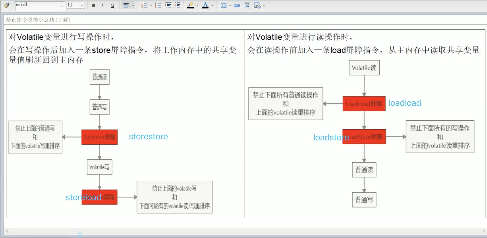

# 一、java基础

## 1、考虑输出结果

视频资料：https://www.bilibili.com/video/BV1Eb411P7bP?t=46

```java
public class Demo01 {
    public static void main(String[] args) {
        int i = 1;
        i = i++;    // i = 1
        int j = i++;   // j=1
        int k = i + ++i * i++; // k=2+3*3 = 11  i=4
        System.out.println("i=" + i);
        System.out.println("j=" + j);
        System.out.println("k=" + k);
    }
}
```

结果

```
i=4
j=1
k=11
```

## 2、集合源码分析

视频：https://www.bilibili.com/video/BV1Kb411W75N?p=259

### 2.1 ArrayList

P529


### 2.2 LinkedList

P530


### 2.3 Vector

P531


### 2.4HashMap

P550


## 3、反射

P636


## 4、动态代理


# 二、单例模式

> ```
> 在某个类或者整个系统中只能有一个实例对象可被获取和使用的代码模式
> ```

## 1、几个重点

- 只能有一个实例
  - 构造器私有化
- 它必须自己创建这个实例
  - 含有一个该类的静态变量来保存这个唯一的实例对象
- 它必须自行向整个系统提供这个实例
  - 对外提供获取该实例对象的方式（直接暴露、提供get方法）

## 2、几种常见形式

- 饿汉式：直接创建对象，不存在线程安全问题
  - 直接实例化饿汉式（简洁直观）
  - 枚举式（最简洁）
  - 静态代码块饿汉式（适合复杂实例化）
- 懒汉式：延迟创建对象
  - 线程不安全（适用于单线程）
  - 线程安全（适用于多线程）
  - 静态内部类形式（适用于多线程）

### 2.1 代码描述

#### 2.1.1 饿汉式

##### 直接实例化饿汉式

```java
/**
 * @description:
 * 饿汉式：直接创建，不管你需不需要
 * @Author: wangchao
 * @Date: 2021/7/11
 */
public class Singleton1 {
    public static final Singleton1 SINGLETON = new Singleton1();

    private Singleton1() {
    }
}
```

测试

```java
public class Test1 {
    public static void main(String[] args) {
        Singleton1 singleton1 = Singleton1.SINGLETON;
        System.out.println(singleton1);
    }
}
```

##### 枚举式（最简洁）

```java
/**
 * @description:
 * 枚举类型：表示该类型的对象是有限的几个，我们可以限定为一个，就成了单例
 * @Author: wangchao
 * @Date: 2021/7/11
 */
public enum Singleton2 {
    SINGLETON
}
```

测试

```java
public class Test2 {
    public static void main(String[] args) {
        Singleton2 singleton2 = Singleton2.SINGLETON;
        System.out.println(singleton2);
    }
}
```

##### 静态代码块饿汉式（适合复杂实例化）

```java
public class Singleton3 {

    public static final Singleton3 SINGLETON;

    private String info;

    static {
        try {
            Properties properties = new Properties();
            properties.load(Singleton3.class.getClassLoader().getResourceAsStream("singleton.properties"));
            SINGLETON = new Singleton3(properties.getProperty("info"));
        } catch (IOException e) {
            throw new RuntimeException(e);
        }
    }

    private Singleton3(String info) {
        this.info = info;
    }

    public String getInfo() {
        return info;
    }
}
```

测试

```java
public class Test3 {
    public static void main(String[] args) {
        Singleton3 singleton3 = Singleton3.SINGLETON;
        System.out.println(singleton3.getInfo());
    }
}
```

#### 2.1.2 懒汉式

##### 线程不安全（适用于单线程）

```java
public class Singleton4 {
    private static Singleton4 singleton;

    private Singleton4() {

    }

    public static Singleton4 getSingleton() {
        if (singleton == null) {
            singleton = new Singleton4();
        }
        return singleton;
    }
}
```

**测试**

```java
// 简单测试
public class Test4 {
    public static void main(String[] args) {
        Singleton4 singleton = Singleton4.getSingleton();
        Singleton4 singleton2 = Singleton4.getSingleton();
        System.out.println(singleton);
        System.out.println(singleton2);
    }
}

结果 是同一个对象
com.supkingx.base.b_singleton.Singleton4@5cad8086
com.supkingx.base.b_singleton.Singleton4@5cad8086
```

```java
// 展示线程不安全
public class Singleton4 {
    private static Singleton4 singleton;

    private Singleton4() {

    }

    public static Singleton4 getSingleton() {
        if (singleton == null) {
            try {
                // 为了展示线程不安全，这是睡眠100ms
                Thread.sleep(100);
            } catch (InterruptedException e) {
                e.printStackTrace();
            }
            singleton = new Singleton4();
        }
        return singleton;
    }
}


public class Test4_1 {
    public static void main(String[] args) throws ExecutionException, InterruptedException {
        Callable<Singleton4> callable = new Callable<Singleton4>() {
            @Override
            public Singleton4 call() throws Exception {
                return Singleton4.getSingleton();
            }
        };
        ExecutorService executorService = Executors.newFixedThreadPool(2);
        Future<Singleton4> submit1 = executorService.submit(callable);
        Future<Singleton4> submit2 = executorService.submit(callable);
        System.out.println(submit1.get());
        System.out.println(submit2.get());
    }
}

结果，不是同一个对象了
com.supkingx.base.b_singleton.Singleton4@5e2de80c
com.supkingx.base.b_singleton.Singleton4@1d44bcfa
```

##### 线程安全（适用于多线程）

```java
public class Singleton5 {
    private static Singleton5 singleton;

    private Singleton5() {

    }
		// DCL (double check lock双端检索机制)，但是这种写法也不是最完美的写法，存在风险（指令重排），详细可见包 com.supkingx.base.f_thread.VolatileDemo，或者第十七章中关于volatile的介绍
    public static Singleton5 getSingleton() {
        // 外层的这个判断完全是为了性能考虑
        if (singleton == null) {
            // 与Singleton4线程不安全锁区别，加了synchronized后线程安全
            synchronized (Singleton5.class) {
                if (singleton == null) {
                    try {
                        Thread.sleep(1000);
                    } catch (InterruptedException e) {
                        e.printStackTrace();
                    }
                    singleton = new Singleton5();
                }
            }
        }
        return singleton;
    }
}

// 测试
public class Test5 {
    public static void main(String[] args) throws ExecutionException, InterruptedException {
        Callable<Singleton5> callable = new Callable<Singleton5>() {
            @Override
            public Singleton5 call() throws Exception {
                return Singleton5.getSingleton();
            }
        };
        ExecutorService executorService = Executors.newFixedThreadPool(2);
        Future<Singleton5> submit1 = executorService.submit(callable);
        Future<Singleton5> submit2 = executorService.submit(callable);
        System.out.println(submit1.get());
        System.out.println(submit2.get());
    }
}

结果
com.supkingx.base.b_singleton.Singleton5@5e2de80c
com.supkingx.base.b_singleton.Singleton5@5e2de80c
```

##### 静态内部类形式（适用于多线程）

```java
/**
 * @description: 懒汉式
 * 在内部类被加载和初始化时，才创建SINGLETON实例对象
 * 静态内部类不会自动随着外部类的加载和初始化而初始化，它是要单独加载和初始化的。
 * 因为是在内部类加载和初始化时创建的，所以是线程安全的。
 * @Author: wangchao
 * @Date: 2021/7/11
 */
public class Singleton6 {
    private Singleton6() {
    }

    private static class Inner {
        private static final Singleton6 SINGLETON = new Singleton6();
    }

    private static Singleton6 getInstance() {
        return Inner.SINGLETON;
    }
}

// 测试
public class Test6 {
    public static void main(String[] args) {
        Singleton6 singleton = Singleton6.getInstance();
        System.out.println(singleton);
    }
}
```

### 总结

- 如果是饿汉式，枚举形式最简单
- 如果是懒汉式，静态内部类形式最简单


# 三、类初始化和实例初始化

## 1、 代码展示

```java
public class Father {
    private int i = test();
    private static int j = method();

    static {
        System.out.print("(1)");
    }

    Father() {
        System.out.print("(2)");
    }

    {
        System.out.print("(3)");
    }

    public int test() {
        System.out.print("(4)");
        return 1;
    }

    public static int method() {
        System.out.print("(5)");
        return 1;
    }
}
```

```java
public class Son extends Father{
    private int i = test();
    private static int j = method();

    static {
        System.out.print("(6)");
    }

    Son() {
        System.out.print("(7)");
    }

    {
        System.out.print("(8)");
    }

    @Override
    public int test() {
        System.out.print("(9)");
        return 1;
    }

    public static int method() {
        System.out.print("(10)");
        return 1;
    }

    public static void main(String[] args) {
        Son s1 = new Son();
        System.out.println();
        Son s2 = new Son();
    }
}
```

输出结果？为什么是这样子的 讲解：https://www.bilibili.com/video/BV1Eb411P7bP?p=3&spm_id_from=pageDriver

```
(5)(1)(10)(6)(9)(3)(2)(9)(8)(7)
(9)(3)(2)(9)(8)(7)
```

调用顺序

> 静态方法->父类被调用的静态方法->父类的静态代码块-->子类被调用的静态方法-->子类的静态代码块-->子类被调用的非静态方法-->父类的非静态代码块-->父类构造方法-->父类中被子类重写的方法（在这里就是指父类中的 int i = test();）-->子类的非静态代码块-->子类的构造方法

为什么（9）出现了两次？

> 因为非静态方法前面其实有一个默认的对象this,this在构造器（或<init>）它表示的是正在创建的对象，因为此时是子类的test()运行，这里父类的i=test() 执行的是子类重写的test()方法

为什么第二次执行少了几个步骤

> 因为(5)(1)(10)(6)是静态方法，只会执行一次


## 2、类初始化过程

- 一个类要创建实例需要先加载并初始化该类
  - main方法所在的类需要先加载和初始化
- 一个子类要初始化的时候需要先初始化父类
- 一个类初始化就是要执行<clinit>()方法
  - <clinit>()方法由静态类变量显示赋值代码和静态代码块组成
  - **类 变量显示赋值代码和静态代码块从上到下顺序执行**
  - <clinit>()方法只执行一次
- 基本执行流程
  - 主要是按照代码顺序执行
    静态方法->父类被调用的静态方法->父类的静态代码块-->子类被调用的静态方法-->子类的静态代码块-->子类被调用的非静态方法-->父类的非静态代码块-->父类构造方法-->父类中被子类重写的方法（在这里就是指父类中的 int i = test();）-->子类的非静态代码块-->子类的构造方法

## 3、实例初始化过程

实例初始化就是执行<init>()方法

下面所指的实例对象可以理解为 A a = new A()，这就是创建一个实例对象

1、<init>() 方法可能重载有多个，有几个构造器就有几个<init>方法

2、<init>()方法由非静态实例变量显示赋值代码和非静态代码块、对应构造器代码组成

3、非静态实例变量显示赋值代码和非静态代码块 代码从上到下顺序执行，而对应构造器的代码最后执行

4、每次创建实例对象，调用对应构造器，执行的就是对应的<init>()方法

5、<init>方法的首行是super()或super（参数列表），即对应父类的<init>方法


## 4、方法的重写

override

- 哪些方法不可以被重写
  - final方法
  - 静态方法
  - pricate等子类中不可见的方法
- 对象的多态
  - 子类如果重写的父类的方法，那么通过子类调用的一定是子类重写过的代码
  - 非静态方法默认的调用对象是this
  - this对象在构造器或者说<init>方法中就是正在创建的对象

## 进阶要求：

- Override和overload的区别
- Override重写的要求？
  - 方法名
  - 形参列表
  - 返回值类型
  - 抛出异常列表
  - 修饰符
- 了解《JVM虚拟机规范》中关于<clinit>和<init>方法的说明，invokespecial指令。


# 四、方法的参数传递机制

> 方法的参数传递机制
>
> String、包装类等对象的不可变性

话不多说，先上代码，猜一猜哪些值变了

```java
public class Exam4 {
    public static void main(String[] args) {
        int i = 1;
        String str = "hello";
        Integer num = 200;
        int[] arr = {1, 2, 3, 4, 5};
        MyData my = new MyData();

        change(i, str, num, arr, my);

        System.out.println("i= " + i);
        System.out.println("str= " + str);
        System.out.println("num= " + num);
        System.out.println("arr= " + Arrays.toString(arr));
        System.out.println("my.a= " + my.a);

    }

    public static void change(int j, String s, Integer n, int[] a, MyData m) {
        j += 1;
        s += "world";
        n += 1;
        a[0] += 1;
        m.a += 1;
    }
}

class MyData {
    int a = 10;

}
```

结果

```
i= 1
str= hello
num= 200
arr= [2, 2, 3, 4, 5]
my.a= 11
```

## 1、分析


```java
 public static void change(int j, String s, Integer n, int[] a, MyData m) {
        j += 1;
        s += "world";
        n += 1;
        a[0] += 1;
        m.a += 1;
    }

 // 分析
j = 2 （这里的j已经是新的地址的，不是原来的i）
s = helloword(但是由于String类型是不可变的，所以会产生一个新的对象，指向新的引用)，已经不在是原来的str了
n = 201（Integer类型的值不可变，所以会产生一个新的对象，指向新的引用)，已经不在是原来的num了
a[0]= 2 (这里的数组还是之前的数组，改了原来的值) 
m.a = 11（这里的MyData还是之前的地址，改了原来的值）
```


## 2、结论

**所以结论是 a[0]和m.a改变了，其他的都没变**

- 形参是基本数据类型
  - 传递数据值

- 实参是引用数据类型
  - 传递地址
  - 特殊类型：String、包装类等对象不可变

# 五、编程题

## 1、递归与循环迭代

1、有n步台阶，一次只能上1步或2步，共有几种走法？

（1）递归

设f(n)=x，表示有n个台阶时，有x中走法

- n=1，一步   f(1)=1
- n=2，一步一步 或者 直接两步    f(2)=2
- n=3，
  - 先到达f(1)，然后f(1)直接跨2步。 
  - 先到达f(2)，然后f(2)跨1步。        
  - 即 f(3) = f(1)+f(2)，表示，到f(1)的走法+到f(2)的走法
- n=4，
  - 先到达f(2)，然后从f(2)直接跨2步 
  - 先到达f(3)，然后f(3)跨1步             
  - 即 f(4) = f(2)+f(3)，表示到f(2)的走法+到f(3)的走法
- ........
- n=x
  - 先到达f(x-2)，然后从f(x-2)直接跨2步 
  - 先到达f(x-1)，然后f(x-1)直接跨1步    
  - 即f(x)=f(x-2)+f(x-1)，表示到f(x-2)的走法+到f(x-1)的走法

```java
public class Recursion {
    public static void main(String[] args) {
        final long start = System.currentTimeMillis();
        System.out.println("共有走法 " + fun(40) + " 种");
        final long end = System.currentTimeMillis();
        System.out.println("总共耗时" + (end - start) + "ms");
    }

    private static int fun(int n) {
        if (n < 1) {
            throw new IllegalArgumentException(n + "不能小于1");
        }
        if (n == 1 || n == 2) {
            return n;
        }
        return fun(n - 2) + fun(n - 1);
    }
}

// 结果
共有走法 165580141 种
总共耗时303ms
```

（2）循环迭代

设f(n)=x，表示有n个台阶时，有x中走法

令 one保存最后走一步的方法，two保存最后走两步的方法

- n=1，一步   f(1)=1
- n=2，一步一步 或者 直接两步    f(2)=2
- n=3，
  - 先到达f(1)，然后f(1)直接跨2步。 
  - 先到达f(2)，然后f(2)跨1步。        
  - 即 f(3) = f(1)+f(2)，表示，到f(1)的走法+到f(2)的走法
    two=f(1)，one=f(2)
- n=4，
  - 先到达f(2)，然后从f(2)直接跨2步 
  - 先到达f(3)，然后f(3)跨1步             
  - 即 f(4) = f(2)+f(3)，表示到f(2)的走法+到f(3)的走法
    two=f(2)；one=f(3)
- ........
- n=x
  - 先到达f(x-2)，然后从f(x-2)直接跨2步 
  - 先到达f(x-1)，然后f(x-1)直接跨1步    
  - 即f(x)=f(x-2)+f(x-1)，表示到f(x-2)的走法+到f(x-1)的走法
    two=f(x-2)，one=f(x-1)

```java
public class LoopIterate {

    public static void main(String[] args) {
        final long start = System.currentTimeMillis();
        System.out.println("共有走法 " + loop(40) + " 种");
        final long end = System.currentTimeMillis();
        System.out.println("总共耗时" + (end - start) + "ms");
    }

    private static int loop(int n) {
        if (n < 1) {
            throw new IllegalArgumentException(n + "不能小于1");
        }
        if (n == 1 || n == 2) {
            return n;
        }
        // 最后走一步的方法是f(2)，其有2种走法 即 初始化为走到第二级台阶的走法
        int one = 2;
        // 最后走两步的方法是f(1)，其有1种走法 即 初始化为走到第一级台阶的走法
        int two = 1;
        // 一共的走法
        int sum = 0;

        // 最后走1步 + 最后走2步的走法
        for (int i = 3; i <= n; i++) {
            sum = one + two;
            two = one;
            one = sum;
        }
        return sum;
    }
}

结果
共有走法 165580141 种
总共耗时0ms
```

**总结**

- 方法调用自身称其为递归，利用变量的原值推出新值称为迭代
- 递归
  - 优点：大问题转化为小问题，减少代码量，可读性好
  - 缺点：递归浪费空间，递归太深容易造成堆栈溢出。
- 迭代
  - 优点：代码运行效率好，因为时间只因循环次数增加而增加，而且没有额外的空间开销；
  - 缺点：代码可读性没有递归强，不够简洁

# 六、成员变量与局部变量

> - 就近原则
> - 变量的分类
>   - 成员变量：类变量、实例变量
>   - 局部变量
> - 非静态代码块的执行：每次创建实例对象都会执行
> - 方法的调用规则：调用一次执行一次

老规矩先上代码

```java
public class Demo02 {
    static int s; // 成员变量--类变量
    int i; // 成员变量--实例变量
    int j; // 成员变量--实例变量

    {
        int i = 1; // 非静态代码块中的局部变量i
        i++;
        j++;
        s++;
    }

    public void test(int j) { // 形参，局部变量,j
        j++;
        i++;
        s++;
    }

    public static void main(String[] args) { // 形参，局部变量 args
        Demo02 obj1 = new Demo02();  // 局部变量,obj1    i=0，j=1，s=1
        Demo02 obj2 = new Demo02();  // 局部变量,obj2    i=0，j=1，s=2

        obj1.test(10);  // i=1,j=1,s=3
        obj1.test(20);  // i=2,j=1,s=4
        obj2.test(30);  // i=1,j=1,s=5

        System.out.println(obj1.i + "," + obj1.j + "," + obj1.s);
        System.out.println(obj2.i + "," + obj2.j + "," + obj2.s);
    }
}

运行结果：
2,1,5
1,1,5
```


## 1、成员变量与局部变量的区别

### 1.1 申明位置

- 局部变量：方法体 { } 中，形参，代码块 { } 中
- 成员变量：类中方法外
  - 类变量：有static修饰
  - 实例变量：没有static修饰

### 1.2 修饰符

- 局部变量：final
- 成员变量：public、protected、private、final、static、volatile、transient

### 1.3 值存储位置

- 局部变量：栈
- 实例变量：堆
- 类变量：方法区


> 堆（heap）：存储对象、实例，和数组
>
> 栈（stack）：虚拟机栈。用于存储局部变量表。局部变量表存放了编译期可以知道长度的各种基本数据类型（boolean、byte、short、char、int、float、long、double）、对象引用（reference类型，存储对象在堆内存的首地址）。方法执行完自动释放。
>
> 方法区（Method Area）用于存储已被虚拟机加载的类信息、常量、静态常量、即时编译器编译后的代码等数据。

例如Demo02 obj1 = new Demo02()，obj1在栈里面，new Demo02()在堆里面

### 1.4 作用域

- 局部变量：从申明出开始，到所属的 } 结束
- 实例变量：在当前类中 `this.`(有时缺省)，在其他类中`对象名.`访问
- 类变量：在当前类中`类名.`（有时缺省）访问，在其他类中`类名.`或`对象名.`访问

### 1.5 生命周期

- 局部变量：每一个线程，每一次调用执行都是新的生命周期
- 实例变量：随着对象的创建而创建，随着对象的回收而消亡，每一个对象的实例变量都是独立的。
- 类变量：随着类的初始化而初始化，随着类的卸载而消亡，该类的所有对象的类变量是共享的。


# 七、Spring系列

## 1、Sping Bean作用域

> 默认情况下Sping只为每个在IOC容器里面声明的bean创建唯一一个实例，整个IOC容器范围内只能共享该实例，该作用域被称为singleton

- singleton 在SpingIOC容器中仅存在一个bean实例，Bean以单实例的方式存在
- prototype 每次调用getBean()时都会返回一个新的实例
- request 每次Http请求都会创建一个新的Bean，该作用域仅适用于WebApplicationContext环境
- session 同一个HTTP Session共享一个bean，不同的HTTP Session适用不同的Bean。该作用域仅适用于WebApplicationContext环境。

## 2、IOC 

> 控制反转，把创建对象的过程交给Spring进行管理


## 3、AOP

> 面向切面：不修改源代码进行功能的增强


# 八、SpringMVC


# 九、redis

## 1、使用场景

| 数据类型 | 使用场景                                   |
| -------- | :----------------------------------------- |
| String   | 单纯的key，value                           |
| Hash     | 可以用于存储用户信息                       |
| List     | 实现最新消息的排行 ，可以模拟消息队列      |
| Set      | 特殊之处：可以自动排重。不会存重复的       |
| ZSet     | 以某一个条件为权重，进行排序，例如热搜排序 |


## 2、持久化


# 十、Mysql


# 十一、JVM

> https://www.bilibili.com/video/BV1PJ411n7xZ?spm_id_from=333.788.b_636f6d6d656e74.11
>
> JVM垃圾回收机制，GC发生在JVM哪部分，有几种GC，它们的算法是什么

## 1、GC是什么

GC是指分代收集算法

- 在次数上频繁收集Young区的是Minor GC
- 在次数上较少收集Old区   Full GC
- 基本不动Perm区

Young区是干嘛的？


Old区是干嘛的？


## 2、GC 发生在JVM哪部分

> 发生在堆里


## 3、GC 4大算法

### 1、引用计数法

有对象被引用就不回收

缺点：每次对象赋值均要维护计数器，且计数器本身也有一定的消耗，较难处理循环引用

JVM实现不采用这种方式了

### 2、复制算法（Copying）

年轻代中使用的是Minor GC，这种GC算法采用的是复制算法（Copying）

#### 原理

- 从根集合（GC Root）开始，通过Tracing从From中找到存活的对象，拷贝到To中。
- From、To交换身份，下次内存分类从To开始

#### 缺点

需要双倍空间

#### 优点

没有标记清除过程，效率高

没有内存碎片，可以实现快速内存分配（bump-the-pointer）

### 3、标记清除（Mark-Sweep）

老年代回收使用


### 4、标记压缩（Mark-Compact）

老年代回收使用


### 5、标记清除压缩（Mark-Sweep-Compact）

两种算法(Mark-Sweep和Mark-Compact)结合使用的，先进行标记清除，清除一些产生一些碎片后再进行压缩

老年代常用这种方式回收对象

## 4、老年代和新生代


# 十二、ElasticSearch

## 1、ElasticSearch和solr的区别

他们都是基于Lucene搜索服务器基础之上开发的一款优秀的高性能的企业级搜索服务器。【他们都是基于分词技术构建的倒排索引的方式进行查询】

- 开发语言：java语言开发
- Solr：2004年诞生
- Es：2010年诞生
- 当实时建立索引的时候，solr会产生io阻塞，而es则不会，es查询性能高于solr。
- 在不断动态添加数据的时候，solr的检索效率会变得底下，而es则没有什么变化。
- Solr利用zookeeper进行分布式管理，而es自身带有分布式系统管理功能。Solr一般都要部署到web服务器上，比如tomcat。启动tomcat的时候需要配置tomcat与solr的关联。【solr本质是一个动态web项目】
- solr支持更多的格式数据【xml、json、csv】，而es仅支持json文件格式。
- solr是传统搜索应用的有力解决方案，但是es更适用于新兴的实时搜索引用。
  - 单纯的对已有的数据进行检索，solr的效率更好，高于es。
- solr官网提供的功能更多，而es本身更注重核心功能，高级功能依赖于第三方插件

## 2、solr


# 十三、单点登录

一处登录，到处使用，多使用在分布式系统中。


# 十四、消息队列

## 1、使用场景

- 不同工程之间传递数据
- 高并发下，来不及处理用户发出的请求。可以使用消息队列异步通信
- 并行操作，好多个消费者都需要消费


## 1、kafka


## 2、RabbitMq


# 十五、JUC

> https://www.bilibili.com/video/BV1Kw411Z7dF?spm_id_from=333.788.b_636f6d6d656e74.12
>
> JUC-->java.util.concurrent   java并发包
>
> 并发：多个线程访问同一个资源：例如秒杀
>
> 并行：多个事情同时做：一边泡面一遍看书一边泡脚。。。。。


# 十六、JMM

> JMM（java内存模型java memory model）本身是一种抽象的概念，并不**真实存在**，它描述的是一组规则或规范，通过这组规范定义了程序中各个变量（包括实例字段，静态字段和构成数组对象的元素）的访问方式

**JMM关于同步的规定：**

1、线程解锁前，必须把共享变量的值刷回主内存。

2、线程加锁前，必须读取主内存的最新值到自己的工作内存

3、加锁解锁是同一把锁

**JMM 规范：**

1、可见性

2、原子性

3、有序性

## 1、可见性介绍

由于JVM运行程序的实体是线程，而每个线程创建时JVM都会为其创建一个工作内存（有些地方称之为栈空间），工作内存是每个线程的私有数据区域，而java内存模型中规定所有变量都存储在**主内存**，主内存是共享内存的区域，所有线程都可以访问，**但线程对变量的操作（读取/赋值等）都必须在自己的工作内存中进行，首先要将变量从主内存拷贝到自己的工作空间，然后对变量进行操作，操作完成后再将变量写回主内存**，不能直接操作主内存中的变量，各个线程中的工作内存中存储着主内存中的**变量副本拷贝**，因此不同的线程间无法直接访问对方的工作内存，线程间的通信(传值)必须通过主内存来完成，其简要访问过程如下。


对于上述关键词的解释：

- 主内存：就是常用的内存条
- 每个线程从主内存拷贝到自己的工作空间中进行操作
- 例如图中，t1线程将age=25拷贝到自己的工作空间后，将其改成37，然后放回主内存，此时主内存会变动通知其他线程（**这就是可见性，对其他线程可见**）

## 2、原子性

参考下一章的AtomicInteger介绍

# 3、有序性

参考下一章volatile中有序性的介绍

## 总结

以上三点保证了线程的安全性。


# 十七、volatile

> volatile是java虚拟机提供的轻量级的同步机制，即削弱版本的synchronized，不保证原子性
>
> 有三个特性：保证可见性、不保证原子性、禁止指令重排

## 1、保证可见性

> 什么是可见性？看十七章的JMM最后的介绍。

验证可见性，如下这段代码，线程"oneThread"对资源Data进行了值的修改，但是main线程并知道这件事情

```java
class Data {
   int age = 10;

    public void growUp() {
        this.age = 18;
    }
}

public class VolatileDemo {
    public static void main(String[] args) {
        Data data = new Data(); // 共享资源
        new Thread(() -> {
            System.out.println(Thread.currentThread().getName() + "-hello");
            try {
                TimeUnit.SECONDS.sleep(3);
            } catch (InterruptedException e) {
                e.printStackTrace();
            }
            data.growUp();
            System.out.println(Thread.currentThread().getName() + "-grow up:" + data.age);
        }, "oneThread").start();

        // 监听age值的是否被修改，如果一直是原值10，则继续循环
        while (data.age == 10) {

        }
        // age被修改后跳出循环并输出
        System.out.println(Thread.currentThread().getName() + ":" + data.age);
    }
}

输出：
oneThread-hello
oneThread-grow up:18
```

上面那段代码中` System.out.println(Thread.currentThread().getName() + "main:" + data.age);`并没有被输出，因为共享资源age并没有加关键字`volatile`，此时的age并不具备**可见性**，当加了关键字volatile后，见如下代码

```java
class Data {
    volatile int age = 10;

    public void growUp() {
        this.age = 18;
    }
}
....main方法同上

输出：
oneThread-hello
oneThread-grow up:18
main:18
```

由于age加了关键字`volatile`此时main线程收到了age变更的通知，这就具备了**可见性**。

## 2、不保证原子性

> 原子性含义：不可分割，完整性，某个线程在做某个业务的时候，中间不可以被加塞或者被分割。需要整体完整，要么同时成功，要么同时失败。
>
> volatile不保证原子性

### 2.1 不保证原子性实例

```java
class Data {
    // 加了volatile后即可保证可见性
    volatile int age = 10;
//    int age = 10;

    public void growUp() {
        this.age = 18;
    }

    // 此时age加了volatile 关键字，volatile不保证原子性
    public void addPlusPlus() {
        age++;
    }
}
public class AtomicityTest {
    public static void main(String[] args) {
        Data data = new Data();

        // 20个线程
        for (int i = 0; i < 20; i++) {
            new Thread(() -> {
                for (int j = 0; j < 1000; j++) {
                    data.addPlusPlus();
                }
            }, "Thread-" + i).start();
        }

        // 默认有两个线程，一个是main线程，一个是GC线程
        while (Thread.activeCount() > 2) {
            // 使线程由执行态变成就绪态，让出cpu时间，在下一个线程执行的时候，此线程有可能被执行，也有可能不被执行
            Thread.yield();
        }
        System.out.println(Thread.currentThread().getName() + "-" + data.age);
    }
}

输出：
main-18838
```

多次执行发现值并不一定，可见volatile并**不保证原子性**，由此也可见age++在多线程环境下是**非线程安全**的

**分析age++为什么非线程安全**

> age++在底层是**三步操作**：1、将主存中age的原始值拿到自己的工作空间，2、在自己的工作空间中对age进行修改，3、将修改后的age放回主存
>
> 这三步操作在多线程的情况下，当A线程修改age后放回主存并通知其他线程(使用了volatile关键字)的这一瞬间，线程B已经将自己修改的age放回主存了，即B还没来及收到主存发出的通知，B就将自己修改的age放回主存了。这就会造成age原来应该加两次的（AB线程各一次），实际上只加了一次。

**为什么volatile不能保证原子性**

> 修改volatile分为四步：
>
> 1、读取volatile变量到local；2、修改变量值；3、local值写回主存；4、插入内存屏障，即lock指令，让其他线程可见。
>
> 这样就很容易看出来，前三步都是不安全的，取值和写回之间，不能保证没有其他线程修改。原子性需要锁来保证。
>
> 这也就是为什么，volatile只用来保证变量可见性，但不保证原子性。


### 2.2 如何解决原子性

1、加synchronized解决，如下

```java
public class Data {
    // 加了volatile后即可保证可见性
    volatile int age = 10;
//    int age = 10;

    public void growUp() {
        this.age = 18;
    }

    // 此时age加了volatile 关键字，volatile不保证原子性,但可以用synchronized实现原子性
    public synchronized void addPlusPlus() {
        age++;
    }
}
```

2、使用AtomicInteger

```java
AtomicInteger num = new AtomicInteger(0);
    public void addAtomic(){
        num.getAndIncrement();
    }
```

> 思考：为什么AtomicInteger可以保证原子性？？？
>
> 待后续章节解释


## 3、禁止指令重排

计算机在执行程序的时候，为了提高性能，编译器和处理器会对**指令做重排**，一般分为以下三种。


- 单线程环境里面确保程序最终执行结果和代码顺序执行的结果一致。
- 处理器在进行重排时必须要考虑指令之间的**数据依赖性**
- 多线程环境下线程交替执行，由于编译器优化重排的存在，两个线程中使用的变量能否保住一致性是无法确定的，结果无法预测。

**何为指令重排**，如下

```java
int x = 11;
int y = 12;
x = x+5;
y = x * x;
```

java代码时上面的顺序，但是在高并发情况下，顺序可以是 1234、2134、1324

但是4不可能排到第一个执行，这就是**数据依赖性**。


**多线程情况下**


可见x，y的值无法保证，所以要禁止指令重排


## 4、探究

为什么volatile可是实现可见性和禁止指令重排

> 首先抛出一个概念：内存屏障（Memory Barrier）又称内存栅栏，是一个CPU指令，它的作用有两个：
>
> 一是保证特定的执行顺序，二是保证某些变量的内存可见性

volatile利用上面两个特性，实现了可见性和禁止指令重排

由于编译器和处理器都能执行指令重排优化。如果在指令间插入一条Memory Barrier则会告诉编译器和CPU，不管什么指令都不能和这条Memory Barrier指令重排，也就是说通过插入内存屏障**禁止在内存屏障前后的指令执行重排优化**。内存屏障另外一个作用就是**强制刷出各种CPU的缓存数据**，因此任何CPU上的线程都能读取到这些数据的最新版本。

具体如下图




## 5、使用volatile的场景

常见的单例模式可能存在的**风险**，话不多说，一切见代码

```java
public class SingletonDemo2 {
    private static SingletonDemo2 singletonDemo = null;

    private SingletonDemo2() {
        // 对象常见的时候，构造器执行
        System.out.println(Thread.currentThread().getName() + "-我是构造器!");
    }

    // DCL (double check lock双端检索机制)
    // 这种写法有风险（指令重排），在高并发下出现的概率可能是千万分之一
    /**
     * 至于为什么会出现上述所说的情况，是因为某一个线程执行到第一次检测，读取到的instance不为null时，instance的引用对象可能没有完成初始化。
     * instance=new SingletonDemo();可以分为以下三个步骤；
     * 1、Memory = allocate() // 分配对象内存空间
     * 2、instance(Memory) // 初始化对象
     * 3、instance = Memory；设置instance指向刚分配的内存地址，此时instance！=null
     * 上面的三步的2、3并没有数据依赖关系，所以当指令重排的时候，步骤会变成1、3、2，此时
     * 当A线程走完第一步时，此时B线程走到下面代码的if(null == singletonDemo)就是false，则会直接返回null（因为此时实例并没有初始化完成）
     * @return
     */
    public static SingletonDemo2 getSingletonDemo() {
        if (null == singletonDemo) {
            synchronized (SingletonDemo2.class) {
                if (null == singletonDemo) {
                    singletonDemo = new SingletonDemo2();
                }
            }
        }
        return singletonDemo;
    }

    public static void main(String[] args) {
        // 单线程环境下，只会创建一个对象，只会执行一次构造器
//        System.out.println(SingletonDemo.getSingletonDemo() == SingletonDemo.getSingletonDemo());

        // 多线程情况下，一切皆有肯
        for (int i = 0; i < 20; i++) {
            new Thread(() -> {
                SingletonDemo2.getSingletonDemo();
            }).start();
        }
    }
}
```

如上所述会出现指令重排的风险，所以需要加上volatile

```java
private static volatile SingletonDemo3 singletonDemo = null;
```

至此，volatile避免指令重排，synchronized保证了原子性，完美

## 6、总结

工作内存与主内存同步延迟现象导致的可见性问题，可以使用synchronized或volatile关键字解决，它们都可以使一个线程修改后的变量立即对其他线程可见。

对于指令重排导致的可见性问题和有序性问题，可以利用volatile关键字解决，因为volatile的另外一个作用就是禁止指令重排
