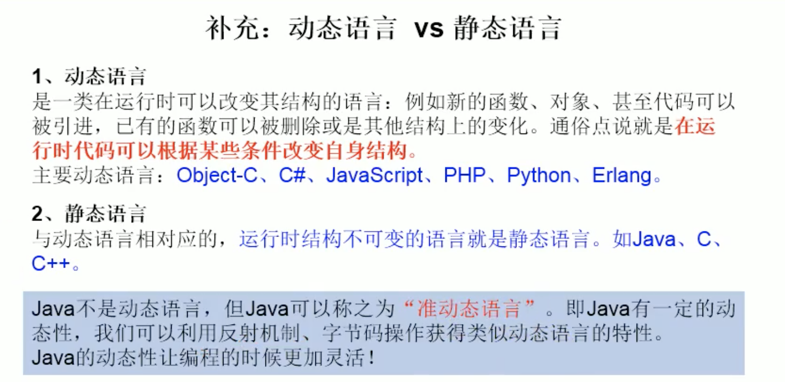
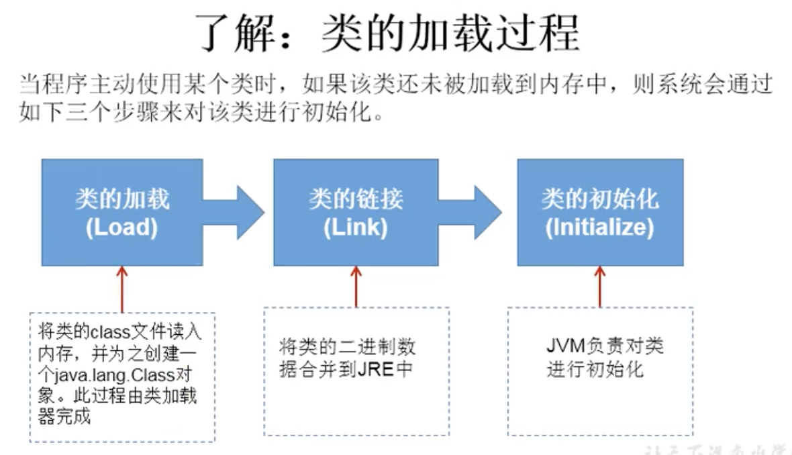
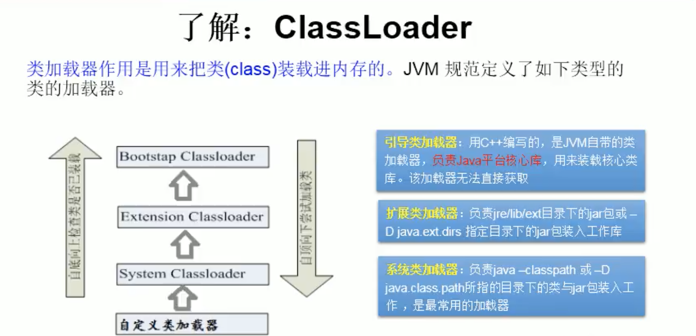

# 一、java基础

## 1、简单题

### 1.1 基本数据类型

Java语言提供了八种基本类型。六种数字类型（四个整数型，两个浮点型），一种字符类型，还有一种布尔型。

> 1、基本类型：byte(8),short(16),int(32),long(64),float(32),double(64),char(16),boolean(1)
> 2、对象类型：Byte,Short,Integer,Long,Float,Double,Character,Boolean

#### 整型

其中byte、short、int、long都是表示整数的，只不过他们的取值范围不一样

- byte的取值范围为-128~127，占用1个字节（-2的7次方到2的7次方-1）
- short的取值范围为-32768~32767，占用2个字节（-2的15次方到2的15次方-1）
- int的取值范围为（-2147483648~2147483647），占用4个字节（-2的31次方到2的31次方-1）
- long的取值范围为（-9223372036854774808~9223372036854774807），占用8个字节（-2的63次方到2的63次方-1）。

可以看到byte和short的取值范围比较小，而long的取值范围太大，占用的空间多，基本上int可以满足我们的日常的计算了，而且int也是使用的最多的整型类型了。

在通常情况下，如果JAVA中出现了一个整数数字比如35，那么这个数字就是int型的，如果我们希望它是byte型的，可以在数据后加上大写的 B：35B，表示它是byte型的。

同样的35S表示short型，35L表示long型的，表示int我们可以什么都不用加，但是如果要表示long型的，就一定要在数据后面加“L”。

#### 浮点型

- float和double是表示浮点型的数据类型，他们之间的区别在于他们的精确度不同
- float 3.402823e+38 ~ 1.401298e-45（e+38表示是乘以10的38次方，同样，e-45表示乘以10的负45次方）占用4个字节
- double 1.797693e+308~ 4.9000000e-324 占用8个字节

double型比float型存储范围更大，精度更高，所以通常的浮点型的数据在不声明的情况下都是double型的，如果要表示一个数据是float型的，可以在数据后面加上“F”。

浮点型的数据是不能完全精确的，所以有的时候在计算的时候可能会在小数点最后几位出现浮动，这是正常的。

> 注意：浮点型运算会导致精度丢失
>
> 因为十进制转化成二进制的过程中，不一定能转化成功（例如2.1，小数位太长），导致一些问题
>
> ```
> BigDecimal的运算如下：
> 
> add(BigDecimal)       BigDecimal对象中的值相加，然后返回这个对象。
> subtract(BigDecimal)  BigDecimal对象中的值相减，然后返回这个对象。
> multiply(BigDecimal)  BigDecimal对象中的值相乘，然后返回这个对象。
> divide(BigDecimal)    BigDecimal对象中的值相除，然后返回这个对象。
> toString()            将BigDecimal对象的数值转换成字符串。
> doubleValue()         将BigDecimal对象中的值以双精度数返回。
> floatValue()          将BigDecimal对象中的值以单精度数返回。
> longValue()           将BigDecimal对象中的值以长整数返回。
> intValue()            将BigDecimal对象中的值以整数返回。
> ```

#### 布尔型

这个类型只有两个值，true和false（真和非真）

- boolean t = true；在编译的时候使用的是int类型，所以占4个字节
- boolean f = false；

Boolean[] b = new boolean[10]，是数组的时候，编译是作为byte array来编译的，所以数组里每个元件占一个字节

#### 文本型

用于存放字符的数据类型，占用2个字节，采用unicode编码，它的前128字节编码与ASCII兼容

字符的存储范围在\u0000~\uFFFF，在定义字符型的数据时候要注意加' '，比如 '1'表示字符'1'而不是数值1，

char c = ' 1 ';

我们试着输出c看看，System.out.println(c);结果就是1，而如果我们这样输出呢System.out.println(c+0);

结果却变成了49。

#### int和Integer的区别

1、Integer是int的包装类，int则是java的一种基本数据类型 
2、Integer变量必须实例化后才能使用，而int变量不需要 
3、Integer实际是对象的引用，当new一个Integer时，实际上是生成一个指针指向此对象；而int则是直接存储数据值 
4、Integer的默认值是null，int的默认值是0


### 1.2 面向对象三大特征

#### （1）封装

封装（Encapsulation）是面向对象的三大特征之一（另外两个是继承和多态），它指的是将对象的状态信息隐藏在对象内部，不允许外部程序直接访问对象内部信息，而是通过该类所提供的方法来实现对内部信息的操作和访问。

#### （2）继承

- Java 使用 extends 作为继承的关键字，子类扩展了父类，获得父类的全部成员变量和方法。
- Java 只能单继承，只有一个直接父类，但可以有无限多个间接父类。当一个 Java 类并未显式指定直接父类时，默认继承 `java.lang.Object` ，因此 `java.lang.Object` 是所有类的直接或间接父类。

##### 重写

重写父类方法应遵循 “两同两小一大“ 规则：

- “两同” 指方法名相同、形参列表相同；
- “两小” 指子类方法返回值类型和抛出的异常类型应比父类方法的更小或相等；
- “一大” 指的是子类方法的访问权限应比父类方法的访问权限更大或相等。

```
class B {
    public void show() {
        System.out.println("B");
    }
}

public class A extends B{
    @Override
    public void show() {
        System.out.println("A");  //重写父类方法
    }
}
```

重载（Overload）和重写（Override）区别：

- 重载指的是同一类中多个同名方法；
- 重写指的是子类和父类的同名方法。

##### suer关键字

- 访问父类的构造函数：可以使用 super() 函数访问父类的构造函数，从而委托父类完成一些初始化的工作；
- 访问父类的成员：如果子类重写了父类的某个方法，可以通过使用 super 关键字来引用父类的方法实现。

##### 父类构造器

子类继承了父类的全部变量和方法，所以实例化子类时，必须先将其父类实例化。调用父类构造器的方式是 super()，参数为父类构造器所需参数。使用 super 调用父类构造器必须出现放在子类构造器的第一行，而 this 调用同一个类中重载的构造器也要放在第一行，所以 super() 和 this() 不能同时出现。

不管是否使用 super 显式调用父类构造器，子类构造器总会调用父类构造器一次，总共会出现三种情况：

- 子类构造器第一行使用 super 显式调用父类构造器；
- 子类构造器第一行使用 this 调用重载的子类构造器，在本类重载的构造器中调用父类构造器；
- 子类构造器第一行既没有 super 调用，也没有 this 调用，系统在第一行隐私调用父类无参构造器。

#### （3）多态

多态：相同类型的变量调用同一个方法时呈现出多种不同的行为特征。

例如，Person extends Creature；Dog extends Creature，都继承了父类的eat()方法

Creature person = new Person();

Creature dog = new Dog();

person.eat()和dog.eat() 就不一样。这就是多态，同一个方法时呈现出多种不同的行为特征。


### 1.5 访问控制符

- private（当前类访问权限）：类中的一个的成员被 private 修饰，它只能在当前类的内部被访问；
- default（包访问权限）：类中的一个成员或者一个外部类不使用任何访问控制符修饰，它能被当前包下其他类访问；
- protected（子类访问权限）：类中的一个的成员被 protected 修饰，它既可以被当前包下的其他类访问，又可以被不同包的子类访问；
- public（公共访问权限）：类中的一个成员或者一个外部类使用 public 修饰，它能被所有类访问。

|  private   | default | protected | public |      |
| :--------: | :-----: | :-------: | :----: | ---- |
| 同一个类中 |    ✔    |     ✔     |   ✔    | ✔    |
| 同一个包中 |         |     ✔     |   ✔    | ✔    |
|   子类中   |         |           |   ✔    | ✔    |
| 全局范围内 |         |           |        | ✔    |


### 1.4、考虑输出结果

视频资料：https://www.bilibili.com/video/BV1Eb411P7bP?t=46

```java
public class Demo01 {
    public static void main(String[] args) {
        int i = 1;
        i = i++;    // i = 1
        int j = i++;   // j=1
        int k = i + ++i * i++; // k=2+3*3 = 11  i=4
        System.out.println("i=" + i);
        System.out.println("j=" + j);
        System.out.println("k=" + k);
    }
}
```

结果

```
i=4
j=1
k=11
```

### 1.3 特殊运算

> 计算：3 << 2
>
> 3 << 2，则是将数字3左移2位
>
> 1、首先把3转换为二进制数字0000 0000 0000 0000 0000 0000 0000 0011
>
> 2、然后把该数字高位(左侧)的两个零移出，其他的数字都朝左平移2位，最后在低位(右侧)的两个空位补零。
>
> 3、则得到的最终结果是0000 0000 0000 0000 0000 0000 0000 1100，则转换为十进制是12。

<< 就是转化成二进制后左移动几位，>> 就是转化成二进制后后移几位

```java
// 2 转化成二进制后左移两位 就是8
2<<2 = 8
```


## 2、集合源码分析

视频：https://www.bilibili.com/video/BV1Kb411W75N?p=259

### 2.1 ArrayList

> 线程不安全

#### （1）初步小理解

##### 默认大小是多少？？？

1、查看源码可知默认大小是10，但是没找到初始化为10的代码？？？？？

```java
/**
  * Constructs an empty list with an initial capacity of ten.
  */
public ArrayList() {
  this.elementData = DEFAULTCAPACITY_EMPTY_ELEMENTDATA;
}
```

2、查看新增方法，在calculateCapacity中可知默认的容量是10

```java
public boolean add(E e) {
        ensureCapacityInternal(size + 1);  // Increments modCount!!
        elementData[size++] = e;
        return true;
    }

// 确定容量
private void ensureCapacityInternal(int minCapacity) {
        ensureExplicitCapacity(calculateCapacity(elementData, minCapacity));
    }

// 判断是否需要扩容
 private void ensureExplicitCapacity(int minCapacity) {
          modCount++;
 
          // 如果最小需要空间比elementData的内存空间要大，则需要扩容
          if (minCapacity - elementData.length > 0)
              //扩容
              grow(minCapacity);
      }

// 计算出容量，小于10，则返回10（可知默认的容量是10）
private static final int DEFAULT_CAPACITY = 10;
private static int calculateCapacity(Object[] elementData, int minCapacity) {
        if (elementData == DEFAULTCAPACITY_EMPTY_ELEMENTDATA) {
            return Math.max(DEFAULT_CAPACITY, minCapacity);
        }
        return minCapacity;
    }

// 进行扩容 1.5倍
private void grow(int minCapacity) {
          // 获取到ArrayList中elementData数组的内存空间长度
          int oldCapacity = elementData.length;
         // 扩容至原来的1.5倍
         int newCapacity = oldCapacity + (oldCapacity >> 1);
         // 再判断一下新数组的容量够不够，够了就直接使用这个长度创建新数组，
          // 不够就将数组长度设置为需要的长度
         if (newCapacity - minCapacity < 0)
             newCapacity = minCapacity;
         //若预设值大于默认的最大值检查是否溢出
         if (newCapacity - MAX_ARRAY_SIZE > 0)
             newCapacity = hugeCapacity(minCapacity);
         // 调用Arrays.copyOf方法将elementData数组指向新的内存空间时newCapacity的连续空间
         // 并将elementData的数据复制到新的内存空间
         elementData = Arrays.copyOf(elementData, newCapacity);
     }
```

由上述代码也可以看出，扩容是扩容到原来的1.5倍

##### 为什么线程不安全

add方法没有加synchronized

##### 线程不安全示例

```java
public class NoSafeDemo {
    public static void main(String[] args) {
        List<String> list = new ArrayList<>();
        for (int i = 0; i <= 30; i++) {
            new Thread(()->{
               list.add(UUID.randomUUID().toString().substring(0,9));
                System.out.println(list);
            }).start();
        }
        // 报错：java.util.ConcurrentModificationException 线程不安全常见的异常（并发修改异常）
      	// 报错原因：并发争抢修改导致
    }
}
```

报错位置如下，可知

- modCount是ArrayList中的一个成员变量。它表示该集合实际被修改的次数

- expectedModCount 是 ArrayList中的一个内部类——**Itr中的成员变量**。expectedModCount表示这个迭代器期望该集合被修改的次数。其值是在ArrayList.iterator方法被调用的时候初始化的。只有通过迭代器对集合进行操作，该值才会改变。

A线程 add走到checkForComodification()的时候，B线程刚add改变了modCount的值，就会出现modCount != expectedModCount

```java
final void checkForComodification() {
    if (modCount != expectedModCount)
        throw new ConcurrentModificationException();
}

private class Itr implements Iterator<E> {
        int cursor;       // index of next element to return
        int lastRet = -1; // index of last element returned; -1 if no such
  
  // =========关注这里
        int expectedModCount = modCount;

        Itr() {}

        public boolean hasNext() {
            return cursor != size;
        }

        @SuppressWarnings("unchecked")
        public E next() {
            checkForComodification();
            int i = cursor;
            if (i >= size)
                throw new NoSuchElementException();
            Object[] elementData = ArrayList.this.elementData;
            if (i >= elementData.length)
                throw new ConcurrentModificationException();
            cursor = i + 1;
            return (E) elementData[lastRet = i];
        }
```


##### 变成线程安全

1、使用方法Collections.synchronizedList()

```java
public class SafeDemo2 {
    public static void main(String[] args) {
        List<String> list = Collections.synchronizedList(new ArrayList<>());
        for (int i = 0; i <= 30; i++) {
            new Thread(()->{
               list.add(UUID.randomUUID().toString().substring(0,9));
                System.out.println(list);
            }).start();
        }
    }
}

```

这个方法会返回一个新的同步list，如下。

```java
 public static <T> List<T> synchronizedList(List<T> list) {
        return (list instanceof RandomAccess ?
                new SynchronizedRandomAccessList<>(list) :
                new SynchronizedList<>(list));
    }
```

该方法的新建和查询有一个互斥锁**（mutex）**，每次只能要么查询要么新建

```java
public boolean add(E e) {
            synchronized (mutex) {return c.add(e);}
}

 public E get(int index) {
            synchronized (mutex) {return list.get(index);}
 }
```


2、使用java.util.concurrent包中的CopyOnWriteArrayList，写时复制

```java
public class SafeDemo3 {
    public static void main(String[] args) {
        List<String> list = new CopyOnWriteArrayList<>();
        for (int i = 0; i <= 30; i++) {
            new Thread(()->{
               list.add(UUID.randomUUID().toString().substring(0,9));
                System.out.println(list);
            }).start();
        }
    }
}
```

参考源码add()

```java
public boolean add(E e) {
    final ReentrantLock lock = this.lock;
    lock.lock();
    try {
        Object[] elements = getArray();
        int len = elements.length;
        Object[] newElements = Arrays.copyOf(elements, len + 1);
        newElements[len] = e;
        setArray(newElements);
        return true;
    } finally {
        lock.unlock();
    }
}

public E get(int index) {
        return get(getArray(), index);
}
```

CopyOnWrite容器即写时复制容器，往一个容器中添加元素的时候，不直接往当前容器Object[]添加，而是先将当前容器进行copy，复制出一个新容器 Object[] newElements，新容器容量比原容器大1，将新元素放入新容器的最后，最后将原容器的引用指向新容器setArray(newElements);
这样做的好处是可以对CopyOnWrite容器进行并发读，而不需要加锁，因为当前容器不会添加任何元素，所以CopyOnWrite容器也是一种读写分离的思想，读和写时不同的容器。
写的时候加锁，保证线程安全。

> 注意和ArrayList增加元素的区别：ArrayList是先设置好一个 具备容量的数组，然后将元素放进去；而CopyOnWriteArrayList是直接在新的数组里添加元素，然后将老数组的引用指向新数组。

### 2.2 LinkedList

P530


### 2.3 Vector

P531

add方法加了synchronized，线程安全

```java
 public synchronized boolean add(E e) {
        modCount++;
        ensureCapacityHelper(elementCount + 1);
        elementData[elementCount++] = e;
        return true;
    }


private void ensureCapacityHelper(int minCapacity) {
	// minCapacity表示最小容量，假如原来数组中有10个对象，那么新增1个对象，那么最小容量就是11，否则装不下
	// 最小容量减去数组的真实容量，如果大于0，就执行扩容操作
	if (minCapacity - elementData.length > 0)
	
		//真正扩容的方法，grow 表示 生长的意思
		grow(minCapacity);
}
 
private void grow(int minCapacity) {
	// 获取数组的真实容量（实际存放成员的个数）
	int oldCapacity = elementData.length;
	
	// 由于capacityIncrement = 0 ，因此newCapacity = oldCapacity + oldCapacity
	int newCapacity = oldCapacity + ((capacityIncrement > 0) ?
									 capacityIncrement : oldCapacity);
	if (newCapacity - minCapacity < 0)
		newCapacity = minCapacity;
	if (newCapacity - MAX_ARRAY_SIZE > 0)
		newCapacity = hugeCapacity(minCapacity);
	// 将数组容量扩容至原来的2倍，并保留原数据
	elementData = Arrays.copyOf(elementData, newCapacity);
```

由上述代码可以看出，扩容至原来的2倍

以下代码完美运行无报错

```java
public class SafeDemo {
    public static void main(String[] args) {
        List<String> list = new Vector<>();
        for (int i = 0; i <= 30; i++) {
            new Thread(()->{
               list.add(UUID.randomUUID().toString().substring(0,9));
                System.out.println(list);
            }).start();
        }
    }
}
```


### 2.4HashMap

#### (1)初步小理解

##### 非线程安全实例

```java
public class NoSafeDemo {
    public static void main(String[] args) {
        Map<Object, Object> map = new HashMap<>();
        for (int i = 0; i <= 30; i++) {
            new Thread(()->{
                map.put(Thread.currentThread().getName(),UUID.randomUUID().toString().substring(0,9));
                System.out.println(map);
            }).start();
        }
        // 报错：java.util.ConcurrentModificationException 线程不安全常见的异常（并发修改异常）
    }
}
```

##### 解决线程安全

1、使用ConcurrentHashMap（怎么实现的有空看下）

```java
public class SafeDemo {
    public static void main(String[] args) {
        Map<Object, Object> map = new ConcurrentHashMap<>();
        for (int i = 0; i <= 30; i++) {
            new Thread(()->{
                map.put(Thread.currentThread().getName(),UUID.randomUUID().toString().substring(0,9));
                System.out.println(map);
            }).start();
        }
    }
}
```

2、使用Collections.synchronizedMap

put加了互斥锁

```java
public class SafeDemo2 {
    public static void main(String[] args) {
        Map<Object, Object> map = Collections.synchronizedMap(new HashMap<>());
        for (int i = 0; i <= 30; i++) {
            new Thread(()->{
                map.put(Thread.currentThread().getName(),UUID.randomUUID().toString().substring(0,9));
                System.out.println(map);
            }).start();
        }
    }
}
```

#### (2)基本概念介绍

> HashMap基于哈希表的Map接口实现，是以key-value存储形式存在，即主要用来存放键值对。HashMap 的实现不是同步的，这意味着它不是线程安全的。它的key、value都可以为null。此外，HashMap中的映射不是有序的。
>
> ​	JDK1.8 之前 HashMap 由 数组+链表 组成的，数组是 HashMap 的主体，链表则是主要为了解决哈希冲突**(两个对象调用的hashCode方法计算的哈希码值一致导致计算的数组索引值相同)**而存在的（“拉链法”解决冲突）.JDK1.8 以后在解决哈希冲突时有了较大的变化，**当链表长度大于阈值（或者红黑树的边界值，默认为 8）并且当前数组的长度大于64时，此时此索引位置上的所有数据改为使用红黑树存储。**
>
> 补充：将链表转换成红黑树前会判断，即使阈值大于8，但是数组长度小于64，此时并不会将链表变为红黑树。而是选择进行数组扩容。
>
> 这样做的目的是因为数组比较小，尽量避开红黑树结构，这种情况下变为红黑树结构，反而会降低效率，因为红黑树需要进行左旋，右旋，变色这些操作来保持平衡 。同时数组长度小于64时，搜索时间相对要快些。所以综上所述为了提高性能和减少搜索时间，底层在阈值大于8并且数组长度大于64时，链表才转换为红黑树。具体可以参考 `treeifyBin`方法。
>
> 当然虽然增了红黑树作为底层数据结构，结构变得复杂了，但是阈值大于8并且数组长度大于64时，链表转换为红黑树时，效率也变的更高效。

小结：

特点：

1.存取无序的

2.键和值位置都可以是null，但是键位置只能是一个null

3.键位置是唯一的，底层的数据结构控制键的

4.jdk1.8前数据结构是：链表 + 数组  jdk1.8之后是 ： 链表 + 数组  + 红黑树

5.阈值(边界值) > 8 并且数组长度大于64，才将链表转换为红黑树，变为红黑树的目的是为了高效的查询。

详细介绍参考

HashMap专题


### 2.5 HashSet

> 线程不安全

#### （1）初步小理解

##### 查看HashSet底层实现

底层居然是HashMap<>();.........

```java
/**
 * Constructs a new, empty set; the backing <tt>HashMap</tt> instance has
 * default initial capacity (16) and load factor (0.75).
 */
public HashSet() {
    map = new HashMap<>();
}
```

那为什么hashSet只能add一个元素，HashMap是put(k,v)呢？？？

因为HashSet的add方法底层也是map的put，只是put的value是固定值PRESENT

```java
private static final Object PRESENT = new Object();
public boolean add(E e) {
        return map.put(e, PRESENT)==null;
}
```

##### 线程不安全实例

```java
public class NoSafeDemo {
    public static void main(String[] args) {
        Set<String> set = new HashSet<>();
        for (int i = 0; i <= 30; i++) {
            new Thread(()->{
                set.add(UUID.randomUUID().toString().substring(0,9));
                System.out.println(set);
            }).start();
        }
        // 报错：java.util.ConcurrentModificationException 线程不安全常见的异常（并发修改异常）
    }
}
```

##### 解决线程安全

1、使用Collections.synchronizedSet()

```java
public class SafeDemo {
    public static void main(String[] args) {
        Set<String> set = Collections.synchronizedSet(new HashSet<>());
        for (int i = 0; i <= 30; i++) {
            new Thread(()->{
                set.add(UUID.randomUUID().toString().substring(0,9));
                System.out.println(set);
            }).start();
        }
    }
}
```

2、使用CopyOnWriteArraySet()

```java
public class SafeDemo2 {
    public static void main(String[] args) {
        Set<String> set = new CopyOnWriteArraySet<>();
        for (int i = 0; i <= 30; i++) {
            new Thread(()->{
                set.add(UUID.randomUUID().toString().substring(0,9));
                System.out.println(set);
            }).start();
        }
    }
}
```

CopyOnWriteArraySet的底层还是CopyOnWriteArrayList

```java
public CopyOnWriteArraySet() {
    al = new CopyOnWriteArrayList<E>();
}
```


## 3、反射

### (1) 概述

- 反射被视为动态语言的关键，反射机制允许程序在执行期间借助于Reflection API取得任何类的内部信息，并能直接操作任意对象的内部属性及方法。
- 加载完类后，在堆内存的方法区(MetaSpace)中就会产生一个CLass类型的对象，这个对象就包含了类的结构信息。我们可以通过这个对象看到类的结构。这个对象就像一面镜子，透过这个镜子看到类的结构，所以，我们形象的称之为：反射。





话不多说，上代码

```java
public class Person {
    private int age;
    private String name;

    public Person(int age, String name) {
        this.age = age;
        this.name = name;
    }

    public int getAge() {
        return age;
    }

    public void setAge(int age) {
        this.age = age;
    }

    public String getName() {
        return name;
    }

    public void setName(String name) {
        this.name = name;
    }

    public void show(){
        System.out.println("秀一下");
    }

    @Override
    public String toString() {
        return "Person{" +
                "age=" + age +
                ", name='" + name + '\'' +
                '}';
    }
}
```

```java
public class Demo01 {
    public static void main(String[] args) throws Exception {
        Class<Person> personClass = Person.class;
        Constructor<Person> constructor = personClass.getConstructor(int.class,String.class);
        // 创建了这个对象
        Person king = constructor.newInstance( 12,"king");

        System.out.println(king);
        // 获取class中的这个字段
        Field age = personClass.getDeclaredField("age");
        // 无视private
        age.setAccessible(true);
        // 给king对象中的age字段设置参数
        age.set(king,100);
        System.out.println(king);
        age.setAccessible(false);

        // 获取class中的show方法
        Method show = personClass.getDeclaredMethod("show");
        // 执行king对象中的show方法
        show.invoke(king);
    }
}
```

疑问：

1、通过直接new的方式或反射的方式都可以直接调用公共的结构，开发中到底用哪个？

> 建议直接用new的方式

2、什么时候用到反射

> 编译的时候不确定用哪个对象，反射特征：动态性，例如动态代理

3、反射机制与面向对象中的封装性是不是矛盾的？如果看待两个技术？

> 不矛盾。反射解决的问题是怎么调用，封装解决的问题是：哪些方法建议使用，哪些方法不建议使用


### (2) 理解Class类并获取Class实例（掌握）

1、类的加载过程

程序经过javac命令后，会生成一个或多个字节码文件（.class），接着我们使用java命令来对某个字节码文件进行解释运行，相当于将某个字节码文件加载到内存中。此过程称之为加载。加载到内存中的类，我们称之为运行时类，此运行时类，就作为Class的一个实例。

换句话说，Class的实例就对应着加载到内存中的一个运行时类


2、获取CLass实例

- 方式一：调用运行时类的属性：class

```java
Class<Person> personClass = Person.class;
```

- 方式二：通过运行时类的对象,调用getClass()

```java
Person person = new Person();
Class aClass = person.getClass();
```

- 方式三：调用Class的静态方法，forName(String classPath)

```java
Class clazz = Class.forName("com.supkingx.base.h_reflect.Person");
```

- 方式四：使用类的加载器

```java
ClassLoader classLoader = Demo01.class.getClassLoader();
Class aClass1 = classLoader.loadClass("com.supkingx.base.h_reflect.Person");
```

### (3) 类的加载与ClassLoader的理解（了解）






```java
// 方式四：使用类的加载器
ClassLoader classLoader = Demo01.class.getClassLoader();
Class aClass1 = classLoader.loadClass("com.supkingx.base.h_reflect.Person");
```

```java
public class Test01 {
    public static void main(String[] args) throws ClassNotFoundException {
        // 获取系统类加载器
        ClassLoader classLoader = Test01.class.getClassLoader();
        Class aClass1 = classLoader.loadClass("com.supkingx.base.h_reflect.Person");
        System.out.println(aClass1);
        System.out.println(classLoader);
        // 通过系统类加载器的getParent()，获取扩展类加载器
        System.out.println(classLoader.getParent());
        // 通过扩展类加载器的getParent()，获取引导类加载器
        // 引导类加载器主要负责java的核心类库，无法加载自定义类
        System.out.println(classLoader.getParent().getParent());
    }
}
```

读取配置文件

```java
public class Test02 {
    public static void main(String[] args) throws IOException {
        Properties properties = new Properties();
        // 读取配置方式一
//        FileInputStream fileInputStream = new FileInputStream("/Users/superking/Documents/project/examination/src/main/resources/jdbc.properties");
       // 方式二：
        InputStream resourceAsStream = Test02.class.getClassLoader().getResourceAsStream("jdbc.properties");
        properties.load(resourceAsStream);
        String user = (String) properties.get("user");
        String password = (String) properties.get("password");
        System.out.println("user:" + user + "," + "password:" + password);

    }
}
```


### (4) 创建运行时类的对象(掌握)

```java
public class Demo02 {
    public static void main(String[] args) throws IllegalAccessException, InstantiationException {
        Class<Person> personClass = Person.class;
        // 调用此方法创建运行时类的对象（内部调用运行实时类的空参构造器）
        // 想要用此方法创建，必须提供public权限的空参构造器

        // 在javabean中要求提供一个public的空参构造器，原因：
        // 便于反射创建运行时类的对象
        // 便于子类继承此运行时类，默认调用super()时，保证父类有次构造器

        Person person = personClass.newInstance();
        System.out.println(person);
    }
}
```

以下创建运行时类的方式用的比较少

```java
Class<Person> personClass = Person.class;
Constructor<Person> constructor = personClass.getConstructor(int.class,String.class);
// 创建了这个对象
Person king = constructor.newInstance( 12,"king");
```


### (5) 获取运行时类的完整结构（了解）

参考代码：包package com.supkingx.base.h_reflect.Test 下的 Test01---Test06

### (6) 调用运行时类的指定结构（掌握）

```java
public class FieldTest {
    public static void main(String[] args) throws NoSuchFieldException, IllegalAccessException, InstantiationException {
        Class<Person> personClass = Person.class;
        Person person = personClass.newInstance();
        Field nameField = personClass.getDeclaredField("name");
        nameField.setAccessible(true);
        nameField.set(person,"king");
        System.out.println(person);

        String name = (String)nameField.get(person);
        System.out.println(name);
    }
}

```

```java
public class MethodTest {
    public static void main(String[] args) throws IllegalAccessException, InstantiationException, NoSuchFieldException, NoSuchMethodException, InvocationTargetException {
        Class<Person> personClass = Person.class;
        Person person = personClass.newInstance();

        final Method show = personClass.getDeclaredMethod("show");
        show.invoke(person);

        // 第二个参数是返回类型
        final Method display = personClass.getDeclaredMethod("display", String.class);
        System.out.println(display.invoke(person, "哈哈哈"));

    }
}
```

```java
public class ConstructorTest {
    public static void main(String[] args) throws NoSuchMethodException, IllegalAccessException, InvocationTargetException, InstantiationException {
        Class<Person> personClass = Person.class;
        Constructor<Person> declaredConstructor = personClass.getDeclaredConstructor(String.class);
        declaredConstructor.setAccessible(true);
        final Person person = declaredConstructor.newInstance("king");
        System.out.println(person);
    }
}
```


### (7) 反射的应用用：动态代理

见下一章

### (8)总结：

关注上面几个需要掌握的内容

加了declared就是获取本类的所有方法，包含私有，如果要多私有Field设置参数，需要Field.setAccessible(true)

没有加declared就是获取包含父类的所有公开方法


## 4、静态代理

### (1)接口

```java
public interface ClothFactory {
    void produceCloth();
}
```

### (2)静态代理类

```java
public class ProxyClothFactory implements ClothFactory{

    private ClothFactory clothFactory; // 就拿被代理对象进行实例化

    public ProxyClothFactory(ClothFactory clothFactory) {
        this.clothFactory = clothFactory;
    }

    @Override
    public void produceCloth() {
        System.out.println("代理工厂做一些准备工作");

        clothFactory.produceCloth();

        System.out.println("代理工厂做一些后续的收尾工作");
    }
}
```

### (3)被代理对象

```java
public class SupClothFactory implements ClothFactory{
    @Override
    public void produceCloth() {
        System.out.println("sup生产衣服、。。。。。。。。");
    }
}
```

### (4)静态代理使用

```java
public class StaticProxyTest {
    public static void main(String[] args) {
        // 创建被代理对象
        SupClothFactory supClothFactory = new SupClothFactory();
        // 创建代理类对象
        ProxyClothFactory proxyClothFactory = new ProxyClothFactory(supClothFactory);
        proxyClothFactory.produceCloth();
    }
}
```

### (5)特点

代理类和被代理类在编译期间就确定下来了


## 5、动态代理

> 使用一个代理将对象包装起来，然后用该代理对象取代原始对象。任何对原始对象的调用都要通过代理。代理对象决定是否以及何时将方法调用转到原方法。

想要实现动态代理，需要解决的问题：
 1、如何根据加载到内存中的被代理类，动态创建一个代理类及其对象
 2、当通过代理类的对象调用方法时，如何动态的去调用被代理类中的同名方法。

动态代理常用的两种方式

1、java自带的代理方式

2、Cglib

### javaProxy

#### (1)接口

```java
public interface Human {

    String getBelief();

    void eat(String food);
}
```

#### (2)动态代理工厂

```java
public class MyInvocationHandler implements InvocationHandler {

    private Object obj;// 需要使用被代理类的对象进行赋值

    public void bind(Object o) {
        this.obj = o;
    }

    // 当我们通过代理类的对象，调用方法A时，就会自动的调用如下方法：invoke(0
    // 将被代理类要执行的方法a的功能，声明在invoke()中
    @Override
    public Object invoke(Object proxy, Method method, Object[] args) throws Throwable {

        // 在原方法执行执行之前加入方法
        System.out.println("method.invoke(obj, args)，执行之前");

        // 代理类对象调用的方法，此方法也就作为了被代理类对象要调用的方法
        // obj:被代理对象
        Object invoke = method.invoke(obj, args);

        // 在原方法执行执行之后加入方法
        System.out.println("method.invoke(obj, args)，执行之后");

        // 上诉方法的返回值就作为当前类中的invoke()的返回值
        return invoke;
    }
}

public class ProxyFactory {
    // 调用此方法，放回一个被代理类对象，被代理类的对象
    public static Object getProxyInstance(Object o) {
        MyInvocationHandler handler = new MyInvocationHandler();
        handler.bind(o);
        // 被代理类的 类加载器、接口、
        return Proxy.newProxyInstance(o.getClass().getClassLoader(), o.getClass().getInterfaces(), handler);
    }
}
```

#### (3)被代理对象

```java
public class Superman implements Human {
    @Override
    public String getBelief() {
        return "I believe I can fly";
    }

    @Override
    public void eat(String food) {
        System.out.println("I like eating " + food);
    }
}
```

#### (4)动态代理的使用

```java
/**
 * @description: 动态代理
 * 想要实现动态代理，需要解决的问题：
 * 1、如何根据加载到内存中的被代理类，动态创建一个代理类及其对象
 * 2、当通过代理类的对象调用方法时，如何动态的去调用被代理类中的同名方法。
 * @Author: wangchao
 * @Date: 2021/7/18
 */
public class DynamicProxyTest {
    public static void main(String[] args) {
        // 被代理类对象
        Superman superman = new Superman();
        // 注意：这里的human不是superman，因为我们是使用superman在这里是被代理类，
        // 通过ProxyFactory.getProxyInstance(superman)生成了superman的代理对象
        Human proxyInstance = (Human) ProxyFactory.getProxyInstance(superman);
        System.out.println(proxyInstance.getBelief());
        proxyInstance.eat("fish");

        System.out.println("\n----------------------\n");

        // 之前的静态代理，我们也可以通过动态代理来创建SupClothFactory的代理对象
        SupClothFactory supClothFactory = new SupClothFactory();
        ClothFactory clothFactory = (ClothFactory)ProxyFactory.getProxyInstance(supClothFactory);
        clothFactory.produceCloth();
    }
}
```

### Cglib

> CGLIB是一个强大的、高性能的代码生成库。其被广泛应用于AOP框架（Spring、dynaop）中，用以提供方法拦截操作。Hibernate作为一个比较受欢迎的ORM框架，同样使用CGLIB来代理单端（多对一和一对一）关联（延迟提取集合使用的另一种机制）。CGLIB作为一个开源项目，其代码托管在github，地址为：https://github.com/cglib/cglib
>
> CGLIB代理主要通过对字节码的操作，为对象引入间接级别，以控制对象的访问。我们知道Java中有一个动态代理也是做这个事情的，那我们为什么不直接使用Java动态代理，而要使用CGLIB呢？答案是CGLIB相比于JDK动态代理更加强大，JDK动态代理虽然简单易用，但是其有一个致命缺陷是，只能对接口进行代理。如果要代理的类为一个普通类、没有接口，那么Java动态代理就没法使用了。
>
> CGLIB底层使用了**ASM**（一个短小精悍的字节码操作框架）来操作字节码生成新的类。除了CGLIB库外，脚本语言（如Groovy何BeanShell）也使用ASM生成字节码。ASM使用类似SAX的解析器来实现高性能。我们不鼓励直接使用ASM，因为它需要对Java字节码的格式足够的了解

#### （1）创建Cglib代理工厂

```java
public class CreatureCglibFactory {

    public static <T>T getInstanceCglib(T t) {
        Enhancer enhancer = new Enhancer();
        enhancer.setSuperclass(t.getClass());
        enhancer.setCallback(new MethodInterceptor() {
            @Override
            public Object intercept(Object obj, Method method, Object[] objects, MethodProxy methodProxy) throws Throwable {
                System.out.println("Hi creature,come on!");
                Object invoke = methodProxy.invoke(t, objects);
                System.out.println("Oh,shit!");
                return invoke;
            }
        });
        return (T)enhancer.create();
    }
}
```

#### （2）测试

```java
public class CreatureCglibFactoryTest {
    public static void main(String[] args) {
        Dog dog = CreatureCglibFactory.getInstanceCglib(new Dog());
        dog.eat();
    }
}

输出:
Hi creature,come on!
哈哈哈哈，真好吃
Oh,shit!
```


### 总结

#### javaproxy

1、如何根据加载到内存中的被代理类，动态创建一个代理类及其对象

```java
Proxy.newProxyInstance(o.getClass().getClassLoader(), o.getClass().getInterfaces(), handler);
```

2、当通过代理类的对象调用方法时，如何动态的去调用被代理类中的同名方法

实现InvocationHandler方法，并使用method.invoke(obj,args);

```java
public class MyInvocationHandler implements InvocationHandler {

    private Object obj;// 需要使用被代理类的对象进行赋值

    public void bind(Object o) {
        this.obj = o;
    }

    // 当我们通过代理类的对象，调用方法A时，就会自动的调用如下方法：invoke(0
    // 将被代理类要执行的方法a的功能，声明在invoke()中
    @Override
    public Object invoke(Object proxy, Method method, Object[] args) throws Throwable {

        // 在原方法执行执行之前加入方法
        System.out.println("method.invoke(obj, args)，执行之前");

        // 代理类对象调用的方法，此方法也就作为了被代理类对象要调用的方法
        // obj:被代理对象
        Object invoke = method.invoke(obj, args);

        // 在原方法执行执行之后加入方法
        System.out.println("method.invoke(obj, args)，执行之后");

        // 上诉方法的返回值就作为当前类中的invoke()的返回值
        return invoke;
    }
}
```

#### cglib

我们通过一个Enhancer和一个MethodInterceptor来实现对方法的拦截。

#### 两者区别

1、java自带的proxy只能对接口进行代理，而cglib可以对所有类进行代理。

2、java动态代理使用java原生反射API（java.lang.reflect）进行操作，在生成类上比较搞笑；CGLIB使用ASM框架直接对字节码进行操作，在类的执行过程中比较高效。


## 6、IO流

### 6.1 字节流

#### FileInputStream/FileOutputStream

顶级父类：inputStream、OutputStream

```java
public class Demo03 {
    public static void main(String[] args) {
        File sourceFile = new File("03-IOTest" + File.separator + "test.jpg");
        File targetFile = new File("03-IOTest" + File.separator + "test2.jpg");
        try (FileInputStream fis = new FileInputStream(sourceFile)) {
            try (FileOutputStream fos = new FileOutputStream(targetFile)) {
                int len;
                byte[] b = new byte[1024];
                // 每次读取b个长度的数据到数组中，当fis读到某尾时 返回-1
                while (((len = fis.read(b)) != -1)) {
                    System.out.println(new String(b, 0, len));
                    fos.write(b, 0, len);
                }
            }
        } catch (Exception e) {
            e.printStackTrace();
        }
    }
}
```

允许追加

public FileOutputStream(File file, boolean append) : 创建文件输出流以写入由指定的 File对象表示的 文件。


### 6.2 字符流

字符文件的便利类。构造时使用系统默认的字符编码和默认字节缓冲区

#### FileReader

顶级父类：Reader、Writer

```java
public class Demo01 {
    public static void main(String[] args) {
        File file = new File("03-IOTest" + File.separator + "2.txt");
        try (FileReader fileReader = new FileReader(file)) {
            int b;
            //  read 方法，每次可以读取一个字符的数据，提升为int类型，读取到文件末尾，返回 -1 ，循环读 取，代码使用演示:
            while (((b = fileReader.read()) != -1)) {
                System.out.println((char) b);
            }
        } catch (Exception e) {
            e.printStackTrace();
        }
    }
}

public class Demo02 {
    public static void main(String[] args) {
        File file = new File("03-IOTest" + File.separator + "2.txt");
        try (FileReader fileReader = new FileReader(file)) {
            int len;
            char[] cbuf = new char[2];
            //  read(char[] cbuf) ，每次读取b的长度个字符到数组中，返回读取到的有效字符个数， 读取到末尾时，返回 -1
            while (((len = fileReader.read(cbuf)) != -1)) {
                System.out.println(new String(cbuf,0,len));
            }
        } catch (Exception e) {
            e.printStackTrace();
        }
    }
}
```

#### FileWrite

```java
public class Demo01 {
    public static void main(String[] args) {
        File file = new File("03-IOTest" + File.separator + "6.txt");
        try (FileWriter fw = new FileWriter(file)) {
            fw.write(97);
            fw.write('b');
            fw.write('c');
            fw.write(30000);
            // 刷新缓冲区，流对象可以继续使用。
            fw.flush();
            // 继续写出第2个字符，写出成功
            fw.write("开");
            fw.write("关");
        } catch (Exception e) {
            e.printStackTrace();
        }
    }
}
```

### 6.3 Preoperties

```java
public class ProDemo {
    public static void main(String[] args) throws FileNotFoundException {
        // 创建属性集对象
        Properties properties = new Properties();
        // 添加键值对元素
        properties.setProperty("filename", "a.txt");
        properties.setProperty("length", "209385038");
        properties.setProperty("location", "a.txt");
        // 打印属性集对象
        System.out.println(properties);
        // 通过键,获取属性值 System.out.println(properties.getProperty("filename")); System.out.println(properties.getProperty("length")); System.out.println(properties.getProperty("location"));
        Set<String> strings = properties.stringPropertyNames(); // 打印键值对
        for (String key : strings) {
            System.out.println(key + " ‐‐ " + properties.getProperty(key));
        }
    }
}

public class ProDemo2 {
    public static void main(String[] args) throws IOException {
        // 创建属性集对象
        Properties pro = new Properties();
        // 加载文本中信息到属性集
        pro.load(new FileInputStream("read.txt"));
        // 遍历集合并打印
        Set<String> strings = pro.stringPropertyNames();
        for (String key : strings) {
            System.out.println(key + " ‐‐ " + pro.getProperty(key));
        }
    }
}
```

## 7、缓冲流

### 7.1 字节缓冲流

#### BufferedInputStream/BufferedOutputStream

```java
public static void copy02(File sourceFile, File targetFile) {
        // 记录开始时间
        long start = System.currentTimeMillis();
        // 创建流对象
        try (
                BufferedInputStream bis = new BufferedInputStream(new FileInputStream(sourceFile));
                BufferedOutputStream bos = new BufferedOutputStream(new FileOutputStream(targetFile));
        ) {
            // 读写数据
            int len;
            byte[] bytes = new byte[8 * 1024];
            while ((len = bis.read(bytes)) != -1) {
                bos.write(bytes, 0, len);
            }
        } catch (IOException e) {
            e.printStackTrace();
        }
        // 记录结束时间
        long end = System.currentTimeMillis();
        System.out.println("缓冲流使用数组复制时间:" + (end - start) + " 毫秒");
    }
```

### 7.2 字符缓冲流

#### BufferedReader

```java
public static void main(String[] args) throws IOException {
        File sourceFile = new File("03-IOTest" + File.separator + "5.txt");
        BufferedReader br = new BufferedReader(new FileReader(sourceFile));
        String line;
        while ((line = br.readLine()) != null) {
            System.out.println(line);
        }
        br.close();
    }
```

#### BufferedWriter

```java
public static void main(String[] args) throws IOException {
        File sourceFile = new File("03-IOTest" + File.separator + "5.txt");
        // 创建流对象
        BufferedWriter bw = new BufferedWriter(new FileWriter(sourceFile));
        // 写出数据
        bw.write("南京");
        // 写出换行
        bw.newLine();
        bw.write("程序");
        bw.newLine();
        bw.write("员");
        bw.newLine();
        // 释放资源
        bw.close();
    }
```

```java
// 复制并排序，使用hashmap自动排序
public class Test01 {
    public static void main(String[] args) throws IOException {
        FileReader fileReader = new FileReader("03-IOTest" + File.separator + "test01.txt");
        FileWriter fileWriter = new FileWriter("03-IOTest" + File.separator + "test02.txt");

        BufferedReader bufferedReader = new BufferedReader(fileReader);
        BufferedWriter bufferedWriter = new BufferedWriter(fileWriter);
        Map<String, String> map = new HashMap<>();
        String line;
        while ((line = bufferedReader.readLine()) != null) {
            String[] split = line.split("\\.");
            map.put(split[0], split[1]);
        }
        for (Map.Entry<String, String> mapEntry : map.entrySet()) {
            bufferedWriter.write(mapEntry.getKey() + "." + mapEntry.getValue());
            bufferedWriter.newLine();
        }
        bufferedReader.close();
        bufferedWriter.close();
    }
}
```

## 8、转换流

> 计算机中储存的信息都是用二进制数表示的，而我们在屏幕上看到的数字、英文、标点符号、汉字等字符是二进制数转换之后的结果。按照某种规则，将字符存储到计算机中，称为**编码** 。反之，将存储在计算机中的二进制数按照某种规则解析显示出来，称为**解码** 。比如说，按照A规则存储，同样按照A规则解析，那么就能显示正确的文本符号。反之，按照A规则存储，再按照B规则解析，就会导致乱码现象。
>
> 编码:字符(能看懂的)-->字节(看不懂的)
>
> 解码:字节(看不懂的)-->字符(能看懂的)
>
> 是从字节流到字符流的桥梁。它读取字节，并使用指定的字符集将其解码为字符。它的字符集可以由名称指定，也可以接受平台的默认字符集

### 8.1 InputStreamReader

```java
public static void main(String[] args) throws IOException {
    File sourceFile = new File("03-IOTest" + File.separator + "5.txt");
    InputStreamReader inputStreamReader1 = new InputStreamReader(new FileInputStream(sourceFile));
    InputStreamReader inputStreamReader2 = new InputStreamReader(new FileInputStream(sourceFile), "GBK");
    int read;
    // 使用默认编码字符流读取,乱码
    while ((read = inputStreamReader1.read()) != -1) {
        System.out.println((char) read);
    }
    inputStreamReader1.close();

    // 使用指定编码字符流读取,正常解析
    while ((read = inputStreamReader2.read()) != -1) {
        System.out.println((char) read);
    }
    inputStreamReader2.close();
}
```

### 8.2 OutputStreamWriter

```java
public static void main(String[] args) throws IOException {
        // 定义文件路径
        String FileName = "03-IOTest" + File.separator + "7.txt";
        // 创建流对象,默认UTF8编码
        OutputStreamWriter osw = new OutputStreamWriter(new FileOutputStream(FileName));
        // 写出数据
        osw.write("你好"); // 保存为6个字节
        osw.close();

        // 定义文件路径
        String FileName2 = "03-IOTest" + File.separator + "7-2.txt";
        // 创建流对象,指定GBK编码
        OutputStreamWriter osw2 = new OutputStreamWriter(new FileOutputStream(FileName2), "GBK");
        // 写出数据
        osw2.write("你好");// 保存为4个字节
        osw2.close();
    }
```

### 小案例：转化文件编码

1. 指定GBK编码的转换流，读取文本文件。
2. 使用UTF-8编码的转换流，写出文本文件。

```java
public class TransDemo {
   public static void main(String[] args) {      
    	// 1.定义文件路径
     	String srcFile = "file_gbk.txt";
        String destFile = "file_utf8.txt";
		// 2.创建流对象
    	// 2.1 转换输入流,指定GBK编码
        InputStreamReader isr = new InputStreamReader(new FileInputStream(srcFile) , "GBK");
    	// 2.2 转换输出流,默认utf8编码
        OutputStreamWriter osw = new OutputStreamWriter(new FileOutputStream(destFile));
		// 3.读写数据
    	// 3.1 定义数组
        char[] cbuf = new char[1024];
    	// 3.2 定义长度
        int len;
    	// 3.3 循环读取
        while ((len = isr.read(cbuf))!=-1) {
            // 循环写出
          	osw.write(cbuf,0,len);
        }
    	// 4.释放资源
        osw.close();
        isr.close();
  	}
}
```

## 9、序列化

```
Java 提供了一种对象**序列化**的机制。用一个字节序列可以表示一个对象，该字节序列包含该`对象的数据`、`对象的类型`和`对象中存储的属性`等信息。字节序列写出到文件之后，相当于文件中**持久保存**了一个对象的信息。 

反之，该字节序列还可以从文件中读取回来，重构对象，对它进行**反序列化**。`对象的数据`、`对象的类型`和`对象中存储的数据`信息，都可以用来在内存中创建对象。
```

### 9.1 ObjectOutputStream

`java.io.ObjectOutputStream ` 类，将Java对象的原始数据类型写出到文件,实现对象的持久存储。

被序列化的对象，一定要实现Serializable接口

`Serializable` 接口给需要序列化的类，提供了一个序列版本号。`serialVersionUID` 该版本号的目的在于验证序列化的对象和对应类是否版本匹配。

```java
public static void main(String[] args) throws IOException {
        File file = new File("03-IOTest" + File.separator + "student.txt");
        Student student = new Student();
        student.setAddress("南京");
        student.setAge(20);
        student.setName("小王");

        ObjectOutputStream os = new ObjectOutputStream(new FileOutputStream(file));
        os.writeObject(student);
        os.close();
    }
```

### 9.2 ObjectInputStream

ObjectInputStream反序列化流，将之前使用ObjectOutputStream序列化的原始数据恢复为对象。 

```java
public static void main(String[] args) throws Exception {
        File file = new File("03-IOTest" + File.separator + "student.txt");
        ObjectInputStream ois = new ObjectInputStream(new FileInputStream(file));
        Student student = (Student) ois.readObject();
        System.out.println(student);
    }
```

#### 反序列化失败的场景

找不到class文件

该类的序列版本号与从流中读取的类描述符的版本号不匹配 

该类没有可访问的无参数构造方法 

## 10、打印流

> 平时我们在控制台打印输出，是调用`print`方法和`println`方法完成的，这两个方法都来自于`java.io.PrintStream`类，该类能够方便地打印各种数据类型的值，是一种便捷的输出方式。

```java
public class PrintDemo {
    public static void main(String[] args) throws IOException {
		// 调用系统的打印流,控制台直接输出97
        System.out.println(97);
      
		// 创建打印流,指定文件的名称
        PrintStream ps = new PrintStream("ps.txt");
      	
      	// 设置系统的打印流流向,输出到ps.txt
        System.setOut(ps);
      	// 调用系统的打印流,ps.txt中输出97
        System.out.println(97);
    }
}
```

## 11、网络编程

### TCP通信分析图解

1. 【服务端】启动,创建ServerSocket对象，等待连接。
2. 【客户端】启动,创建Socket对象，请求连接。
3. 【服务端】接收连接,调用accept方法，并返回一个Socket对象。
4. 【客户端】Socket对象，获取OutputStream，向服务端写出数据。
5. 【服务端】Scoket对象，获取InputStream，读取客户端发送的数据。

> 到此，客户端向服务端发送数据成功。

-%E5%B0%B1%E4%B8%9A%E8%AF%BE(2.0)-%E7%BD%91%E7%BB%9C%E7%BC%96%E7%A8%8B/22.%E3%80%90%E7%BD%91%E7%BB%9C%E7%BC%96%E7%A8%8B%E3%80%91-%E7%AC%94%E8%AE%B0/%E5%B0%B1%E4%B8%9A%E7%8F%AD-day11-%E7%BD%91%E7%BB%9C%E7%BC%96%E7%A8%8B/img/5_%E7%AE%80%E5%8D%95%E9%80%9A%E4%BF%A1.jpg?lastModify=1628331959)

> 自此，服务端向客户端回写数据。

1. 【服务端】Socket对象，获取OutputStream，向客户端回写数据。
2. 【客户端】Scoket对象，获取InputStream，解析回写数据。
3. 【客户端】释放资源，断开连接。

### 客户端向 服务端发送数据

#### 服务端实现：

```java
public class TCPServer {
   public static void main(String[] args) throws IOException {
        //1.创建服务器ServerSocket对象和系统要指定的端口号
        ServerSocket server = new ServerSocket(8888);
        //2.使用ServerSocket对象中的方法accept,获取到请求的客户端对象Socket
        Socket socket = server.accept();
        //3.使用Socket对象中的方法getInputStream()获取网络字节输入流InputStream对象
        InputStream is = socket.getInputStream();
        //4.使用网络字节输入流InputStream对象中的方法read,读取客户端发送的数据
        byte[] bytes = new byte[1024];
        int len = is.read(bytes);
        System.out.println(new String(bytes,0,len));
        //5.使用Socket对象中的方法getOutputStream()获取网络字节输出流OutputStream对象
        OutputStream os = socket.getOutputStream();
        //6.使用网络字节输出流OutputStream对象中的方法write,给客户端回写数据
        os.write("收到谢谢".getBytes());
        //7.释放资源(Socket,ServerSocket)
        socket.close();
        server.close();
    }
}
```

#### 客户端实现

```java
   public static void main(String[] args) throws IOException {
        //1.创建一个客户端对象Socket,构造方法绑定服务器的IP地址和端口号
        Socket socket = new Socket("127.0.0.1",8888);
        //2.使用Socket对象中的方法getOutputStream()获取网络字节输出流OutputStream对象
        OutputStream os = socket.getOutputStream();
        //3.使用网络字节输出流OutputStream对象中的方法write,给服务器发送数据
        os.write("你好服务器".getBytes());
        //4.使用Socket对象中的方法getInputStream()获取网络字节输入流InputStream对象
        InputStream is = socket.getInputStream();
        //5.使用网络字节输入流InputStream对象中的方法read,读取服务器回写的数据
        byte[] bytes = new byte[1024];
        int len = is.read(bytes);
        System.out.println(new String(bytes,0,len));
        //6.释放资源(Socket)
        socket.close();
    }
```

### 经典案例

#### 文件上传

```java
public class FileUpload_Client {
    public static void main(String[] args) throws IOException {
        // 1.创建流对象
        // 1.1 创建输入流,读取本地文件
        BufferedInputStream bis = new BufferedInputStream(new FileInputStream("15-Socket/test.jpg"));
        // 1.2 创建输出流,写到服务端
        Socket socket = new Socket("localhost", 6666);
        BufferedOutputStream bos = new BufferedOutputStream(socket.getOutputStream());

        //2.写出数据.
        byte[] b = new byte[1024 * 8];
        int len;
        while ((len = bis.read(b)) != -1) {
            bos.write(b, 0, len);
            bos.flush();
        }
        System.out.println("文件发送完毕");
        // 3.释放资源

        bos.close();
        socket.close();
        bis.close();
        System.out.println("文件上传完毕 ");
    }
}
```

```java
public class FileUpload_Server {
    public static void main(String[] args) throws IOException {
        System.out.println("服务器 启动.....  ");
        // 1. 创建服务端ServerSocket
        ServerSocket serverSocket = new ServerSocket(6666);
        // 2. 循环接收,建立连接
        while (true) {
          	/*
          	3. socket对象交给子线程处理,进行读写操作
               Runnable接口中,只有一个run方法,使用lambda表达式简化格式
            */
            Socket accept = serverSocket.accept();
            new Thread(() -> {
                try (
                        //3.1 获取输入流对象
                        BufferedInputStream bis = new BufferedInputStream(accept.getInputStream());
                        //3.2 创建输出流对象, 保存到本地 .
                        FileOutputStream fis = new FileOutputStream("15-Socket/" + System.currentTimeMillis() + ".jpg");
                        BufferedOutputStream bos = new BufferedOutputStream(fis);
                ) {
                    // 3.3 读写数据
                    byte[] b = new byte[1024 * 8];
                    int len;
                    while ((len = bis.read(b)) != -1) {
                        bos.write(b, 0, len);
                    }

                    // 4.=======信息回写===========================
                    System.out.println("back ........");
                    OutputStream out = accept.getOutputStream();
                    out.write("上传成功".getBytes());
                    out.close();
                    //================================

                    //5. 关闭 资源
                    bos.close();
                    bis.close();
                    accept.close();
                    System.out.println("文件上传已保存");
                } catch (IOException e) {
                    e.printStackTrace();
                }
            }).start();
        }
    }
}
```

#### 模拟web服务器

```java
public class ServerDemo {
    public static void main(String[] args) throws IOException {
        ServerSocket server = new ServerSocket(8888);
        while (true) {
            Socket socket = server.accept();
            new Thread(new Web(socket)).start();
        }
    }

    static class Web implements Runnable {
        private Socket socket;

        public Web(Socket socket) {
            this.socket = socket;
        }

        public void run() {
            try {
                //转换流,读取浏览器请求第一行
                BufferedReader readWb = new
                        BufferedReader(new InputStreamReader(socket.getInputStream()));
                String requst = readWb.readLine();
                //取出请求资源的路径
                String[] strArr = requst.split(" ");
                System.out.println(Arrays.toString(strArr));
                 // 去掉web前面的/
                String path = strArr[1].substring(1);
                System.out.println(path);
                // 读取客户端请求的资源文件
                FileInputStream fis = new FileInputStream(path);
                System.out.println(fis);
                byte[] bytes = new byte[1024];
                int len = 0;
                //向浏览器 回写数据
                OutputStream out = socket.getOutputStream();
                // 写入HTTP协议响应头,固定写法
                out.write("HTTP/1.1 200 OK\r\n".getBytes());
                out.write("Content-Type:text/html\r\n".getBytes());
                // 必须要写入空行,否则浏览器不解析
                out.write("\r\n".getBytes());
                while ((len = fis.read(bytes)) != -1) {
                    out.write(bytes, 0, len);
                }
                fis.close();
                out.close();
                readWb.close();
                socket.close();
            } catch (Exception ex) {

            }
        }
    }
}
```


## 12、多线程

### 创建线程池的方式

1、固定大小线程池

缺点，阻塞队列无限大  LinkedBlockingQueue()  Integer.MAX_VALUE

```java
Executors.newFixedThreadPool(1);
```

2、单线程池

需要保证顺序执行各个任务的场景 

缺点，阻塞队列无限大  LinkedBlockingQueue()  Integer.MAX_VALUE

```java
Executors.newSingleThreadExecutor()
```

3、创建一个周期性的线程池，可以定时执行任务

```java
Executors.newScheduledThreadPool(3);
// 三秒钟一次
executorService.schedule(()->{},3,TimeUnit.SECONDS);
```

4、缓存线程池，无限创建线程（ Integer.MAX_VALUE）

```
Executors.newCachedThreadPool()
```

里面使用了SynchronousQueue（），SynchronousQueue 也是一个队列来的，但它的特别之处在于它内部没有容器，一个生产线程，当它生产产品（即put的时候），如果当前没有人想要消费产品(即当前没有线程执行take)，此生产线程必须阻塞，等待一个消费线程调用take操作，take操作将会唤醒该生产线程，同时消费线程会获取生产线程的产品（即数据传递），这样的一个过程称为一次配对过程(当然也可以先take后put,原理是一样的)。

5、 new ThreadPoolExecutor

```java
// 一个核心线程,最大线程数2，3秒没人用就释放，阻塞队列长度3(阻塞队列里面的任务都在等待一个线程)
        ThreadPoolExecutor pool = new ThreadPoolExecutor(
                1,
                2,
                //  线程池维护线程所允许的空闲时间
                3,
                // 单位
                TimeUnit.SECONDS,
                new LinkedBlockingDeque<>(3),
                new ThreadFactoryBuilder().setNameFormat("testThread-%d").setDaemon(true).build(),
                new ThreadPoolExecutor.DiscardPolicy());
```

### 线程的生命周期

线程的生命周期包含5个阶段，包括：新建、就绪、运行、阻塞、销毁。

- 新建：就是刚使用new方法，new出来的线程；
- 就绪：就是调用的线程的start()方法后，这时候线程处于等待CPU分配资源阶段，谁先抢的CPU资源，谁开始执行;
- 运行：当就绪的线程被调度并获得CPU资源时，便进入运行状态，run方法定义了线程的操作和功能;
- 阻塞：在运行状态的时候，可能因为某些原因导致运行状态的线程变成了阻塞状态，比如sleep()、wait()之后线程就处于了阻塞状态，这个时候需要其他机制将处于阻塞状态的线程唤醒，比如调用notify或者notifyAll()方法。唤醒的线程不会立刻执行run方法，它们要再次等待CPU分配资源进入运行状态;
- 销毁：如果线程正常执行完毕后或线程被提前强制性的终止或出现异常导致结束，那么线程就要被销毁，释放资源;

线程池的一个作用就是节省了新生，就绪，阻塞，

### 线程的拒绝策略

- abortPolicy

```
这种拒绝策略在拒绝任务时，会直接抛出一个类型为 RejectedExecutionException 的 RuntimeException，让你感知到任务被拒绝了，于是你便可以根据业务逻辑选择重试或者放弃提交等策略。
```

- DiscardPolicy

```
这种拒绝策略正如它的名字所描述的一样，当新任务被提交后直接被丢弃掉，也不会给你任何的通知，相对而言存在一定的风险，因为我们提交的时候根本不知道这个任务会被丢弃，可能造成数据丢失。
```

- DiscardOldestPolicy

```
如果线程池没被关闭且没有能力执行，则会丢弃任务队列中的头结点，通常是存活时间最长的任务，这种策略与第二种不同之处在于它丢弃的不是最新提交的，而是队列中存活时间最长的，这样就可以腾出空间给新提交的任务，但同理它也存在一定的数据丢失风险。
```

- CallerRunsPolicy

```
相对而言它就比较完善了，当有新任务提交后，如果线程池没被关闭且没有能力执行，则把这个任务交于提交任务的线程执行，也就是谁提交任务，谁就负责执行任务。这样做主要有两点好处。

第一点新提交的任务不会被丢弃，这样也就不会造成业务损失。
第二点好处是，由于谁提交任务谁就要负责执行任务，这样提交任务的线程就得负责执行任务，而执行任务又是比较耗时的，在这段期间，提交任务的线程被占用，也就不会再提交新的任务，减缓了任务提交的速度，相当于是一个负反馈。在此期间，线程池中的线程也可以充分利用这段时间来执行掉一部分任务，腾出一定的空间，相当于是给了线程池一定的缓冲期.
```

